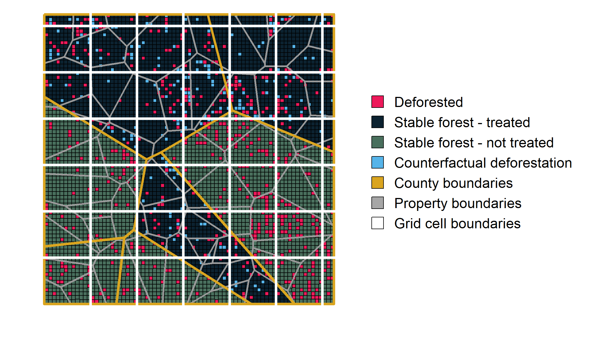

\sectionfont{\fontsize{11}{11}\selectfont}
\subsectionfont{\fontsize{11}{11}\selectfont}


```{r setup, include=FALSE}
library(knitr)
library(ggplot2)
library(kableExtra)
library(tidyverse)
library(Metrics)
library(reshape2)
library(patchwork)
library(grid)
library(gridExtra)

source(here::here('paper', 'schart.R'))


knitr::opts_chunk$set(echo = FALSE, warnings = FALSE, messages = FALSE, out.width="49%", fig.align = "center")

palette <- list("white" = "#FAFAFA",
                "light_grey" = "#d9d9d9",
                "dark" = "#0c2230",
                "red" = "#ed195a",
                "blue" = "#1c86ee",
                "green" = "#7CAE7A",
                "dark_green" = "#496F5D",
                "gold" = "#DAA520")
```


# Abstract {-}
Conservation scientists are increasingly measuring the impacts of conservation interventions by applying quasiexperimental impact evaluation to remotely sensed panel data on land use change. However, these applications come with new challenges. Using Monte Carlo simulations and analytical proofs, we demonstrate that many of the panel econometric models employed for conservation impact evaluation are biased - the significance, magnitude and even direction of estimated effects from many studies are likely incorrect. These errors threaten to undermine the evidence base that underpins conservation policy adoption and design. We review the methods in this burgeoning literature and develop guidance for the design of econometric models quantifying conservation policy effectiveness. 

# Introduction
Policymakers often need to understand the causal impacts of conservation interventions. Do marine protected areas stop unsustainable harvesting of fish? Can payments for ecosystem services encourage lasting reforestation? While randomized experiments are the gold standard for the identification of causal relationships [@edwards2020; @jayachandran2017], conservation often poses questions that are prohibitively expensive, unethical or impossible to pursue through experimentation. In such settings, a growing portfolio of statistical techniques enable researchers to draw causal conclusions using observational data [@larsen2019]. Increasingly, these econometric approaches to impact evaluation are being used to disentangle the causal relationships that underpin conservation decisionmaking [@butsic2017; @baylis2016; @williams2020]. These econometric methods can generate estimates of an intervention's impact by comparing observed outcomes to a statistical counterfactual of what would have happened in the absence of an intervention [@ferraro2009; @meyfroidt2016; @ferraro2019; @ribas2020].


<!-- When successful, these methods can provide answers that improve the way society confronts environmental challenges. However, inappropriate methods can yield misleading conclusions and, as a result, risk diverting scarce financial and political resources from the most effective conservation strategies. -->

Importantly, these econometric methods account for the non-random assignment of interventions that often confound identification of causal relationships in conservation. For example, a low rate of deforestation within a remote protected area may reflect the protected area's effectiveness, or it may be indicative of the remote location's poor suitability for agricultural development [@andam2008; @pfaff2009]. To build valid counterfactuals in the face of non-random selection, researchers frequently build upon spatial, panel data to observe changes in outcomes across treated and control units after the adoption of an intervention [@blackman2013]. When a rigorous research design is applied to panel data, observational studies can yield conclusions that are comparable to what a researcher would discover if they were able to run a randomized experiment [@ferraro2017].

One important development that has enabled the proliferation of conservation impact evaluation is the increasing prevalence of remotely sensed datasets detailing conservation outcomes through time [@blackman2013; @jones2015]. For example, NASA's Landsat archive can be used to generate consistent information on land use spanning the entirety of the world since the 1970s [@hansen2012]. As a result, a scientist hoping to quantify the impacts of a land use policy adopted decades ago can assemble data for treated and control units that span both pre- and post-implementation periods [@jain2020].

However, many commonly used measures of land use change have structural differences from the data used in traditional, linear panel models. For example, deforestation is often measured using data with a similar structure to the Global Forest Change product produced by @hansen2013. When converted to a panel structure, these data yield binary observations detailing the first year in which each 30 by 30m pixel was deforested. Importantly, the data do not allow for the detection of reforestation timing and, as a result, are unable to detect repeated deforestation events in the same location. To date, insufficient attention has been paid to how such binary, irreversible outcome data may affect the performance of standard econometric tools.

Here, we use a combination of analytical proofs and Monte Carlo simulations to demonstrate that many econometric analyses of deforestation are likely biased - significance, magnitude and even direction of estimated effects might be incorrect. While we focus on deforestation, many of our results apply to any setting with binary, irreversible data including mortality [e.g., @friedman], technology adoption [e.g., @bollinger], and reincarceration [e.g., @mastrobuoni]. The resulting biases arise even when researchers follow common guidance to adopt "rigorous" research designs with valid counterfactuals [@blackman2013; @jones2015]. Our main result shows that two-way fixed effects regressions with pixel unit fixed effects cannot identify the desired treatment effect parameter. Papers published in both conservation science and economics journals as recently as 2021 use this problematic specification to recover treatment effect estimates. To help guide future impact evaluations, we identify multiple ways in which this bias can be reduced or even eliminated. We then explore non-random selection that arises due to irreversibility in the deforestation setting and how this feature of the data may lead to bias. Finally, we reflect on the econometric benefits that emerge when researchers are able to match their model structure to the relevant scale of the deforestation process. 

# Measuring avoided deforestation using panel methods

We focus on the case in which a researcher would like to quantify the impact an intervention has had on deforestation. We assume that the intervention has clearly defined boundaries (e.g., a protected area, certified concession, or indigenous territory), and that the researcher has access to spatially explicit observations of forest cover and forest loss spanning the periods before and after the intervention was adopted. This general setting describes a broad array of studies that apply panel methods to remotely sensed data (Table \@ref(tab:table-lit)).

\renewcommand{\arraystretch}{1.5}
```{r table-lit}

lit_table <- read.csv("lit_table.csv")[,1:4]

kable(lit_table, format = "latex", 
      caption = "Econometric model structures used in avoided deforestation impact evaluations. All of the included studies use data accessed as pixelated binary deforestation.",
      col.names = c("Paper",
                    "Panel Method",
                    "Unit of analysis",
                    "Unit fixed effects level")) %>% 
  row_spec(0,bold=TRUE) %>% 
  kable_styling(font_size = 10, latex_options = c("striped", "HOLD_position"),
                #full_width = TRUE
                position = "center"
                )

```
\clearpage


In each of the studies detailed in Table \@ref(tab:table-lit), the researcher's goal is to measure the impact that a specific policy had on deforestation within treated units, also known as the \textit{average treatment effect on the treated} ($ATT$). The $ATT$ estimates the difference between the average deforestation rate of treated units with treatment, and the average deforestation rate of treated units without treatment. The fundamental challenge is that, for every treated unit, the researcher is unable to observe the value that the outcome would have taken in the absence of treatment [@holland1986]. In our case, this means that the researcher cannot observe the deforestation that would have occurred in treated units had they not received treatment. Figure \@ref(fig:counterfactual) displays this problem in the context of a simulated conservation intervention that reduced deforestation rates in treated areas --- the landscape is depicted as observed by the researcher at the end of the observation period, including the unobservable counterfactual of what would have happened if the conservation intervention had not been adopted. Note that in untreated areas, there is no counterfactual deforestation, since no intervention ever took place. 


```{r counterfactual, echo=FALSE, fig.cap="A map of a simulated landscape depicting patterns of deforestation under an effective conservation intervention, as well as counterfactual deforestation illustrating what would have happened in the absence of the intervention.", out.width = "100%"}

fig_nobs = 75^2


```

## Modeling the decision to deforest

<!-- NOTE: We should expand upon this description of the basic latent > binary decision rule model, and highlight examples from the literature that use this type of cut-off in both dynamic and static settings. Also need to adjust notation given that previous Pfaff model has been removed. -->

We model deforestation $(y_{ivt})$ as a binary choice by a landowner to clear a small plot of land $i$ within their larger property $v$ at time $t$. The decision to deforest depends upon a latent variable $(y_{ivt}^*)$ that represents the returns from the plot of land in its cleared state $(V_{ivt}^{cleared})$ relative to the returns from its forested state $(V_{ivt}^{uncleared})$, such that:

\begin{align}
 y^*_{ivt} = V^{cleared}_{ivt} - V^{uncleared}_{ivt} (\#eq:clearing)\\
 y_{ivt} = \begin{cases}
      1 &  \text{if $y^*_{ivt}>0$}\\
      0 &  \text{otherwise}
   \end{cases}
\end{align}

This generic clearing rule underpins a broad class of more specific static and dynamic models that have been used to explore the determinants of deforestation [e.g., @pfaff1999; @kerr2003; @pfaff2004].

However, this basic model makes an assumption that the decision to deforest is reversible. In reality, a number of characteristics of both the process of deforestation, as well as the methods used to detect deforestation in individual plots, complicate this assumption. First, the goal of many conservation interventions is to prevent the loss of mature forests that may take decades, if not centuries, to regrow. In such cases, deforestation itself may be considered irreversible in human time scales, focusing the researchers' attention upon the first instance in which a plot is deforested. Even when deforestation of secondary forests is an object of interest, constraints imposed by remotely sensed datasets may force empirical researchers to treat deforestation as irreversible. Gradual processes of reforestation are inherently harder to identify than abrupt losses of forest cover [@hansen2013]. In addition, determining the precise year in which the extended process of forest regrowth began is currently an active area of research for the remote sensing community, and often requires many years of post-regrowth observations. As a result, commonly used deforestation datasets such as the Global Forest Change product often only identify the first year in which a pixel was cleared [@hansen2013]. Whether desired, or due to technical limitations, the resulting inability to observe repeated deforestation means that deforestation is, in effect, an irreversible process in most conservation impact evaluations. In response to this irreversibility, @jones2015 and @alix-garcia2017 have suggested that deforested pixels should be dropped in the periods after they are first cleared. We follow this guidance, further modifying our binary deforestation variable:

<!-- NOTE: Add more citations to previous paragraph -->


\begin{align}
 y^o_{ivt} = \begin{cases}
      1   & y^*_{ivt} > 0 \text{ and } y^*_{iv \tau} \leq 0 \text{ for all } \tau<t  \\
      0   &  y^*_{ivt} \leq 0 \text{ and } y^*_{iv \tau} \leq 0 \text{ for all } \tau<t \\
      NAN & otherwise
   \end{cases}
\end{align}


## Estimating the $ATT$ using difference-in-differences and two-way fixed effects estimators {#ATT}

Two methods commonly used to estimate the $ATT$ in conservation intervention settings with panel data are Difference-in-Differences (DID) and Two-way Fixed Effects (TWFE) regression (@blackman2013; @jones2015). Our parameter of interest, the $ATT$, is the average effect of the conservation intervention on treated pixels. Let $y_{ivt}(1)$ and $y_{ivt}(0)$ denote the potential outcomes of pixel $i$ in property $v$ in time $t$ with and without the treatment, respectively. In addition, let $t_0$ denote the year that the intervention was implemented and let $D_i$ represent a dummy indicating whether pixel $i$ is ever treated. The $ATT$ can now be expressed as: 

$$ ATT = E[y_{ivt}(1) - y_{ivt}(0) |  t\geq t_0, D_i=1]$$

DID and TWFE methods have become popular in part, because the researcher does not need random assignment of treatment to generate convincing estimates of a program's impact on avoided deforestation. Instead, the researcher must make a common trends assumption, under which we evaluate each method. 

\textbf{Assumption 1:} (Common trends)
\begin{align*}
E[y_{ivt}(0) |  t\geq t_0, D_i=1]-E[y_{ivt}(0) |  t< t_0, D_i=1]=E[y_{ivt}(0) |  t\geq t_0, D_i=0]-E[y_{ivt}(0) |  t< t_0, D_i=0]
\end{align*}

Assumption 1 requires that pixels in treated and untreated areas would have experienced the same change in their probability of deforestation across the two periods had no intervention ocurred. While fundamentally untestable, ensuring that deforestation rates in the intervention area and the control area followed parallel trajectories prior to the date of the intervention can lend credibility to this assumption [@butsic2017]. 

We also make the following stable unit treatment value assumption (SUTVA)

\textbf{Assumption 2:} (SUTVA)
\begin{align*}
\forall d \in \{ 0,1\}: \text{ if }D_i=d \text{ and }t\geq t_0, \text{ then }y_{ivt}(d)=y_{ivt}
\end{align*}

Assumption 2 requires that the potential outcomes for pixel $i$, $y_{ivt}(1)$ and $y_{ivt}(0)$, do not depend on the treatment status of any other pixel. There also cannot exist unobserved versions of treatment that may affect the potential outcomes. 

\textbf{Regression 1:} (DID regression)
Under these two assumptions, the researcher can estimate the $ATT$ using a traditional DID regression. Let $\beta_{DID}$ denote the coefficient of the interaction between $D_{i}$ and an indicator for whether the intervention has been implemented in time $t$, $\mathbb{1} \{ t\geq t_0\}$,  in the following (population) OLS regression: 
\begin{align}
y^o_{ivt} = \alpha_0 + \alpha_1 D_i + \alpha_2 \mathbb{1} \{ t\geq t_0\}+ \beta_{DID} \text{ x } D_i \mathbb{1} \{ t\geq t_0\}  + \epsilon_{it}
\end{align}

Conceptually, the DID estimator calculates the treatment effect as the difference between the differences of the treated and untreated observations before and after treatment [@butsic2017]. 
\begin{align*}
\beta_{DID} = E[y^o_{ivt} |  t\geq t_0, D_i=1] - E[y^o_{ivt} |  t<t_0, D_i=1] - (E[y^o_{ivt} |  t\geq t_0, D_i=0] - E[y^o_{ivt} |  t<t_0, D_i=0] )\\
\end{align*}

When the $y^o_{ivt}$s are i.i.d. and Assumptions 1 and 2 hold, it is straightforward to show that
\begin{align*}
\beta_{DID}=ATT
\end{align*}

Often, however, the researcher wants to estimate the $ATT$ in a setting that does not fit the two-group, two-period case covered by the standard DID model. In such cases, TWFE regressions are frequently used to apply DID methods to multiple groups or treatment periods. This amounts to estimating a regression that includes unit and time fixed effects to control for unobservable confounding variables that vary across units or through time. 

\textbf{Regression 2:} (TWFE regression)
Let $\beta_{TWFE}$ denote the coefficient of the interaction between $D_{i}$ and $\mathbb{1} \{ t\geq t_0\}$  in the following (population) OLS regression: 
\begin{align}
y^o_{ivt} = \alpha + \beta_{TWFE} \text{ x } D_i \mathbb{1} \{ t\geq t_0\} + \lambda_t + \gamma_i + \epsilon_{it}
\end{align}
Here $\lambda_t$ and $\gamma_i$ represent the year and pixel fixed effects, respectively. 

In the case of two groups and two time periods, the TWFE regression typically yields an estimate of the $ATT$ that is equivalent to the estimate generated by the DID model [@wooldridge2010]. With this in mind, many researchers have used the TWFE model as a "generalized DID" that can be estimated in settings where different units are exposed to treatment in more than two distinct time periods (Table \@ref(tab:table-lit)). For example, a researcher may use a TWFE regression model to examine the effectiveness of a network of protected areas where the protected areas were created at different times, or a payment for ecosystem services (PES) program that enrolled properties in annual cohorts. 

### Pixel level, TWFE models fail to estimate the $ATT$
Despite widespread use of pixel level analyses of deforestation, the application of TWFE models to a binary, irreversible process such as deforestation yields a biased estimate of the $ATT$. Specifically, the proof contained in Appendix \@ref(TWFE-proof) shows that, in the two-group, two-period case, the coefficient of interest from the TWFE model $(\beta_{TWFE})$ estimates the post-treatment difference in outcomes (single difference), rather than the desired $ATT$:

\[ \beta_{TWFE} = ATT + \underbrace{E[y_{it}(0) | t<t_0, D_i=1] - E[y_{it}(0) | t<t_0, D_i=0]}_{\text{pre-treatment difference in deforestation rates}} \]

Regression 2 thus forgoes the benefits that panel methods provide, and if the treated area has a different baseline deforestation rate than the control, will generate a biased estimate of the intervention's impact. Many conservation interventions are specifically targeted towards locations with either low opportunity costs for conservation or high threats of conversion. As a result, it is likely that many conservation impact evaluations will have treatment and control units that experienced different pre-treatment deforestation rates. It is important to note that this bias could even lead to changes in the estimated treatment effect's sign, in addition to errors in the effect's magnitude and significance. 

This result stems from researchers' use of pixel fixed effects in the regression specification. By including pixel fixed effects in TWFE regressions, researchers hope to control for local confounders, including pre-treatment differences in the outcome. However, when following common guidance to drop pixels in the periods after they are first deforested, these fixed effects do not behave as the researcher expects. Because the pixels that are deforested in the first period are not observed for the entire panel, these observations go unaccounted for in $\beta_{TWFE}$. Implicitly, the pre-treatment deforestation rates get assigned as 0 for both the treatment and control groups. In Appendix \@ref(ex-post), we show that $\hat{\beta}_{TWFE}$ is equivalent to the coefficient from a regression on a dataset where all pixels deforested in the pre-treatment period are simply dropped from the dataset completely.

<!-- Researchers often find themselves in situations where the more flexible TWFE model is preferable to the simple DID, such as in the case of multiple groups and time periods. While many economists may be transitioning to newly developed estimators to address settings in which multiple groups undergo treatment in different time periods [e.g., @callaway2020; @gardner2021], we show in section \@ref(multipleGT) that many of these estimators suffer from the same issue. -->

### Alternative construction of $y^o_{ivt}$ cannot recover the $ATT$

Although dropping previously deforested pixels from the panel introduces bias into the TWFE estimate of the $ATT$, keeping observations in the panel after initial deforestation introduces its own problems. The $ATT$ as defined in Section \@ref(ATT) is an estimate of the impact of an intervention on the frequency of deforestation events (i.e. the decision to clear). Keeping the deforested pixel in the panel beyond the first period in which it was observed as deforested would incorrectly imply that it has actively been deforested in each subsequent time period, when in fact, no new deforestation event or clearing decision has occurred. This is intuitively problematic, because the deforestation rate in each period would be monotonically increasing by construction, which is not necessarily the case. We show that pixel-level regression models that do not drop deforested pixels in subsequent periods do indeed incur severe bias if used to estimate the $ATT$ as it is defined here (Appendix \@ref(keep-pixels)).

<!-- Alternatively, some researchers opt to keep deforested pixels in the panel, and choose to estimate an intervention's impact on deforested area, rather than on deforestation rates. However, when reforestation timing is unaccounted for, as is the case with most data products using a binary measure of deforestation, this is not possible. Rather than measuring deforested area at any given time, this outcome variable measures the stock of ever-deforested area through the current time period. It is unclear that this is a relevant parameter of interest in many cases and should not be interpreted as either a deforestation rate or the deforested area in a given time period. -->

## Estimating the $ATT$ using survival analysis  {#survival}
### Hazard rate ratios from a single survival model do not estimate the $ATT$ under common trends

Survival analysis has emerged as a common approach to modeling irreversible changes such as mortality, technology adoption, or recidivism [@friedman; @mastrobuoni]. Survival models, such as the Cox Proportional Hazards model, quantify how covariates relate to changes in the length of time that a unit remains in a sample. In the case of deforestation, survival analyses can be used to explore how policy adoption changes the duration that treated, forested pixels survive until they are first cleared. 

Despite the theoretical appeal of using survival models to study deforestation, they are still relatively uncommon in conservation impact evaluation. One emerging approach introduces the intuition of a difference in differences research design into a Cox Proportional Hazards model [e.g. @heilmayr2020; @sales2022]. Specifically, researchers estimate a Cox proportional hazards model of the following general form:

\textbf{Regression 3:} (Cox DID regression)
Let $\beta_{coxDID}$ denote the coefficient of the interaction between $D_{i}$ and $\mathbb{1} \{ t\geq t_0\}$  in the following (population) OLS regression:
\begin{align}
h(t) = \delta_0(t)exp( \alpha_0 + \alpha_1 D_i + \alpha_2 \mathbb{1} \{ t\geq t_0\}+ \beta_{coxDID} \text{ x } D_i \mathbb{1} \{ t\geq t_0\}  + \epsilon_{it})
\end{align}

, where $h(t)$ is the hazard rate of deforestation, $t$ years into the study period; and $\delta_0(t)$ is the baseline hazard function. 

Multiple studies across a wide variety of settings have interpreted the resulting exponentiatated coefficient $exp(\beta_{coxDID})$ as a hazard ratio that is indicative of the impact that treatment has had on the relative likelihood of survival. Specifically, based on the way this hazard ratio is interpreted in multiple papers, it appears that many researchers expect this hazard ratio to represent the ratio of the hazard rates in the treatment group post-treatment, relative to the counterfactual in that group had treatment not occurred. This desired hazard ratio measuring the relative impact of treatment on the treated $(HRTT)$ can be considered a reframing of the traditional $ATT$ as a ratio rather than a difference: 

$$ HRTT = \frac{E[y_{ivt}(1)  |  t\geq t_0, D_i=1]} {E[y_{ivt}(0)  |  t\geq t_0, D_i=1]}$$

Both in conservation and alternative settings, researchers using Regression 3 make Assumption 1, and evaluate whether it is plausible in their setting. However, Appendix \@ref(proportional-trends) shows that $exp(\beta_{coxDID})$ only identifies the $HRTT$ under an alternative assumption:

\textbf{Assumption 3:} (Proportional trends)
\begin{align}
\frac{E[y_{ivt}(0) |  t\geq t_0, D_i=1]}{E[y_{ivt}(0) |  t< t_0, D_i=1]}=\frac{E[y_{ivt}(0) |  t\geq t_0, D_i=0]}{E[y_{ivt}(0) |  t< t_0, D_i=0]}
\end{align}

Assumption 3 requires that pixels in treated and untreated areas would have experienced the same ratio of change in their probability of deforestation across the two periods had no intervention occurred. Note that in general, Assumption 1 and Assumption 3 cannot simultaneously hold. This means that researchers estimating Regression 3 under the traditional common trends assumption (Assumption 1) will not recover the $HRTT$, the relevant treatment effect parameter. 

### Proposing a new survival analysis-based estimator of the $ATT$

To the best of our knowledge, no prior studies have successfully combined the Cox Proportional Hazards model and the difference in differences research design to recover an unbiased estimate of the $ATT$ under the traditional common trends assumption (Assumption 1). Here we outline a new estimation approach that first recovers an unbiased estimate of the $HRTT$ and then translates this into an estimate of the $ATT$ that holds under Assumption 1. First, we note that the desired $HRTT$ can be re-written as a combination of three different hazard ratios: 

\begin{align*}
HR_1 &= \frac{E[y_{ivt}(1)  |  t\geq t_0, D_i=1]} {E[y_{ivt}(0)  |  t < t_0, D_i=1]}\\
HR_2 &= \frac{E[y_{ivt}(1)  |  t\geq t_0, D_i=1]} {E[y_{ivt}(0)  |  t\geq t_0, D_i=0]}\\
HR_3 &= \frac{E[y_{ivt}(0)  |  t\geq t_0, D_i=0]} {E[y_{ivt}(0)  |  t < t_0, D_i=0]}
\end{align*}

$$HRTT = \frac{E[y_{ivt}(1)  |  t\geq t_0, D_i=1]} {E[y_{ivt}(0)  |  t\geq t_0, D_i=1]} = \frac{1}{1/{HR_1} + 1/HR_2 - 1/(HR_2*HR_3)}$$

Each of the three hazard ratios, $HR_1$, $HR_2$, and $HR_3$, can be estimated through separate Cox Proportional Hazards models estimated on subsets of the larger dataset. Specifically:

* $HR_1 = exp( \alpha )$, where $\alpha$ is estimated by subsetting to observations from the treated group $(D_i = 1)$, and estimating the hazard rate of deforestation at time $t$ as $h(t) =\lambda_0(t) exp(\alpha 1\{ t \geq t_0\} )$; and

* $HR_2 = exp( \beta )$, where $\beta$ is estimated by subsetting to observations from the post-treatment period $(t \geq t_0)$, and estimating the hazard rate of deforestation at time $t$ as $h(t) =\gamma_0(t) exp( \beta 1\{ D_i = 1\} )$;

* $HR_3 = exp( \delta )$, where $\delta$ is estimated by subsetting to observations from the untreated group $(D_i = 0)$, and estimating the hazard rate of deforestation at time $t$ as $h(t) =\psi_0(t) exp(\delta 1\{ t \geq t_0\} )$.

Because the numerator of $HRTT$, $E[y_{ivt}(1)  |  t\geq t_0, D_i=1]$, can be estimated as the mean of post-treatment deforestation rates in the treated group (denoted $\widehat{defor}_{D_i:1, t\geq t_0}$), we can estimate the $ATT$ using this estimated deforestation rate and our estimate of $HRTT$:

$$\widehat{ATT}_{Cox} = \widehat{defor}_{D_i:1, t\geq t_0} - \frac{\widehat{defor}_{D_i:1, t\geq t_0} }{\widehat{HRTT}}$$

We have shown that the simple extension of the traditional DID to the survival setting only recovers an easily interpretable measure of a policy's impact under an assumption that cannot simultaneously hold with the traditional common trends assumption, the ``Proportional Trends" assumption. In contrast, our proposed estimator, which relies on separate estimation of relevant hazard ratios, does recover the relevant analog of the $ATT$ under common trends. We explore the performance of $\widehat{ATT}_{Cox}$ relative to the proposed OLS regressions under various circumstances likely to arise in the deforestation setting in the next sections. If a researcher opts to use survival analysis to recover an intervention's impact, their choice of estimator should depend on which trends assumption is plausible in their specific setting. 

# Monte Carlo simulations to compare alternative model performance

The rapid growth of the conservation impact evaluation literature has resulted in a diversity of model structures that all attempt to estimate the effectiveness of conservation interventions (Table \@ref(tab:table-lit)). To explore the relative performance of these different models, we employ a series of Monte Carlo simulations. Specifically, we randomly generate synthetic landscapes with known policy effectiveness and analyze the performance of different econometric models in estimating the policy's known impact.

## Landscape configuration

```{r res-input}
nobs = 150^2
ppoints = 225
cpoints = 25
avg_parea = nobs/ppoints
avg_carea = nobs/cpoints
cellsize_med = 10
cellsize_large = 30

# property: 100 pixels | 100 x 30^2 = 90000 m^2 = 9 ha
p_ha = avg_parea * 30^2 / 10000
c_ha = avg_carea * 30^2 / 10000

# unit | grid cell resolution (m) | area (ha) | comparable use in literature

resolution_df <- data.frame(
  "unit" = c("Property", "County", "Large grid", "Small grid"),
  "avg_pix" = c(avg_parea, avg_carea, cellsize_large^2, cellsize_med^2),
  "structure" = c("Thiessen polygons", "Thiessen polygons", "Uniform square", "Uniform square")
) %>%
  mutate(area_ha = avg_pix * 30^2 / 10000) %>% 
  select(unit, structure, avg_pix, area_ha)

analysis_to_fig_ratio = nobs/fig_nobs

analysis_km2 <- nobs * 0.0009

```

We begin each Monte Carlo simulation by creating a synthetic landscape consisting of `r sqrt(nobs)` rows and `r sqrt(nobs)` columns of square pixels, equivalent to a raster that is `r analysis_to_fig_ratio` times larger than what is illustrated in Figure \@ref(fig:counterfactual). We assume that each pixel has a resolution of 30 meters, comparable to the resolution of many Landsat-based, remote sensing analyses. The landscape thus represents an area of approximately `r analysis_km2` km2. We then divide this landscape into a variety of spatial units, composed of either uniform aggregations of pixels (i.e. large or small "grid cells"), or randomly spaced Thiessen polygons (i.e. "counties" or "properties"). Grid cells are intended to represent arbitrary units of spatial aggregation imposed by the researcher. In contrast, counties and properties are intended to represent simulated administrative units over which policy or land use decisions are made. Table \@ref(tab:res) summarizes the relative scale of each of these spatial units under our baseline specifications.
<!-- Albert TODO: I tried to go back to the analysis code to fill in the XX values above, but each of the analysis scripts has a slightly different nobs. Could you fill in the four XX values above with the size of our baseline specification? Also, would be good to make sure our final specification is fairly consistent across runs (I'm not entirely sure which of the analysis scripts we're actually relying on right now)-->

<!-- TODO (during review): Note that our counties are still really small. The average municipality in Brazil is 1,500 km2, and the smallest county in the US is ~15km2. While this is in review, should we simulate with larger counties?-->


```{r res}
kable(resolution_df, format = "latex", row.names = FALSE,  booktabs = T,
       caption = "Spatial unit structure and size",
       col.names = NULL) %>%
  add_header_above(c("Spatial unit"=1, "Spatial structure"=1, "Avg. number of pixels"=1, "Area (hectares)"=1), escape = TRUE, line =TRUE, bold = TRUE)%>%
  kable_styling(font_size = 10, latex_options = c("HOLD_position", "striped"),
                position = "center")

```


## Data generating process

Each of our simulated landscapes consists of administrative units that are either untreated $(D_i=0)$ or are assigned to a conservation treatment $(D_i=1)$. We observe deforestation in two, even-length periods, a pre-treatment $(t < t_{0})$ and a post-treatment $(t \ge t_{0})$ period. 

We follow Equation \@ref(eq:clearing) and model these binary deforestation events as a function of each pixel's unobservable value along the continous, latent variable ($y^*_{ivt}$) indicating the return to clearing pixel $i$, in property $v$, in year $t$:
\begin{align*}
y^*_{ivt} = & V^{cleared}_{ivt} - V^{uncleared}_{ivt}\\
=&\beta_0 + \beta_1 D_i +
 \beta_{2,0} (1 -  D_i ) \mathbbm{1}\{  t \geq t_0  \} +(\beta_{2,1} + \beta_3 )D_i \mathbbm{1}\{  t \geq t_0  \} +
 \alpha_i + u_{it} + \rho_{v}
\end{align*}

That is, the returns to deforestation evolve over the two time periods $(\mathbbm{1}\{  t \geq t_0  \})$, and differ across the control $(  D_i = 0 )$ and treated pixels $(  D_i = 1 )$. In addition, we assume that the value of deforestation is influenced by time-invariant random disturbances at the scale of individual pixels ($\alpha_i \sim N(0, \sigma_a^2)$) or properties ($\rho_v \sim N(0, \sigma_p^2)$), as well as time-varying, pixel-scale disturbances ($u_{it} \sim N(0, \sigma_u^2)$). These disturbances can represent a variety of spatial and temporal processes including, for example, the biophysical characteristics of a location, or the preferences of a property owner.

## Assumed parameter values

For the remainder of the paper, we explore a guiding example that has been parameterized to represent an impactful intervention in a high deforestation setting. Conservation interventions often have annual treatment effects smaller than a 1 percentage point reduction in the annual deforestation rate [e.g. @robalino2013; @jones2017]. These modest reductions in the annual deforestation rate, however, can amount to large landscape-scale effects. For example, @alix-garcia2018 find that environmental land registration in Brazil’s Amazonian states of Mato Grosso and Para reduced the annual deforestation rate by an average of 0.5 percentage points, which has resulted in an overall reduction in deforestation of 10\%. 

Our initial simulated landscape has the following characteristics: a pre-treatment deforestation rate of 2\% in the control area; a pre-treatment deforestation rate of 5\% in the intervention area; a decrease in the deforestation rate of 0.5 percentage points between the first and second period in the absence of treatment; and an average reduction of 1 percentage point in the deforestation rate in treated units due to the intervention ($ATT = -0.01$). We assume that $\sigma_u = 0.5$. Finally, we begin by assuming away time invariant pixel ($\sigma_a = 0$) and property-level disturbances ($\sigma_p = 0$) but relax this assumption in Section \@ref(property). Note that Assumptions 1 and 2 are satisfied by construction. The derivations detailing the mapping from the landscape characteristics to the corresponding parameters in $y^*_{ivt}$ can be found in Appendix \@ref(parameter-mapping). 

## Evaluation criteria

We compare econometric models using a combination of estimate bias, root mean squared error (RMSE), and coverage probability. Using our Monte Carlo simulations, we calculate estimate bias as the difference between each model's mean estimate of the $ATT$ and the known $ATT$ parameter. RMSE describes the distribution of estimates around the $ATT$. Coverage probability is defined as the proportion of simulations in which the true $ATT$ lies within the simulation's 95\% confidence interval (CI). As such, we would expect the $ATT$ to lie within this CI 95\% of the time, however, factors such as the bias of the estimates, their distribution, and treatment of standard errors may impact coverage.  

# Alternative model specifications can yield unbiased estimates of the $ATT$

TWFE models have risen to prominence due to their flexibility in applying DID methods to settings with multiple groups and variation in treatment timing. However, TWFE models with pixel fixed effects are not a viable approach to estimate the $ATT$ in deforestation impact evaluations. Column 1 of Figure \@ref(fig:summary-fig) shows the bias associated with Regression 2, a TWFE regression with pixel unit fixed effects. In our guiding example, the ex-post single difference is 0.02 (the $ATT$ plus the post-treatment group difference in deforestation rates), when the true $ATT$ is equal to -0.01. This means that a positive bias of 0.03 results from the use of this regression model. However, we show that multiple alternate model specifications enable researchers to generate unbiased estimates of the $ATT$. We describe several straightforward solutions to this challenge below.

## Traditional difference-in-differences model

In the two-group, two-period case the traditional DID (Regression 1) is an unbiased estimator of the $ATT$, as shown in column 3 of Figure \@ref(fig:summary-fig) (The typical DID is equivalent to including treatment fixed effects). However, researchers often want to use TWFE models because of their flexibility in situations that do not fall under the simplest DID setting. Therefore, researchers should be aware of the trade-offs using aggregated units of analysis and fixed effects when using TWFE models for deforestation impact evaluation.

## Spatially aggregated fixed effects

One can also use fixed effects at the level of a spatially aggregated unit rather than the pixel to resolve bias associated with TWFE regressions with pixel fixed effects. For simplicity, we assume the researcher can choose between three levels at which to aggregate the data: grid cell, county, and property. Grid cells are uniform grids layered over the study area. Counties are heterogeneous administrative units at which we assign the treatment. Lastly, properties are smaller spatial units that lie within one or more counties. Pixel level TWFE models with spatially aggregated unit fixed effects are all in the form of Regression 4.

\textbf{Regression 4:} (pixel level TWFE regression with spatially aggregated unit fixed effects)
Let $\beta_{FE,j}$ denote the coefficient of the interaction between $D_{i}$ and $\mathbb{1} \{ t\geq t_0\}$  in the following (population) OLS regression:
\begin{align}
y^o_{ivt} = \alpha + \beta_{FE,j} \text{ x } D_i \mathbb{1} \{ t\geq t_0\} + \lambda_t + \gamma_j + \psi_k + \epsilon_{it}
\end{align}
, where $\lambda_t$ denotes year fixed effects and $\gamma_j$ and $\psi_k$ denote one of grid ($g$), county ($c$), or property ($v$) fixed effects ($j,k=\{g, c, v \}$). We include both $\gamma_j$ and $\psi_k$ in order to account for fixed effects at both the level of treatment assignment, $k$ (In this case, $k=c$), and another spatial unit, $j$. 

Columns 4-6 of Figure \@ref(fig:summary-fig) show that pixel level TWFE regressions are unbiased estimators of the $ATT$ when grid, county, or property fixed effects are used rather than pixel fixed effects. We also see that, in the absence of property level perturbations (i.e. $\sigma_p=0$ in the DGP), all three models provide similar estimates and estimate distributions. 

```{r summary-fig, echo = FALSE, warnings = FALSE, results = FALSE, message=FALSE, fig.cap="bias, distribution, and coverage of all models with clustered standard errors.",  fig.width = 10, fig.height = 7, out.width="100%"}

#knitr::include_graphics("figs/schart.png")

specchart_long <- readRDS("results/summary_long.rds")

df_summary <- specchart_long %>%
  filter(is.na(notes) & 
           weights == 0 
         & (grid.fe == 0 | gridsize == max(gridsize, na.rm = T))
            & prop_concern == 0
           & (property.fe == 0 | se_county == 0)
         & (property.fe == 0 | treatment.fe == 0)
           ) %>%
  mutate_at(vars(bias, cover), as.numeric
         )%>%
  mutate_at(vars(pixel, grid, property, county, pixel.fe, grid.fe, property.fe, county.fe, treatment.fe, cox, HE.estimator, se_pixel, se_grid, se_property, se_county), ~ as.logical(as.integer(.))
  )%>%
  group_by(pixel, grid, property, county, pixel.fe, grid.fe, property.fe, county.fe, treatment.fe, cox, HE.estimator, se_pixel, se_grid, se_property, se_county)%>%
  summarise(RMSE = rmse(bias, 0),
            q05 = quantile(bias, probs = .05),
            q95 = quantile(bias, probs = .95),
            Bias = mean(bias),
            cover = mean(cover))%>%
  select(Bias, everything())

df_summary <- rbind(df_summary[10,], df_summary[6,],  df_summary[5,], df_summary[7:9,],  df_summary[1:3,], df_summary[4,])

par(oma=c(1,0,1,1))

labels <- list("Unit of analysis:" = c("pixel", "grid", "property", "county"),
               "Fixed effects:" = c("pixel FE", "grid FE", "property FE", "county FE", "treatment FE"),
               "Survival" = c("Simple Cox DID", "ATT-Cox estimator"),
               "SE structure:" = c("clustered at pixel", "clustered at grid", "clustered at property", "clustered at county"))

na_row <- c("Bias" = NA,
            "q05" = NA,
            "q95" = NA)

select_results <- rbind(na_row, as.data.frame(df_summary), na_row)

coverage <- select_results$cover
c_print <- round(coverage, digits = 3)
c_print[is.na(c_print)] <- ""

RMSE <- select_results$RMSE
RMSE <- as.numeric(RMSE)
RMSE_print<- round(RMSE, digits = 4)
RMSE_print[is.na(RMSE_print)] <- ""

select_results <- as.data.frame(subset(select_results, select=-c(cover, RMSE)))

index.ci <- match(c("q05","q95"), names(select_results))

# One could also add information about model fit to this chart
ylim <- c(-0.035,0.04)

topline = -0.012

midline = topline-0.02-.0025

ylim <- c(midline-.02,0.04)
#bottomline = (min(ylim)+topline)/2
#Create the plot
rmse_cex = .9
cov_cex = 1
leg_cex = 1.2

schart(select_results,labels, ylim = ylim, index.ci=index.ci, col.est = c(palette$dark, palette$red),
       bg.dot=c(palette$dark, "grey95", "white", palette$red),
       col.dot=c(palette$dark, "grey95", "white", palette$red),
       ylab="Bias", highlight=c(2,3)
       ,band.ref=c(-.05, .04)
       , axes = FALSE
       #, col.band.ref="#c7e9f9"
) # make some room at the bottom
Axis(side=2, at = c( 0, 0.03), labels=TRUE)
abline(h=topline)
abline(h=midline)
#abline(h=bottomline)
lapply(1:(length(RMSE_print)), function(i) {
  # text(x= i, y=min(ylim)+.002, paste0(i), col="black", font=2, cex = 1)
  mtext(if(i<11){paste0(i)}, side=1, at = i + 1, font=2, cex=.95)#, line=1, at=-1)
  text(x= i, y=midline+0.005, paste0(RMSE_print[i]), col="black", font=1, cex=rmse_cex)
  text(x= i, y=min(ylim)+0.0025, paste0(c_print[i]), col="black", font=1, cex=cov_cex )
})
text(x=mean(1:nrow(select_results))
     , y=midline-.005, "coverage probability", col="black", font=2)
text(x=mean(1:nrow(select_results))
     , y=topline-.005, "RMSE", col="black", font=2)
legend(x=6.5, y=0.045, col = "grey50", legend = "0.05 to 0.95 quantile \n of estimate distribution", seg.len=0.65, inset = 0.005,  box.lty=0, cex=leg_cex, lty = 1, lwd = 4, bg="transparent")


```


## Spatially aggregated units of analysis

Another potential solution to the bias associated with TWFE models is for researchers to aggregate multiple pixel level observations into larger units of analysis. The researcher must now calculate the deforestation rate in each time period. While we detail the tradeoffs of various deforestation rate calculations in the appendix (Appendix \@ref(rate-formula)), the following results are based on Equation \@ref(eq:deforrate) which is arguably the most commonly used formula in the literature [e.g. @carlson2018; @busch2015]. 
\begin{align*} 
z_{jt} &= \frac{F_{j,t-1} - F_{j,t}}{F_{j,t-1}} (\#eq:deforrate)
\end{align*}
, where $F_{j,t}$ and $F_{j,t-1}$ are the forest cover in unit $j$ at times $t$ and $t-1$, respectively. Unit $j$ represents one of the three aggregated units, the grid cell (g), county (c), or property (v).

\textbf{Regression 5:} (grid/county/property level regression)
Let $\beta_{j}$ denote the coefficient of the interaction between $D_{j}$ and $\mathbb{1} \{ t\geq t_0\}$  in the following (population) OLS regression, where $j=\{g,c,v \}$:
\begin{align}
z_{jt} = \alpha + \beta_{j} \text{ x } D_j \mathbb{1} \{ t\geq t_0\} + \lambda_t + \gamma_j + \epsilon_{jt}
\end{align}
, where $\lambda_t$ denotes year fixed effects and $\gamma_j$ denotes one of grid, county, or property fixed effects. The treatment variable $D_j = \frac{1}{N_j}\sum_{i=1}^{N_j}D_i$, is the average treatment value amongst all pixels in unit $j$. Note that in these regressions, the level of unit fixed effects matches the unit of analysis. 

Columns 7-9 of Figure \@ref(fig:summary-fig) show that the bias of the estimates does not vary dramatically across different levels of aggregation, however, the distributions are varied. In particular, the property-level model had the highest RMSE of unbiased specifications due to the heterogeneity in property sizes across the landscape. 

## Survival analysis
Survival analysis provides an appealing alternative to traditional linear estimators when studying irreversible changes such as deforestation. The simple, single-regression DID framing of the Cox Proportional hazards model  (Regression 3), however, is not a viable solution (Section \@ref(survival)) under the typical common trends assumption (Assumption 1). Column 2 of Figure \@ref(fig:summary-fig) shows the bias associated with this model in our parameterization where Assumption 1 holds but Assumption 3 does not. In light of the fact that the simple Cox DID is not a viable analog to the traditional DID, we explore whether our proposed estimator, $\widehat{ATT_{Cox}}$, recovers relevant treatment effect parameters in the deforestation setting. We see in column 10 that $\widehat{ATT_{Cox}}$ indeed recovers our parameter of interest, the $ATT$.

Although our proposed, survival analysis-based approach to estimation yields a good estimate of the true $ATT$ in this simple setting, multiple considerations raise questions about the utility of this non-linear model in more complex settings. One of the primary reasons for the use of survival analysis is censoring. This occurs when the researcher has partial information about the subjects’ survival times but does not have access to precise event times. While the researcher may not observe all pixels until they are deforested, many other common forms of censoring are rarely a concern in the context of deforestation since remote sensing typically enables the creation of balanced panels. Further, the proposed strategy to drop pixels in the periods after they are first deforested successfully addresses irreversibility in deforestation events. Finally, as we show in the following sections, survival analysis is likely to suffer from bias when unobservables enter the landscape at a scale different than the unit of analysis. While researchers can account for this in OLS specifications, there is no clear solution in survival analysis. 

# Non-random sample selection can generate bias {#property}

Irreversibility in observed deforestation also creates the potential for non-random sample selection. Specifically, deforested pixels are no longer at risk of clearing in the periods after they are first deforested. This means the "at risk" set of pixels changes through time as more pixels become deforested. As such, the distribution that describes the returns to clearing the at-risk pixels may change through time as well, leading to non-random selection of the sample through time. For example, pixels with extremely high returns to clearing are more likely to be cleared early on, regardless of treatment status. In subsequent periods, therefore, these high return pixels are less likely to be present in the sample at all. In the context of two-groups and two-periods, only the second period suffers from this non-random sample selection. We express the bias introduced from non-random sample selection below.

\textbf{Result:} Under Assumptions 1 and 2, in the two-group, two-period case, $\beta_{DID}$ suffers from non-random sample selection bias when the $y^o_{ivt}$s are not i.i.d.

\begin{align}
\beta_{DID} = & ATT +  \underbrace{E[y^o_{ivt}|t\geq t_0, D_i=1]-E[y_{ivt}|t\geq t_0, D_i=1] - (E[y^o_{ivt}|t\geq t_0, D_i=0]-E[y_{ivt}|t\geq t_0, D_i=0])}_\text{{bias emerging from non-random sample selection}}
\end{align}

\textbf{Proof:} Appendix \@ref(selection-proof) Q.E.D.

In essence, the first and third expectations in the bias term are conditional on the pixel remaining forested after the first period.

Non-random sample selection did not bias our initial simulations as presented in Figure \@ref(fig:summary-fig) because we assumed away time-invariant pixel and property-level disturbances. The sample of at risk pixels in each time period did not depend on the deforestation that occurred the previous period, since the $y^o_{ivt}$s were i.i.d.. However, once time-invariant disturbances enter the DGP, the distribution of the $y^o_{iv2}s$ is potentially different from that of the $y^o_{iv1}$s. This is likely to be the case in reality, since each plot of land will have time-invariant characterisitcs such as slope, elevation, market access, agricultural suitability, etc. that impact its expected returns to clearing. 

In order to see how this non-random selection influences estimates in our simulated setting, we set $\sigma_a$, the standard error of the time-invariant pixel-level disturbances equal to $0.1$. Figure \@ref(fig:selection-fig) shows that non-random selection introduces a slight downward bias across every specification.

<!-- Another way to think about this bias is through the lens of reforestation timing. In equation 10, we see that the bias arises when the expectation of the observed $y^o_{ivt}$ and the true $y_{ivt}$ differ. This occurs when the researcher cannot observe reforestation timing in the data, and thus deforestation is irreversible in the panel dataset. We note that in practice, researchers cannot recover the second and fourth terms of the bias term in equation 10, meaning that the magnitude of this bias is unknown to the researcher. However, this bias is likely to be of a smaller magnitude in reality than in our simulated setting, since our simulated time frame for forest regrowth is too short to reflect true reforestation timing.  -->
<!-- Albert to do: I worry that this framing may confuse the reader - above we talk about how our measure of deforestation is irreversible, but now we talk about reforestation. Either needs to be clarified, re-written with a different approach to clarifying this process, or removed  -->


```{r selection-fig, results = FALSE, warning = FALSE, message = FALSE, fig.cap="Non-random selection introduces bias into estimates. Specifications are ordered by absolute value of mean bias (least to most bias) ",  fig.width = 10, fig.height = 7, out.width="100%"}

specchart_long <- readRDS("results/summary_selection.rds")

df_summary <- specchart_long %>%
  filter(is.na(notes) & 
           pixel.fe == 0 & 
           (cox == 0 | HE.estimator ==1) &
           weights == 0 & 
           (grid.fe == 0 | gridsize == max(gridsize, na.rm = T))&
           prop_concern == 0
           & (property.fe == 0 | se_county == 0)
         & (property.fe == 0 | treatment.fe == 0)
           ) %>%
  mutate_at(vars(bias, cover), as.numeric
         )%>%
  mutate_at(vars(pixel, grid, property, county, pixel.fe, grid.fe, property.fe, county.fe, treatment.fe, HE.estimator, se_pixel, se_grid, se_property, se_county), ~ as.logical(as.integer(.))
  )%>%
  group_by(pixel, grid, property, county, pixel.fe, grid.fe, property.fe, county.fe, treatment.fe, HE.estimator, se_pixel, se_grid, se_property, se_county)%>%
  summarise(RMSE = rmse(bias, 0),
            q05 = quantile(bias, probs = .05),
            q95 = quantile(bias, probs = .95),
            Bias = mean(bias),
            cover = mean(cover))%>%
  select(Bias, everything())

df_summary <- df_summary %>%  
  dplyr::arrange(abs(Bias))

par(oma=c(1,0,1,1))

labels <- list("Unit of analysis:" = c("pixel", "grid", "property", "county"),
               "Fixed effects:" = c("pixel FE", "grid FE", "property FE", "county FE", "treatment FE"),
               "Survival" = c("ATT-Cox estimator"),
               "SE structure:" = c("clustered at pixel", "clustered at grid", "clustered at property", "clustered at county"))

na_row <- c("Bias" = NA,
            "q05" = NA,
            "q95" = NA)

select_results <- rbind(na_row, as.data.frame(df_summary), na_row)

coverage <- select_results$cover
c_print <- round(coverage, digits = 3)
c_print[is.na(c_print)] <- ""

RMSE <- select_results$RMSE
RMSE <- as.numeric(RMSE)
RMSE_print<- round(RMSE, digits = 4)
RMSE_print[is.na(RMSE_print)] <- ""

coverage <- round(df_summary$cover, digits=3)
RMSE <- round(df_summary$RMSE, digits=5)
select_results <- as.data.frame(subset(select_results, select=-c(cover, RMSE)))


index.ci <- match(c("q05","q95"), names(select_results))

topline = -0.012

midline = topline-0.007-.001

ylim <- c(midline-.007,0.005)
#Create the plot

schart(select_results,labels, ylim = ylim, index.ci=index.ci, col.est = c(palette$dark, palette$red),
       bg.dot=c(palette$dark, "grey95", "white", palette$red),
       col.dot=c(palette$dark, "grey95", "white", palette$red),
       ylab="Bias",
       band.ref=c(-.05, .04),
heights = c(8,10),
cex = c(1.25, 1.25),
leftmargin = 13, 
        axes = FALSE
       #, col.band.ref="#c7e9f9"
) # make some room at the bottom
Axis(side=2, at = c( -0.005, 0 , 0.005), labels=TRUE)
abline(h=topline)
abline(h=midline)
#abline(h=bottomline)
lapply(1:length(RMSE_print), function(i) {
  # text(x= i, y=min(ylim)+.002, paste0(i), col="black", font=2, cex = 1)
  #mtext(paste0(i), side=1, at = i, font=2, cex=.95)#, line=1, at=-1)
  text(x= i, y=topline-0.0065, paste0(RMSE_print[i]), col="black", font=1, cex=rmse_cex)
  text(x= i, y=midline - 0.007, paste0(c_print[i]), col="black", font=1, cex=cov_cex )
})
# mtext('coverage\nprobability', side=2, las=1, at = loc_1, adj = 1, font=2, line=1)
# mtext('RMSE', side=2, las=1, at = loc_2, font=2, line=1)
text(x=mean(1:nrow(select_results))
     , y=midline-.0025, "coverage probability", col="black", font=2)
text(x=mean(1:nrow(select_results))
     , y=topline-.0025, "RMSE", col="black", font=2)

```

# Selecting the appropriate spatial structure

## Model structures that match the spatial process deforestation can reduce bias

Connecting the econometric model to the process by which land use change occurs on the ground has clear benefits for estimation and inference in deforestation impact evaluation. Table \@ref(tab:table-lit) shows that researchers often use an arbitrary spatial unit such as a point, pixel, or grid cell as the unit of analysis. While this may be a useful way of structuring data, it can lead to biased results if land use change is determined through a process that is mediated by other spatial structures.

In reality, property level unobservables such as the preferences and resources of a landowner may drive significant variation in land use across a landscape. These differences will impact both treatment effect estimates and coverage probabilities. To illustrate this effect, we introduce property-level perturbations to the returns from forest clearing by varying $\sigma_p$, the standard deviation of time-invariant property level disturbances in the DGP.

The introduction of $\sigma_p$ changes the relative performance of each specification. The traditional DID does not account for the spatial nature of the deforestation process, and in Figure \@ref(fig:did-property), we see that the pixel-level DID begins to suffer in terms of bias, RMSE, and coverage as these property-level unobservables play a larger role in the data generating process. 

```{r did-property, results = FALSE, message = FALSE, warning = FALSE, fig.align="center", fig.cap="Bias, RMSE, and coverage of the pixel-level DID model as the relative scale of property level disturbances increase", fig.width = 10, fig.height = 7, out.width = "100%", fig.pos='H', fig.show='hold'}

full_summary <- readRDS("results/summary_full.rds") %>%
  filter(treatment.fe == 1 & se_pixel == 1 & is.na(notes) & cox == 0) %>%
  mutate_at(vars(bias, cover), as.numeric) %>%
  group_by(std_p) %>%
  summarise(Bias = mean(bias),
            cover = mean(cover),
            RMSE = rmse(bias, 0),
            q05 = quantile(bias, probs = .05),
            q95 = quantile(bias, probs = .95)) %>%
  mutate(s0 = std_p==0,
         s1 = std_p==0.1,
         s2 = std_p==0.2,
         s3 = std_p==0.3) %>% 
  arrange(desc(s0), desc(s1), desc(s2), desc(s3))

na_row <- c("Bias" = NA,
            "q05" = NA,
            "q95" = NA)

select_results <- rbind(na_row, full_summary, na_row)

coverage <- select_results$cover
c_print <- round(coverage, digits = 3)
c_print[is.na(c_print)] <- " "

RMSE <- select_results$RMSE
RMSE <- as.numeric(RMSE)
RMSE_print<- round(RMSE, digits = 4)
RMSE_print[is.na(RMSE_print)] <- " "

schart_results <- select_results %>%
  mutate(F_col = FALSE,
         F_col2 = FALSE)%>%
  select(c(Bias, F_col, F_col2, q05, q95))
index.ci <- match(c("q05","q95"), names(schart_results))

labels <- list("",
               "")


topline = -0.014
midline = topline-0.004
ylim <- c(midline-0.003,0.005)

par(oma=c(1,0,1,1))

schart(as.data.frame(schart_results), labels = labels, 
       ylim = ylim, axes = FALSE, index.ci=index.ci, ylab="              Bias",
       #leftmargin = 16, 
       col.est = c(palette$dark, palette$red), 
       bg.dot=c("white", "white", "white", "white"),
       col.dot=c("white", "white", "white", "white"),
       heights = c(6,1), cex = c(1.25,1.25))

#mtext("Bias             ", side=2, at = -0.00, font=2, las=1, line=.5)
Axis(side=2, at = c(-0.01, -0.005, 0, 0.005, 0.01), labels=TRUE)
abline(h=topline)
abline(h=midline)
lapply(1:length(RMSE), function(i) {
  text(x= i, y=topline-0.0025, paste0(RMSE_print[i]), col="black", font=1, cex=rmse_cex)
  text(x= i, y=midline-0.0025, paste0(c_print[i]), col="black", font=1, cex=cov_cex)
})
text(x=mean(1:nrow(schart_results))
     , y=midline-.001, "coverage probability", col="black", font=2)
text(x=mean(1:nrow(schart_results))
     , y=topline-.001, "RMSE", col="black", font=2)
# mtext("RMSE", side=2, at = midline+0.003, font=2, las=1, line=.5)
# mtext("Coverage\nprobability", side=2, at = midline-0.003, font=2, las=1, line=.5)
mtext(paste0(0), side=1, at = 2, font=2, cex=1.2, line=3)
mtext(paste0(0.1), side=1, at = 3, font=2, cex=1.2, line=3)
mtext(paste0(0.2), side=1, at = 4, font=2, cex=1.2, line=3)
mtext(paste0(0.3), side=1, at = 5, font=2, cex=1.2, line=3)
mtext(bquote("Value of " ~ sigma[p]), side=1, at = 0, font=2, cex=1.25, line=3)

```


In Figure \@ref(fig:agg) we see that, by incorporating spatially aggregated units into the model structure, the researcher can reduce bias relative to the simple pixel-level DID in settings where property-level perturbations are relatively large ($\sigma_p= 0.3$). This improvement is apparent across specifications that either control for spatially aggregated fixed effects (Regression 4; left panel) or use a spatially aggregated unit of analysis (Regression 5; right panel). That said, specifications with a spatially aggregated unit of analysis consistently outperform their counterpart with spatially aggregated fixed effects. Further, we see that the scale of aggregation plays a role. Analyses incorporating the property or grid cells near the size of the average property outperform models using larger or smaller scales. Ultimately, all models that incorporate spatial aggregation suffer from relatively little bias and incur less bias than the simple pixel-level DID. In Appendix \@ref(property-alt), we see that specifications incorporating the property as the unit of analysis continue to outperform other models in alternate parameterizations. 


```{r agg, results = FALSE, message = FALSE, warning = FALSE, fig.align="center", fig.cap="Bias, distribution, and coverage with $\\sigma_p=0.3$ for specifications with aggregated unit fixed effects (left panel), and specifications with aggregated units of analysis (right panel)", fig.width = 10, fig.height = 7, out.width = "100%", fig.pos='H', fig.show='hold'}

full_summary <- readRDS("results/summary_full.rds") %>%
  mutate_at(vars(bias, cover), as.numeric)%>%
  filter(std_p==0.3 , 
           is.na(notes) , 
           pixel.fe == 0 , 
           weights == 0 , 
           cox == 0 , 
         is.na(gridsize) | gridsize != min(gridsize, na.rm = T),
           prop_concern == 0 ,
           (property.fe == 0 | se_county == 0) ,
          (property.fe == 0 | treatment.fe == 0)
         ) %>%
  group_by(pixel, grid, property, county, grid.fe, property.fe, county.fe, treatment.fe, se_pixel, se_grid, se_property, se_county, gridsize)%>%
  summarise(Bias = mean(bias),
            cover = mean(cover),
            RMSE = rmse(bias, 0),
            q05 = quantile(bias, probs = .05),
            q95 = quantile(bias, probs = .95))%>%
  mutate(grid.fe_large = ifelse(gridsize != max(as.numeric(gridsize), rm.na = T) | is.na(gridsize), 0, 1),
         grid.fe_small = ifelse(gridsize == max(as.numeric(gridsize), rm.na = T) | is.na(gridsize) , 0, 1),
         grid_large = ifelse(grid.fe_large == 1 & grid == 1, 1, 0),
         grid_small = ifelse(grid.fe_small == 1 & grid == 1, 1, 0))

# Panel A - Pixel-level analyses
select_results_A <- full_summary %>% 
  filter(pixel==1, se_property == 1 | property.fe == 0) %>% 
  # arrange(desc(treatment.fe), desc(grid.fe_small), desc(grid.fe_large), desc(county.fe), desc(property.fe))
  dplyr::arrange(desc(abs(Bias)))

select_results_B <- full_summary %>% 
  filter(pixel==0) %>% 
 # arrange(desc(pixel), desc(treatment.fe), desc(grid.fe_small), desc(grid.fe_large),  desc(county.fe), desc(property.fe))
  dplyr::arrange(desc(abs(Bias)))

na_row <- c("Bias" = NA,
            "q05" = NA,
            "q95" = NA)
select_results <- rbind(na_row, select_results_A, na_row, select_results_B, na_row)

coverage <- select_results$cover
c_print <- round(coverage, digits = 3)
c_print[is.na(c_print)] <- " "

RMSE <- select_results$RMSE
RMSE <- as.numeric(RMSE)
RMSE_print<- round(RMSE, digits =3)
RMSE_print[is.na(RMSE_print)] <- " "

gridsize_print <- select_results$gridsize
gridsize_print[is.na(gridsize_print)] <- " "

schart_results <- select_results %>% 
  select(c(Bias, q05, q95, pixel, grid_large, grid_small, county, property, treatment.fe,  grid.fe_large, grid.fe_small, county.fe, property.fe
           ))%>%
  mutate_at(vars(pixel, county, property, grid_large, grid_small, treatment.fe, county.fe, property.fe, grid.fe_large, grid.fe_small), ~as.logical(as.numeric(.)))

index.ci <- match(c("q05","q95"), names(schart_results))

labels <- list("Unit of analysis:" = c("pixel", "large grid", "small grid", "county", "property"),
               "Fixed effects:" = c("treatment FE", "large grid FE", "small grid FE", "county FE", "property FE")
               )

topline = -0.015
midline = topline-0.005
ylim <- c(midline-0.004,0.006)

par(oma=c(1,0,1,1))

schart(as.data.frame(schart_results), labels = labels, ylim = ylim, axes = FALSE, index.ci=index.ci, ylab="        Bias", 
       highlight = c(6, 11),  leftmargin = 16, col.est = c(palette$dark, palette$red), heights = c(6,4), cex = c(1.25, 1.25),
       bg.dot=c(palette$dark, "grey95", "white", palette$red),
       col.dot=c(palette$dark, "grey95", "white", palette$red)
       )
text(x=7
     , y=midline-.0015, "coverage probability", col="black", font=2)
text(x=7
     , y=topline-.0015, "RMSE", col="black", font=2)
Axis(side=2, at = c(-0.01, 0, 0.005), labels=TRUE)
abline(h=topline)
abline(h=midline)
lapply(1:length(RMSE), function(i) {
  text(x= i, y=midline+0.0015, paste0(RMSE_print[i], " "), col="black", font=1, cex=rmse_cex)
  text(x= i, y=midline-0.004, paste0(c_print[i]), col="black", font=1, cex=cov_cex)
#  mtext(gridsize_print[i], side=1, at = i, font=2, cex=1.5, line=16)
})
# mtext("RMSE", side=2, at = midline+0.0015, font=2, las=1, line=.5)
# mtext("Coverage\nprobability", side=2, at = midline-0.004, font=2, las=1, line=.5)
#abline(v = 7)


```

Although spatial aggregation can improve the performance of OLS-based model specifications, there is no clear analog for survival models. Figure \@ref(fig:summary) in the appendix shows that the performance of $\widehat{ATT_{Cox}}$ suffers as $\sigma_p$ increases. When unobserved, spatial processes contribute to the underlying DGP, linear models that effectively control for these processes are likely to outperform survival analysis-based estimates of the impact of conservation interventions.

<!-- As property level unobservables play a larger role, the treatment of standard errors also becomes more important. Standard error clustering is used by nearly every study in the literature for inference. The clustering problem is caused by the presence of a common unobserved random shock at the group level that leads to correlation between all observations within a group [@hansen2007]. We have introduced the random shock at the property level in our guiding example to represent individual landowner preferences or property characteristics. As such, correlation within grids and counties will also be introduced, since they contain multiple pixels within a property. Clustering standard errors relaxes the assumption of no correlation across observations within the spatial unit used for clustering [@jones2015]. -->


<!-- ```{r cover, fig.pos = "H", fig.cap = "test"} -->

<!-- coverage_pixel <- read.csv("did_cover.csv")[2:8] %>% -->
<!--   mutate(fixed.effects = "treatment (DID)") %>% -->
<!--   rbind(read.csv("fix_cover.csv")[2:8] ) -->


<!-- kable(coverage_pixel, format = "latex", row.names = FALSE,  booktabs = T, -->
<!--       caption = "Coverage probabilities for pixel-level specifications in presence of property level unobservables", -->
<!--       col.names = NULL) %>% -->
<!--   add_header_above(c("unit of analysis"=1,"unit fixed effects"=1, "standard error structure"=1, "0"=1, "0.1" = 1, "0.2" = 1, "0.3" = 1), escape = TRUE, line =TRUE, bold = TRUE)%>% -->
<!--   add_header_above(c(" "=1, " "=1, " "=1, "coverage probability ($\\\\sigma_p =$)"=4), escape = FALSE, line =FALSE, bold =TRUE)%>% -->
<!--   kable_styling(font_size = 10, latex_options = c("HOLD_position", "striped"), -->
<!--                 position = "center")%>% -->
<!--   row_spec(4, hline_after = TRUE) -->

<!-- ``` -->

<!-- Table \@ref(tab:cover) demonstrates how the presence of property level unobservables impacts coverage probability in pixel-level specifications, either as the simple DID (Regression 1; rows 1-4) or with spatially aggregated unit fixed effects (Regression 3; rows 5-7). The level at which standard errors are clustered clearly has an impact on coverage probability. Looking at the pixel-level DID, we see that the introduction of property-level unobservables causes coverage probability to decline rapidly when the spatial aspect of the deforestation process is ignored. As such, clustering at the pixel level is clearly ill-advised. -->


<!-- ```{r agg-cover, results = "asis", fig.show='hold'} -->

<!-- coverage_agg <- read.csv("agg_cover.csv")[2:9]%>% -->
<!--   mutate(weighted = ifelse(weighted=="yes", fixed.effects, "none")) -->

<!-- kable(coverage_agg, format = "latex", row.names = FALSE, booktabs = T, -->
<!--       caption = "Coverage probabilities for specifications with spatially aggregated unit of analysis in presence of property level unobservables", -->
<!--       col.names = NULL) %>% -->
<!--   add_header_above(c("unit of analysis"=1, "unit FE"=1, "area weights"=1, "SE structure"=1, "0"=1, "0.1" = 1, "0.2" = 1, "0.3" = 1), escape = TRUE, line =TRUE, bold = TRUE)%>% -->
<!--   add_header_above(c(" "=1, " "=1, " "=1, " "=1, "coverage probability ($\\\\sigma_p =$)"=4), escape = FALSE, line =FALSE, bold =TRUE)%>% -->
<!--   kable_styling(font_size = 10, latex_options = c("HOLD_position", "striped"), -->
<!--                 position = "center") -->

<!-- ``` -->

<!-- Table \@ref(tab:agg-cover) demonstrates how coverage probabilities are impacted by property-level unobservables for TWFE models with aggregated units of analysis and unit fixed effects. Property and county-level specifications both perform relatively well in the presence of property-level unobservables. Coverage probability declined after the introduction of property-level unobservables for the grid-level specification. This also occured in the pixel-level specification with grid unit fixed effects (Table \@ref(tab:cover)). Despite having on average higher RMSE, specifications with aggregated units of analysis and unit fixed effect have higher coverage probabilities relative to their pixel-level counterparts. -->

<!-- ## Matching grid cell resolution to scale of heterogeneity may reduce bias -->

<!-- In many instances, researchers do not have access to geospatial boundaries of these relevant administrative units. In these cases, utilizing a grid cell or alternative administrative unit to capture spatial heterogeneity is likely preferable to pixel level DID models for purposes of both estimation and inference. The scale of this grid cell or alternative unit relative to the process of land use change is important. Grid cell size plays a role in both estimation and inference, particularly when property level unobservables are present.  -->

<!-- We now vary the grid cell resolution used in our monte carlo simulations to understand the importance of scale when conducting conservation impact evaluations. Table \@ref(tab:grid-res) helps us to get a sense of relative scale within our synthetic landscapes for this section. We assume pixels are comparable to Landsat resolution (30 m), and the average property in our landscape is 9 hectares.  -->

<!-- ```{r grid-res} -->
<!-- nobs = 150^2 -->
<!-- ppoints = 75 -->
<!-- avg_parea = nobs/ppoints -->
<!-- # property: 900 square pixels | 900*900 = 810000 m^2 = 81 ha -->
<!-- ha = avg_parea^2 / 10000 -->

<!-- # unit | grid cell resolution (m) | area (ha) | comparable use in literature -->

<!-- resolution_df <- data.frame( -->
<!--   "pix" = c(3, 5 ,10, 20, 30, 50, 100) -->
<!-- ) %>% -->
<!--   mutate(resolution = pix*30, -->
<!--          area_ha = resolution^2 / 10000#, -->
<!--          #obs = round(nobs / pix^2) -->
<!--          ) -->

<!-- # property: 892.8571 square pixels | 30*30*892.8571 = 803571.4 m^2 = 80.35714 ha -->


<!-- kable(resolution_df, format = "latex", row.names = FALSE,  booktabs = T, -->
<!--        caption = "Grid cell resolution and comparable area", -->
<!--        col.names = NULL) %>%  -->
<!--   add_header_above(c("resolution (pixels)"=1,"comparable resolution (m)"=1, "area (hectares)"=1), escape = TRUE, line =TRUE, bold = TRUE)%>%  -->
<!--   kable_styling(font_size = 10, latex_options = c("HOLD_position", "striped"),  -->
<!--                 position = "center") -->

<!-- ``` -->


<!-- Figure \@ref(fig:grid-fe) shows how bias, coverage probability, and RMSE depend on grid size in pixel-level TWFE regressions with grid unit fixed effects (Regression 4, where $j$ represents grid cell $j$). Particularly undersized or large grid cells tend to perform relatively worse in terms of bias, coverage and RMSE. We find that too high of resolution (too small of grid cells) analyses suffer from potentially severe bias, and low resolution (too large of grid cells) analyses may be both biased and suffer from imprecise estimation and inference. -->

<!-- The top panel of Figure \@ref(fig:grid-fe) shows property unobservables exacerbate the issue with small grid cells, causing undersized grids to result in upward bias much more severe than when property unobservables play a lesser role. Larger grid cells account for the spatial autocorrelation introduced within property boundaries by the property unobservables and reduce the risk of dropping grid cells from the analysis unintentially.  -->

<!-- ```{r grid-setup, include = FALSE} -->
<!-- all_gridsizes <- readRDS("results/all_gridsizes_100a01_3.rds")%>% -->
<!--   mutate_at(vars(avg_garea, Bias), as.numeric) -->
<!-- prop_sizes <- readRDS("results/prop_sizes.rds") -->

<!-- all_gridsizes <- readRDS("results/all_gridsizesa01_3_200.rds")%>% -->
<!--   mutate_at(vars(avg_garea, Bias), as.numeric) -->
<!-- prop_sizes <- readRDS("results/prop_sizes_200.rds") -->

<!-- ua_grid <- all_gridsizes %>% -->
<!--   filter(grid == 1)%>% -->
<!--   mutate(`unit of analysis` = "grid") -->

<!-- ua_prop0.25 <- subset(all_gridsizes, property == "unit of analysis" & parameterization == "property unobservables (0.25)") -->
<!-- ua_prop0.1 <- subset(all_gridsizes, property == "unit of analysis" & parameterization == "property unobservables (0.1)") -->
<!-- ua_prop0.0 <- subset(all_gridsizes, property == "unit of analysis" & parameterization == "no property influence") -->

<!-- ua_pixel <- all_gridsizes %>% -->
<!--   filter(grid == 0 & pixel == 1)%>% -->
<!--   mutate(`unit of analysis` = "pixel") -->

<!-- fe_prop0.25 <- subset(all_gridsizes, property == "fixed effects" & parameterization == "property unobservables (0.25)") -->
<!-- fe_prop0.1 <- subset(all_gridsizes, property == "fixed effects" & parameterization == "property unobservables (0.1)") -->
<!-- fe_prop0.0 <- subset(all_gridsizes, property == "fixed effects" & parameterization == "no property influence") -->


<!-- library(ggplot2) -->

<!-- my_breaks = c(9, 30*30, 50*50, 75*75, 100^2) -->
<!-- my_labels = c("3x3",  "30x30", "50x50", "75x75", "") -->
<!-- xlimits = c(4, max(ua_grid$avg_garea)) -->

<!-- ``` -->


<!-- ```{r grid-fe, message = FALSE, results = FALSE, warning = FALSE, fig.align="center", fig.cap="Regression 5 with grid as unit of analysis; bias, coverage, and rmse depend on grid size when property level unobservables are present. Note: x-axis begins at 2x2 grid cells to ensure grid cells are not simply pixels.", out.width = "85%", fig.pos='H',  fig.width = 12, fig.height = 6, fig.show='hold'} -->
<!-- #knitr::include_graphics(c("figs/gridsize_bias_uoa.png", "figs/gridsize_cover_uoa.png", "figs/gridsize_rmse_uoa.png")) -->

<!-- ua_pixel_bias <- ggplot()+ -->
<!--   #geom_ribbon(data = ua_pixel, aes(x=avg_garea, ymin=q25, ymax=q75, fill = parameterization), alpha = 0.1)+ -->
<!--   geom_density(data = prop_sizes, aes(psize), fill = "grey80")+ -->
<!--   geom_vline(xintercept=my_breaks, colour="grey90") + -->
<!--   geom_hline(yintercept = 0, color = "green", linetype = "dashed", size = 1.25) + -->
<!--   #geom_hline(yintercept = c(fe_prop0.25$Bias, fe_prop0.1$Bias, fe_prop0.0$Bias), color = c("blue", "green", "red"), linetype = "dashed", size = 1) + -->
<!--   geom_line(data = ua_pixel, aes(x = avg_garea, y = Bias, colour = parameterization), size = 1.25) + -->
<!--   geom_vline(xintercept = mean(all_gridsizes$parea), linetype = "dashed", color = "red")+ -->
<!--   ylim(-0.004, 0.0075)+ -->
<!--   annotate(geom="text", x=75*75, y=0.005, label="average property area", -->
<!--            color="red", size = 5)+ -->
<!--   geom_segment(aes(x = 75*75, y = 0.0045, xend = mean(all_gridsizes$parea) + 10, yend = 0.004), color = "red", -->
<!--                arrow = arrow(length = unit(0.5, "cm")))+ -->
<!--   scale_x_continuous( -->
<!--     breaks = my_breaks, -->
<!--     labels = my_labels, -->
<!--     limits = xlimits, -->
<!--     name = "Grid size") + -->
<!--   theme_minimal()+ -->
<!--   theme(text = element_text(size=15), -->
<!--         panel.grid.minor.x = element_blank(), -->
<!--         panel.grid.major.x = element_blank()) + -->
<!--   ylab("Bias")+ -->
<!--   ggtitle("bias vs. grid size (as fixed effects)") -->
<!-- ua_pixel_bias -->

<!-- #%%%%%%%%%%%%%%%%%%%%%%%%%%%%%%%%%%%%%%%%%%%%%%%%%%%%%%%%%%%%%%%%%%%%%%%%% -->
<!-- #### grid FE coverage -->
<!-- #%%%%%%%%%%%%%%%%%%%%%%%%%%%%%%%%%%%%%%%%%%%%%%%%%%%%%%%%%%%%%%%%%%%%%%%%% -->
<!-- ua_pixel_cover <- ggplot()+ -->
<!--   geom_density(data = prop_sizes, aes(psize), fill = "grey80")+ -->
<!--   geom_vline(xintercept=my_breaks, colour="grey90") + -->
<!--   geom_hline(yintercept = 0.95, color = "green", linetype = "dashed", size = 1) + -->
<!--   geom_line(data = ua_pixel, aes(x = avg_garea, y = cover, colour = parameterization), size = 1.25) + -->
<!--   ylab("coverage probability")+ -->
<!--   geom_vline(xintercept = mean(all_gridsizes$parea), linetype = "dashed", color = "red")+ -->
<!--   ylim(0.5, 1)+ -->
<!--   scale_x_continuous( -->
<!--     breaks = my_breaks, -->
<!--     labels = my_labels, -->
<!--     limits = xlimits, -->
<!--     name = "Grid size") + -->
<!--   theme_minimal()+ -->
<!--   theme(text = element_text(size=15), -->
<!--         panel.grid.minor.x = element_blank(), -->
<!--         panel.grid.major.x = element_blank()) + -->
<!--   ggtitle("coverage vs. grid size (as fixed effects)") -->
<!-- ua_pixel_cover -->


<!-- #%%%%%%%%%%%%%%%%%%%%%%%%%%%%%%%%%%%%%%%%%%%%%%%%%%%%%%%%%%%%%%%%%%%%%%%%% -->
<!-- #### grid FE rmse -->
<!-- #%%%%%%%%%%%%%%%%%%%%%%%%%%%%%%%%%%%%%%%%%%%%%%%%%%%%%%%%%%%%%%%%%%%%%%%%% -->

<!-- ua_pixel_rmse <- ggplot()+ -->
<!--   geom_density(data = prop_sizes, aes(psize), fill = "grey80")+ -->
<!--   geom_vline(xintercept=my_breaks, colour="grey90") + -->
<!--   geom_hline(yintercept = 0, color = "green", linetype = "dashed", size = 1.25) + -->
<!--   geom_line(data = ua_pixel, aes(x = avg_garea, y = RMSE, colour = parameterization), size = 1.25) + -->
<!--   ylab("RMSE")+ -->
<!--   geom_vline(xintercept = mean(all_gridsizes$parea), linetype = "dashed", color = "red")+ -->
<!--   ylim(0, .0075)+ -->
<!--   scale_x_continuous( -->
<!--     breaks = my_breaks, -->
<!--     labels = my_labels, -->
<!--     limits = xlimits, -->
<!--     name = "Grid size") + -->
<!--   theme_minimal()+ -->
<!--   theme(text = element_text(size=15), -->
<!--         panel.grid.minor.x = element_blank(), -->
<!--         panel.grid.major.x = element_blank()) + -->
<!--   ggtitle("RMSE vs. grid size (as fixed effects)") -->
<!-- ua_pixel_rmse -->
<!-- ``` -->


<!-- Figure \@ref(fig:grid-uoa) shows how bias, coverage probability, and RMSE depend on grid size in grid-level TWFE regressions (Regression 5, where $j$ represents grid cell $j$). Again, undersized or particularly large grid cells suffer in terms of bias, coverage probability, and RMSE relative to grid cells within the distribution of property sizes. In the presence of significant heterogeneity at the property scale ($\sigma_p = 0.25$), undersized grids suffer from severe bias. This manifests in poor coverage probability and RMSE for these undersized grids as well. As grid cells become particularly large, all parameterizations begin to suffer in tems of RMSE and coverage, making the use of very low resolution grid cells a potential concern in terms of precision and inference.  -->

<!-- The findings in this section demonstrate the dangers of conducting the analysis at a scale removed from that which drives landscape heterogeneity or the deforestation process. Using grid cells or pixels at too small of scale is likely to result in biased estimates. If using the grid cell as the unit of analysis rather than simply as the level of unit fixed effects, low resolution grid cells may also result in imprecise estimates of the $ATT$ and undesireable inference.  -->


<!-- ```{r grid-uoa, message = FALSE, results = FALSE, warning = FALSE, fig.align="center", fig.cap="Regression 4 with grid unit fixed effects; bias, coverage, and rmse depend on grid size when property level unobservables are present. Note: x-axis begins at 2x2 grid cells to ensure grid cells are not simply pixels.", out.width = "85%", fig.width = 12, fig.height = 6, fig.pos='H', fig.show='hold'} -->
<!-- #knitr::include_graphics(c("figs/gridsize_bias_fe.png", "figs/gridsize_cover_fe.png", "figs/gridsize_rmse_fe.png")) -->

<!-- ua_grid_bias <- ggplot()+ -->
<!--   geom_density(data = prop_sizes, aes(psize),  fill = "grey80")+ -->
<!--   geom_vline(xintercept=my_breaks, colour="grey90") + -->
<!--   geom_hline(yintercept = 0, color = "green", linetype = "dashed", size = 1.25) + -->
<!--   geom_hline(yintercept = c(ua_prop0.25$Bias, ua_prop0.1$Bias, ua_prop0.0$Bias), color = c("blue", "green", "red"), linetype = "dashed", size = 1) + -->
<!--   geom_line(data = ua_grid, aes(x = avg_garea, y = Bias, colour = parameterization), size = 1.25) + -->
<!--   ylab("Bias")+#xlab("Grid area")+ -->
<!--   geom_vline(xintercept = mean(all_gridsizes$parea), linetype = "dashed", color = "red")+ -->
<!--   ylim(-0.004, 0.0075)+ -->
<!--   annotate(geom="text", x=50*50, y=0.006, label="average property area", -->
<!--            color="red", size = 5)+ -->
<!--   geom_segment(aes(x = 50*50, y = 0.0055, xend = mean(all_gridsizes$parea) + 10, yend = 0.005), color = "red", -->
<!--                arrow = arrow(length = unit(0.5, "cm")))+ -->
<!--   scale_x_continuous( -->
<!--     breaks = my_breaks, -->
<!--     labels = my_labels, -->
<!--     limits = xlimits, -->
<!--     name = "Grid size") + -->
<!--   theme_minimal()+ -->
<!--   theme(text = element_text(size=15), -->
<!--         panel.grid.minor.x = element_blank(), -->
<!--         panel.grid.major.x = element_blank()) + -->
<!--   ggtitle("bias vs. grid size (as unit of analysis)") -->
<!-- ua_grid_bias -->

<!-- #%%%%%%%%%%%%%%%%%%%%%%%%%%%%%%%%%%%%%%%%%%%%%%%%%%%%%%%%%%%%%%%%%%%%%%%%% -->
<!-- #### grid unit of analysis coverage -->
<!-- #%%%%%%%%%%%%%%%%%%%%%%%%%%%%%%%%%%%%%%%%%%%%%%%%%%%%%%%%%%%%%%%%%%%%%%%%% -->

<!-- ua_grid_cover <- ggplot()+ -->
<!--   geom_density(data = prop_sizes, aes(psize), fill = "grey80")+ -->
<!--   geom_vline(xintercept=my_breaks, colour="grey90") + -->
<!--   geom_hline(yintercept = 0.95, color = "green", linetype = "dashed", size = 1) + -->
<!--   geom_line(data = ua_grid, aes(x = avg_garea, y = cover, colour = parameterization), size = 1.25) + -->
<!--   ylab("coverage probability")+ -->
<!--   geom_vline(xintercept = mean(all_gridsizes$parea), linetype = "dashed", color = "red")+ -->
<!--   ylim(0.5, 1)+ -->
<!--   scale_x_continuous( -->
<!--     breaks = my_breaks, -->
<!--     labels = my_labels, -->
<!--     limits = xlimits, -->
<!--     name = "Grid size") + -->
<!--   theme_minimal()+ -->
<!--   theme(text = element_text(size=15), -->
<!--         panel.grid.minor.x = element_blank(), -->
<!--         panel.grid.major.x = element_blank()) + -->
<!--   ggtitle("coverage vs. grid size (as unit of analysis)") -->
<!-- ua_grid_cover -->


<!-- #%%%%%%%%%%%%%%%%%%%%%%%%%%%%%%%%%%%%%%%%%%%%%%%%%%%%%%%%%%%%%%%%%%%%%%%%% -->
<!-- #### grid unit of analysis rmse -->
<!-- #%%%%%%%%%%%%%%%%%%%%%%%%%%%%%%%%%%%%%%%%%%%%%%%%%%%%%%%%%%%%%%%%%%%%%%%%% -->

<!-- ua_grid_rmse <- ggplot()+ -->
<!--   geom_density(data = prop_sizes, aes(psize), fill = "grey80")+ -->
<!--   geom_vline(xintercept=my_breaks, colour="grey90") + -->
<!--   geom_hline(yintercept = 0, color = "green", linetype = "dashed", size = 1.25) + -->
<!--   geom_line(data = ua_grid, aes(x = avg_garea, y = RMSE, colour = parameterization), size = 1.25) + -->
<!--   ylab("RMSE")+#xlab("Grid area")+ -->
<!--   geom_vline(xintercept = mean(all_gridsizes$parea), linetype = "dashed", color = "red")+ -->
<!--   scale_x_continuous( -->
<!--     breaks = my_breaks, -->
<!--     labels = my_labels, -->
<!--     limits = xlimits, -->
<!--     name = "Grid size") + -->
<!--   theme_minimal()+ -->
<!--   theme(text = element_text(size=15), -->
<!--         panel.grid.minor.x = element_blank(), -->
<!--         panel.grid.major.x = element_blank()) + -->
<!--   ggtitle("RMSE vs. grid size (as unit of analysis)") -->
<!-- ua_grid_rmse -->

<!-- ``` -->

## Weighting by area recovers landscape scale estimates

As researchers transition towards spatially aggregated units of analysis, interpretation of the estimated $ATT$ can become more complicated. Authors frequently choose to use a set of evenly-sized pixels or grid cells as their preferred units of analysis in order to simplify the interpretation of their estimated $ATT$ [@alix-garcia2017]. For example, when researchers estimate a model with pixel-level units of analysis, the coefficient of interest can be interpreted as a population average for all treated, forested pixels. In contrast, if a property is used as the unit of analysis, the coefficient should be interpreted as the effect of the intervention on the characteristic property in the sample. In order to obtain a landscape-scale interpretation, one must weight the regression by the area of each unit of analysis (i.e. property). 

Weighting does not have a large impact on bias, RMSE, or coverage probability when the treatment effect is constant across properties (even with property-level unobservables). The use of area weights is likely to be most useful when the treatment effect in the characteristic property differs from the landscape's $ATT$. To illustrate this effect, we consider a landscape in which treatment effects are correlated with property size. The full DGP for this case can be found in Appendix \@ref(pweightDGP). 

The treatment effect now varies across properties, and properties with greater areas experience treatment effects of a lower magnitude than smaller properties. For clarity of definitions, we assign treatment at the property level in this subsection. We consider two sample $ATT$s: the landscape $ATT$ and the property-level $ATT$. They can be defined as follows:

* $ATT_{ls} = \frac{1}{n_{i:D_i=1}}\sum_{i:D_i=1}(y_{iv2}(1) - y_{iv2}(0))$, where $n_{i:D_i=1}$ is the number of treated pixels in the simulated landscape; and

* $ATT_{property} = \frac{1}{n_{v:D_v=1}} \sum_{v:D_v=1}(\frac{1}{n_{iv}} \sum_{i=1}^{n_{iv}}(y_{iv2}(1) - y_{iv2}(0)))$, where $n_{v:D_v=1}$ is the number of treated properties in the simulated landscape; and $n_{iv}$ is the number of pixels in property $v$.

Note that neither $ATT_{ls}$ nor $ATT_{property}$ can be estimated directly, because $y(0)_{iv2}$ is not observed for treated units. 

```{r pweight, include= FALSE}

summary_pweights <- readRDS("results/summary_pweights.rds")

summary <- summary_pweights %>%
  mutate_at(vars(estimate, cover, p_ATT), as.numeric
  )%>%
  mutate_at(vars(pixel, grid, property, county, pixel.fe, grid.fe, property.fe, county.fe, treatment.fe, weights, se_pixel, se_grid, se_property, se_county), ~ as.logical(as.integer(.))
  )%>%
  filter(is.na(notes) & pixel.fe == FALSE & (treatment.fe == T | property == T) & (se_property == T | se_pixel == T))%>%
  group_by(pixel, property, property.fe, treatment.fe, weights, se_property, se_pixel)%>%
  summarise(RMSE = rmse(estimate, given_ATT),
            q05 = quantile(estimate, probs = .05),
            q95 = quantile(estimate, probs = .95),
            Estimate = mean(estimate),
            cover = mean(cover),
            ls_ATT = mean(ls_ATT),
            p_ATT = mean(p_ATT))%>%
  select(Estimate, everything())

ls_ATT <- round(mean(summary$ls_ATT), digits = 4)
p_ATT <- round(mean(summary$p_ATT), digits = 4)

```

Because the treatment is more effective in properties of a smaller size, the treatment effect for the average property is greater than the average treatment effect experienced across the landscape. Figure \@ref(fig:pweight-fig) shows the sample $ATT$s for both the property and landscape. In our simulation, $ATT_{property}$ = `r p_ATT`, and $ATT_{property}$ = `r ls_ATT`. The property-level TWFE regression recovers the $ATT$ relative to the characteristic property when area weights are not used and the landscape scale $ATT$ when they are used. Researchers should use these area weights when they are interested in the impact of the intervention across the landscape. In cases where the researcher is interested in how an intervention affects incentives at the property level, using these weights may not be necessary.


```{r pweight-fig, fig.align="center", results = FALSE, warning = FALSE, message = FALSE, fig.cap="Weighting recovers landscape scale interpretation", fig.pos='H', fig.width = 8, fig.height = 5, out.width= "100%", fig.show='hold'}

df_summary <- summary 

par(oma=c(1,0,1,1))

labels <- list("Unit of analysis:" = c("pixel", "property"),
               "Fixed effects:" = c("property FE", "treatment FE"),
               "Weights:" = c("area weights"))
coverage <- round(df_summary$cover, digits=3)
RMSE <- round(df_summary$RMSE, digits=5)
select_results <- as.data.frame(subset(df_summary, select=-c(cover, RMSE)))

select_results <- subset(select_results, select=-c(ls_ATT, p_ATT, se_property, se_pixel))%>%
  distinct()

na_row <- c("Bias" = NA,
            "q05" = NA,
            "q95" = NA)
select_results <- rbind(na_row, select_results, na_row)


#identifying quantile columns
index.ci <- match(c("q05","q95"), names(select_results))

# limits
ylim <- c(-0.018, -0.006)
#Create the plot

schart(select_results,labels, ylim = ylim,leftmargin = 12, heights = c(4, 2), index.ci=index.ci, col.est = c(palette$dark, palette$red),
       bg.dot=c(palette$dark, "grey95", "white", palette$red),
       col.dot=c(palette$dark, "grey95", "white", palette$red)
       , ylab="                              "
      , axes = F
) # make some room at the bottom
Axis(side=2, at = c(-0.006, -0.01, -0.014), labels=TRUE)
abline(h=mean(summary$p_ATT), col = palette$blue, lty = "dashed")
abline(h=mean(summary$ls_ATT), col = palette$dark, lty = "dashed")
mtext("property level\nATT       ", side=2, at = mean(summary$p_ATT), font=2, las=1, line=2.5, cex = .85, col = palette$dark)
mtext("landscape\nATT      ", side=2, at = mean(summary$ls_ATT), font=2, las=1, line=2.5, cex = .85, col = palette$dark)


```

# Estimating the $ATT$ under staggered treatment {#multipleGT}

The traditional DID regression applies to settings with two groups and two time periods. However, researchers often use TWFE regressions to exploit variation across groups of units that receive treatment at different times. Recent work has shown that, in these staggered treatment settings, TWFE regressions identify a weighted average of all possible two-group/two-period DID estimators in the data [@goodman-bacon2021]. 

Further, when estimating the $ATT$, some weights on each group-time treatment effect parameter may actually be negative [@dechaisemartin2020]. Newly developed DID estimators seek produce unbiased estimates of the $ATT$ in settings with multiple groups and time periods. These estimators do so through a variety of strategies including imputation [e.g., @borusyak2021], two-stage least squares [e.g., @gardner2021], and the re-weighting of group-time $ATT$s [e.g., @callaway2020]. Some researchers might hope that these new estimators would solve the bias detailed in Section \@ref(ATT). 

<!-- various strategies to solutions https://causalinf.substack.com/p/two-stage-did-and-taming-the-did?s=r -->

## New DID estimators are biased when applied to binary, irreversible outcomes

Although the new class of DID estimators effectively address concerns about staggered treatment timing and heterogeneous treatment effects, they continue to yield biased treatment effect estimates when applied to binary, irreversible, outcomes. To illustrate this, we introduce a setting in which groups of units receive treatment at different times (full DGP can be found in Appendix \@ref(multiDGP)). We consider three groups: an early group, a late group, and a never-treated group, where the early and late groups undergo treatment in years three and four, respectively. Each group experiences differing pre-treatment deforestation rates (7\%, 4\%, and 2\% for the early, late, and never-treated groups, respectively) and no time trend. The $ATT$ for both treated groups is $-0.02$. Common trends is satisfied by construction, and we do not introduce any dynamic effects. Figure \@ref(fig:observed-multiGT) shows the observed deforestation rates ($E[y^o_{ivt}]$) from one iteration of our simulation in this setting. 

```{r observed-multiGT, out.width="100%", fig.cap="Observed deforestation in simulated example with multiple groups and periods.", fig.pos='H', fig.width = 9, fig.height = 5, fig.show='hold'}

#knitr::include_graphics("figs/defor_multiGT.png")

rate_landscape <- readRDS("results/landscape.rds")

ggplot(data=rate_landscape, aes(x=year, y=defor, colour=Group))+
  geom_line(size=1.5)+
  ylab("Deforestation rate")+
  xlab("Year")+
  scale_y_continuous(labels = scales::percent)+
  scale_color_manual(values=c(palette$dark, palette$blue, palette$red))+
  ggtitle("Annual deforestation across multiple groups")+
  theme_minimal(base_size = 14)+
  theme(#legend.key = element_rect(color = NA, fill = NA),
        legend.key.size = unit(.5, "cm"),
        legend.title.align = 0.5,
        text = element_text(size = 14),
        panel.border = element_rect(colour = "black", fill=NA, size=1))
  

```

The left panel of Figure \@ref(fig:multiGT) shows that the estimators developed in @callaway2020, @gardner2021, and @borusyak2021 suffer from similar bias to TWFE regressions with pixel unit fixed effects if the pixel is used as the unit of analysis. All methods yield a treatment effect greater than or equal to 0 in all post-treatment periods, reflecting the fact that pre-treatment period deforestation rates are unaccounted for by the estimators. This is particularly  clear in the @callaway2020 estimator in which pre-treatment periods are all precisely zero, indicating that the estimator could only compute treatment effects using pixels that survived until the end of the observation period. The right panel of Figure \@ref(fig:multiGT) shows that this bias is eliminated when one uses an aggregated unit of analysis with binary treatment (e.g., county). We do not include pixel-level TWFE regressions with spatially aggregated fixed effects, because most recently developed estimators do not allow for a comparable implementation. Therefore if the researcher wants to obtain a landscape-scale interpretation, they must use an aggregated grid cell or weight the regression by the unit area. 

```{r multiGT-gen, include = FALSE} 
#knitr::include_graphics(c("figs/pixel_multiGT.png", "figs/county_multiGT.png"))
truth <- 

county_es <- readRDS("results/county_es.rds")
pixel_es <- readRDS("results/pixel_es.rds")%>%
  filter(estimator != "Borusyak, Jaravel, Spiess (2021)")

color_scale = c("TWFE" = palette$red, "Gardner (2021)" = palette$dark, "Callaway and Sant'Anna (2020)" = palette$blue, "Borusyak, Jaravel, Spiess (2021)" = palette$dark_green,  "Truth" = palette$green)

# Get list of estimators
estimators = unique(county_es$estimator)
  
# Subset factor levels
levels = c("TWFE", "Borusyak, Jaravel, Spiess (2021)", "Callaway and Sant'Anna (2020)", "Gardner (2021)", "Truth")
levels = levels[levels %in% estimators]
  
# Subset color scales
color_scale = color_scale[names(color_scale) %in% estimators]

# create confidence intervals
out_pix = pixel_es %>%
  dplyr::mutate(
    ci_lower = q05,
    ci_upper = q95,
    estimator = factor(estimator, levels = levels)
    )

# create confidence intervals
out_county = county_es %>%
  dplyr::mutate(
    ci_lower = q05,
    ci_upper = q95,
    estimator = factor(estimator, levels = levels)
    )
  
# position 
position = position_dodge(width = 0.5)

ylimmin = min(min(out_pix$ci_lower), min(out_county$ci_lower))
ylimmax = max(max(out_pix$ci_upper), max(out_county$ci_upper))
ylim = c(ylimmin, ylimmax)

p1 <- ggplot(out_pix, ggplot2::aes(x = term, y = estimate, color = estimator, ymin = ci_lower, ymax = ci_upper)) +
  geom_point(position = position, size = 2.6) +
  geom_errorbar(position = position) +
  geom_vline(xintercept = -0.5, linetype = "dashed", size = 0.25) +
  labs(y = "Mean point estimate", x = "Event Time", color = "Estimator") +
  theme_minimal(base_size = 14) +
  scale_color_manual(values = color_scale) +
  guides(
      color = ggplot2::guide_legend(title.position = "top", nrow = 2)
    ) +
  ylim(ylimmin, ylimmax)+
  ggtitle(" Pixel as unit of analysis")+
  theme(plot.title = element_text(hjust = 0))

p2 <- ggplot(out_county, ggplot2::aes(x = term, y = estimate, color = estimator, ymin = ci_lower, ymax = ci_upper)) +
  geom_point(position = position, size = 2.6) +
  geom_errorbar(position = position) +
  geom_vline(xintercept = -0.5, linetype = "dashed", size = 0.25) +
  labs(y = "Mean point estimate", x = "Event Time", color = "Estimator") +
  theme_minimal(base_size = 14) +
  scale_color_manual(values = color_scale) +
  guides(
      color = ggplot2::guide_legend(title.position = "top", nrow = 2)
    ) +
  ylim(ylimmin, ylimmax)+
  ggtitle("Aggregated unit of analysis")+
  theme(axis.title.y=element_blank(),
        axis.text.y=element_blank(),
        axis.ticks.y=element_blank(),
        plot.title = element_text(hjust = 0))

p4 <- ggplot(data.frame(l = p1$labels$y, x = 1, y = 1)) +
      geom_text(aes(x, y, label = l), angle = 90) + 
      theme_void() +
      coord_cartesian(clip = "off")

p1$labels$y <- p2$labels$y <- " "

combined <- p4 + (p1 | p2) & theme(legend.position = "bottom")
```

```{r multiGT, results = FALSE, warning = FALSE, out.width="100%", fig.cap="New estimators, similar to TWFE regressions with pixel unit fixed effects, cannot identify ATT with pixel as unit of analysis", fig.pos='H', fig.width = 9, fig.height = 6, fig.show='hold'}

combined + plot_layout(widths = c(1, 25), guides = "collect") 
grid.rect(x= unit(0.56, "npc"), y = unit(0.605, "npc"), width = .86, height = .625, gp = gpar(lwd = 2, col = "black", fill = NA))
grid.rect(x= unit(0.56, "npc"), y = unit(0.605, "npc"), width = 0, height = .625, gp = gpar(lwd = 2, col = "black", fill = NA))


```

## New DID estimators can yield unbiased estimates of heterogeneous treatment effects

Finally, we examine the performance of the new DID estimators relative to a traditional TWFE regression when treatment effects vary across time and across groups. We again work with an early, late and untreated group. The full parameterization and DGP can be found in Appendix \@ref(multiDGP-param). Figure \@ref(fig:observed-multiGT2) shows deforestation rates in each of the three groups through time.

```{r observed-multiGT2, out.width="100%", fig.cap="Observed deforestation in simulated example when treatment effects vary across groups and through time", fig.width = 9, fig.height = 5, fig.pos='H', fig.show='hold'}

#knitr::include_graphics("figs/defor_multiGT2.png")
het_landscape <- readRDS("results/het_landscape.rds")

ggplot(data=het_landscape, aes(x=year, y=defor, colour=Group))+
  geom_line(size=1.5)+
  ylab("deforestation rate")+
  scale_y_continuous(labels = scales::percent)+
  scale_color_manual(values=c(palette$dark, palette$blue, palette$red))+
  ggtitle("Annual deforestation across heterogeneous groups")+
  theme_minimal(base_size = 14)+
  theme(#legend.key = element_rect(color = NA, fill = NA),
        legend.key.size = unit(.5, "cm"),
        legend.title.align = 0.5,
        text = element_text(size = 14),
        panel.border = element_rect(colour = "black", fill=NA, size=1))
  

```

Figure \@ref(fig:multiGT2) shows the event study estimates produced by each of the three estimators as well as the "truth" for both pixel and county-level analyses. Again, none of the estimators yield the $ATT$ with pixel-level analyses. In the county-level estimates, we see that the newer estimators slightly outperform the TWFE estimator. This is evidence of the weighting that has become a concern with TWFE estimators in these type of settings. While TWFE estimates represent a weighted average of all possible 2x2 DID estimates, the weights may not always be intuitive [@goodman-bacon2021]. In contrast, newer estimators do not suffer from this concern. 

```{r multiGT2-gen, include = FALSE}

county_es <- readRDS("results/county_es_hetTE.rds")
pixel_es <- readRDS("results/pixel_es_heterogTE.rds")%>%
  filter(estimator != "Borusyak, Jaravel, Spiess (2021)")

color_scale = c("TWFE" = palette$red, "Gardner (2021)" = palette$dark, "Callaway and Sant'Anna (2020)" = palette$blue, "Borusyak, Jaravel, Spiess (2021)" = palette$dark_green,  "Truth" = palette$green)

# Get list of estimators
estimators = unique(county_es$estimator)
  
# Subset factor levels
levels = c("TWFE", "Borusyak, Jaravel, Spiess (2021)", "Callaway and Sant'Anna (2020)", "Gardner (2021)", "Truth")
levels = levels[levels %in% estimators]
  
# Subset color scales
color_scale = color_scale[names(color_scale) %in% estimators]

# create confidence intervals
out_pix = pixel_es %>%
  dplyr::mutate(
    ci_lower = q05,
    ci_upper = q95,
    estimator = factor(estimator, levels = levels)
    )

# create confidence intervals
out_county = county_es %>%
  dplyr::mutate(
    ci_lower = q05,
    ci_upper = q95,
    estimator = factor(estimator, levels = levels)
    )
  
# position 
position = position_dodge(width = 0.5)

ylimmin = min(min(out_pix$ci_lower), min(out_county$ci_lower))
ylimmax = max(max(out_pix$ci_upper), max(out_county$ci_upper))
ylim = c(ylimmin, ylimmax)

p1 <- ggplot(out_pix, ggplot2::aes(x = term, y = estimate, color = estimator, ymin = ci_lower, ymax = ci_upper)) +
  geom_point(position = position, size = 2.6) +
  geom_errorbar(position = position) +
  geom_vline(xintercept = -0.5, linetype = "dashed", size = 0.25) +
  labs(y = "Mean point estimate", x = "Event Time", color = "Estimator") +
  theme_minimal(base_size = 14) +
  scale_color_manual(values = color_scale) +
  guides(
      color = ggplot2::guide_legend(title.position = "top", nrow = 2)
    ) +
  ylim(ylimmin, ylimmax)+
  ggtitle(" Pixel as unit of analysis")+
  theme(plot.title = element_text(hjust = 0))+
  scale_y_continuous(breaks = c(-0.02, 0, 0.02, 0.04))

p2 <- ggplot(out_county, ggplot2::aes(x = term, y = estimate, color = estimator, ymin = ci_lower, ymax = ci_upper)) +
  geom_point(position = position, size = 2.6) +
  geom_errorbar(position = position) +
  geom_vline(xintercept = -0.5, linetype = "dashed", size = 0.25) +
  labs(y = "Mean point estimate", x = "Event Time", color = "Estimator") +
  theme_minimal(base_size = 14) +
  scale_color_manual(values = color_scale) +
  guides(
      color = ggplot2::guide_legend(title.position = "top", nrow = 2)
    ) +
  ylim(ylimmin, ylimmax)+
  ggtitle("Aggregated unit of analysis")+
  theme(axis.title.y=element_blank(),
        axis.text.y=element_blank(),
        axis.ticks.y=element_blank(),
        plot.title = element_text(hjust = 0))

p4 <- ggplot(data.frame(l = p1$labels$y, x = 1, y = 1)) +
      geom_text(aes(x, y, label = l), angle = 90) + 
      theme_void() +
      coord_cartesian(clip = "off")

p1$labels$y <- p2$labels$y <- " "

combined <- p4 + (p1 | p2) & theme(legend.position = "bottom")
```

```{r multiGT2, fig.cap="TWFE regressions suffer from weighting concerns when treatment effects vary across groups and through time", results = FALSE, warning = FALSE, out.width="100%", fig.pos='H', fig.width = 9, fig.height = 6, fig.show='hold'}

combined + plot_layout(widths = c(1, 25), guides = "collect")
grid.rect(x= unit(0.56, "npc"), y = unit(0.605, "npc"), width = .86, height = .625, gp = gpar(lwd = 2, col = "black", fill = NA))
grid.rect(x= unit(0.56, "npc"), y = unit(0.605, "npc"), width = 0, height = .625, gp = gpar(lwd = 2, col = "black", fill = NA))

```


# Conclusions
By applying econometric methods of causal inference to remotely-sensed measurements of land use change, researchers have advanced society's understanding of the impacts of conservation interventions. However, this interdisciplinary research community has insufficiently considered how the data generating processes underpinning land use change and its measurement might affect the performance of standard econometric models. The analytical proofs and simulations presented in this paper highlight that the conclusions made in many prior studies may be biased. 

Researchers can take several practical steps in the design of their econometric models to more accurately measure the impacts of conservation policies. First, despite past guidance to the contrary, researchers should recognize that pixel-level, TWFE models are unable to yield unbiased estimates of a policy's impact when applied to irreversible, binary outcomes. Researchers can easily avoid this bias by aggregating either the units of observation, or the scale at which fixed effects are estimated. Second, while survival models provide an appealing empirical framework with which to study deforestation, past studies have typically overlooked implicit assumptions made when applying survival models to the difference in differences research design. To resolve this challenge, we propose a new, survival-based estimation procedure that enables researchers to recover an unbiased estimate of the $ATT$ under the traditional parallel trends assumption. Finally, we provide evidence suggesting that researchers should seek to align the structure of their econometric models to match the real-world units at which land use decisions are being made. For example, if unobservable, property-level characteristics are thought to be an important driver of deforestation, the inclusion of property-level fixed effects can improve the accuracy of model estimates and inference. Ultimately, context plays a role in what is feasible, and researchers should make clear the limits to their impact evaluation strategy. 

<!-- In order to avoid issues associated with TWFE models that incorporate point fixed effects, researchers can take advantage of aggregated spatial units. TWFE models with aggregated units of analysis and point level TWFE models with aggregated fixed effects are both viable solutions. Which spatial unit of aggregation is preferable depends upon the process by which land use change actually occurs. Bias can arise from non-random sample selection when the outcome represents an irreversible state, as is the case in the deforestation setting. It can also arise when the specification is unrelated to the scale of the process determining land use change. As such, we explore the benefits of conducting estimation and inference at the scale that drives landscape heterogeneity and provide guidance for when the researcher does not have access to geospatial boundaries detailing the relevant units. -->

Our research contributes to an emerging literature calling for a deeper understanding of the interdependencies between the creation of remotely sensed data, and the interpretation of that data through econometric models [@jain2020; @alix-garcia2020]. <!-- Note: At some point during review, we'll want to cite Carleton, Proctor and Sum. Currently their draft is still "do not cite", but would be relevant here. --> However, we have largely abstracted away from prior concerns that characteristics of the remote sensing data collection process, including sensor properties, atmospheric conditions, and image processing methods, may influence the structure of output data products. Of particular concern is the potential for these processes to give rise to non-classical measurement error, which can lead to biased estimates of the $ATT$ [@wooldridge2010].  Importantly, our study implicitly assumes that pixel-level outcomes are measured without any non-classical measurement error. Fortunately, @alix-garcia2020 propose a solution for unbiased causal inference in the context of a remotely sensed binary outcome in which misclassification is non-classical.

<!-- 
ALBERT: I think most of these points are now being addressed in the actual paper. Maybe we can drop this paragraph? I'd prefer to have a single paragraph about limitations.

Several econometric considerations relevant to model design and interpretation were not explored in this paper. TWFE regression models have received substantial attention in the econometrics literature recently, regarding concerns surrounding their viability and interpretability [e.g. @kropko2020]. For example, properties of TWFE regression models that arise when treatment effects are heterogeneous across groups or over time may lead to erroneous results [@dechaisemartin2020]. We largely abstract away from choices of scale with regards to grid size or unit of analysis, but biased estimates may result from scale choices that are too large or too small relative to the data generating process or decision unit [@avelino2016] (partially implemented). This makes choice of grid cell size a relevant but unexplored aspect of our study. Lastly, the benefits of pre-matching control and treatment units are not addressed, but they are well understood to be substantial [e.g. @jones2015; @blackman2013]. -->

Although this paper focuses upon efforts to identify the impacts of conservation policies on deforestation, the lessons we highlight are relevant to a wider audience. Specifically, many of our key findings apply to diverse settings in which the outcome of interest represents an irreversible, binary event. For example, studies exploring the drivers of unidirectional technology adoption may fall prey to the same issues we have identified in the context of deforestation. Moving forward, researchers should carefully consider the underlying structure of their data, and ensure that their chosen models minimize bias and allow inference at expected levels of confidence. Misleading causal inference may lead policymakers to avoid effective policies, or to adopt interventions that worsen environmental damages. 

# Acknowledgements {-}
We thank Kelsey Jack, Andrew Plantinga, and Jennifer Alix-Garcia for useful comments on early versions of this paper. We are grateful for feedback received at the BIOECON XXII conference. We thank the University of California, Santa Barbara's Academic Senate for a Faculty Research Grant that supported this work. This paper is based upon work supported by the National Aeronautics and Space Administration under Grant No. 80NSSC20K1489 issued through the Land Cover and Land Use Change Program. This paper contributes to the Global Land Programme.

# References
<div id="refs"></div>

---
nocite: | 
  @koch, @panlasigui2018, @nolte_decentralized_2017, @butsic_effect_2017, @baehr_linking_2021, @benyishay_indigenous_2017, @arriagada_payments_2012, @busch2015, @heilmayr_impacts_2016, @blackman_titling_2017, @herrera_impacts_2019, @anderson2018, @araujo_property_2009, @alix-garcia_forest_2017, @wendland_protected_2015, @alix-garcia_avoided_2018, @blackman2018, @carlson_effect_2018, @jones_forest_2017, @tabor_evaluating_2017, @holland_titling_2017, @baylis_conserving_2012, @blackman_strict_2015, @sanchez-azofeifa_costa_2007, @shah_evaluating_2015, @sims_parks_2017
---

# Appendix {#appendix}

## proof showing pixel level TWFE regression models with pixel fixed effects do not identify $ATT$ {#TWFE-proof}

In settings with a binary and unrepeatable outcome variable, the commonly used pixel level TWFE model yields the post-treatment difference in outcomes (single difference), rather than the desired $ATT$.


proof:

Consider a two-period setting $(t=1,2)$ with multiple pixels indexed by $i$. We observe $y_{it}$, the realized deforestation occurring in each pixel in each time period. Some units are exposed to a policy treatment ($D_i=1$) in the second time period $( t_0=2)$. Using the potential outcomes framework, we consider the potential outcomes for each observation as $y_{i,2}(D_i)$. In this notation, the treatment effect for unit $i$ can be defined as

$$\tau_i = y_{i,2}(1) - y_{i,2}(0) $$

<!-- We are interested in estimating the average treatment effect on the treated (ATT), which can be defined as: -->

In many deforestation maps generated through remote sensing, deforestation is represented as a binary indicator. Furthermore, deforestation is only observed once for a given location since these data products typically do not monitor the timing of reforestation. Given these constraints, deforestation is typically (@alix-garcia2017; @jones2015) represented as a binary, unrepeatable variable taking the following values: 


\[y_{it}= \begin{cases} 
      0 & \text{the pixel has never been deforested}\\
      1 & \text{the pixel was deforested in year }t\\
      NAN & \text{the pixel was deforested in a year }<t\\
   \end{cases}
\]

The traditional two-way fixed effects model seeks to estimate this effect using the following regression specification:

$$ y_{it} = \alpha + \beta_{TWFE} \text{ x } D_i \mathbb{1} \{ t\geq t_0\}  + \gamma_i + \eta_{t=2}+ u_{it}, \text{ for } t=1,2 $$

Taking into account the data structure of $y_{it}$ and our two-period case, we are left with:

$$ y_{i1}=\alpha+\gamma_i+u_{i1}$$

and

\[y_{i2}= \begin{cases} 
      \alpha+\beta_{TWFE} \text{ x }D_i+\gamma_i+\eta_{t=2} + u_{i2} & y_{i1}= 0\\
      NAN & y_{i1} \neq 0 
   \end{cases}
\]


First differencing,

\[y_{i2}-y_{i1}= \begin{cases} 
      (\alpha+\beta_{TWFE} \text{ x }D_i+\gamma_i+\eta_{t=2} + u_{i2}) - (\alpha+\gamma_i+u_{i1}) & y_{i1}= 0\\
      NAN & y_{i1} \neq 0 
   \end{cases}
\]


 Focusing on the first case, where $y_{i1}=0$
\begin{align*}
y_{i2}-y_{i1}&=(\alpha+\beta_{TWFE}\text{ x }D_i+\gamma_i+\eta_{t=2} + u_{i2}) - (\alpha+\gamma_i+u_{i1})\\
&=\beta_{TWFE}\text{ x }D_i + \eta_{t=2} + \Delta u_{i}
\end{align*}


The general expression can be restated as:

\[y_{i2}-y_{i1}= \begin{cases} 
 \beta_{TWFE} \text{ x }D_i + \eta_{t=2} + \Delta u_{i} & y_{i1}= 0\\
      NAN & y_{i1} \neq 0 
   \end{cases}
\]

With binary treatment ($D_i$), $\hat{\beta}_{TWFE}$, the regression’s estimate of $\beta_{TWFE}$ can be expressed as the double difference in mean outcomes across treated / untreated units, and across the two time periods:


\begin{align*}
\hat{\beta}&= \frac{1}{n_{i:D_i=1}}\sum_{i:D_i=1} y_{i2} - \frac{1}{n_{i:D_i=1}}\sum_{i:D_i=1} y_{i1} - (\frac{1}{n_{i:D_i=0}}\sum_{i:D_i=0} y_{i2} - \frac{1}{n_{i:D_i=0}}\sum_{i:D_i=0} y_{i1})
\end{align*}

However, this is only valid when $y_{i1}=0$. As a result, we can restate as: 

\begin{align*}
\hat{\beta}_{TWFE}&= \frac{1}{n_{i:D_i=1}}\sum_{i:D_i=1} y_{i2} - 0 - (\frac{1}{n_{i:D_i=0}}\sum_{i:D_i=0} y_{i2} - 0)\\
\end{align*}

Applying the potential outcomes notation to indicate whether we see the treated or untreated outcome:
\begin{align*}
\hat{\beta}_{TWFE}&= \frac{1}{n_{i:D_i=1}}\sum_{i:D_i=1} y_{i2}(1) - \frac{1}{n_{i:D_i=0}}\sum_{i:D_i=0} y_{i2}(0)\\
\end{align*}

Adding and subtracting $\frac{1}{n_{i:D_i=1}}\sum_{i:D_i=1} y_{i2}(0)$ gives:
\begin{align*}
\hat{\beta}_{TWFE}&=    \frac{1}{n_{i:D_i=1}}\sum_{i:D_i=1} y_{i2}(1) - y_{i2}(0)  \\
+& \frac{1}{n_{i:D_i=0}}\sum_{i:D_i=1}y_{i2}(0) - \frac{1}{n_{i:D_i=0}}\sum_{i:D_i=0} y_{i2}(0) 
\end{align*}

And finally, taking the expectation gives:
\begin{align*}
E[\hat{\beta}_{TWFE}]&=ATT+Diff\\
\beta_{TWFE}&=ATT+Diff\\
\blacksquare &
\end{align*}

## TWFE with pixel fixed effects is equivalent to running TWFE on dataset after dropping all pixels that were deforested in the first period {#ex-post}

Table \@ref(tab:twfe-comp) shows that the coefficient of interest from the TWFE regression with pixel fixed effects is equivalent to the same regression on a dataset where all pixels deforested in the first period are dropped. We generate a panel of two years pre-and post treatment in order to show that the estimated coefficient is not equivalent to the ex-post difference in means, although both should be estimating the same parameter. This exercise provides further evidence that this commonly used TWFE regression is not adequate for recovering the $ATT$.  

```{r twfe-comp}
models_of_interest <- c("DID", "TWFE", "TWFE on dataset dropping deforested pixels prior to treatment", "ex-post difference in means")

twfe_comp <- readRDS("results/TWFE_comp.rds")%>%
  mutate(q25 = round(q25, digits = 5),
         q75 = round(q75, digits = 5))%>%
  unite("0.25 to 0.75 quantile", c(q25, q75), sep = " , ", remove = TRUE)%>%
  filter(model %in% models_of_interest)%>%
  select(model, Bias, everything()) 

kable(twfe_comp, format = "latex", row.names = FALSE,  booktabs = T,
      caption = "TWFE with pixel fixed effects is equivalent to TWFE on dataset with all first-period deforested pixels dropped completely from the dataset"
       # ,
       # col.names = NULL
      ) %>%
  kable_styling(font_size = 10, latex_options = c("HOLD_position", "striped"),
                position = "center")%>%
  row_spec(4, hline_after = TRUE)

```


## Keeping pixels in periods after they are first deforested is not a viable solution  {#keep-pixels}

Remotely sensed metrics of deforestation at the pixel level are often subject to the dynamics of forest disturbance and regrowth. After a deforestation event occurs, the deforested area is unlikely to revert to forest cover within the study period, as it takes several years for forest to regenerate to a detectable level. Further, many data products do not allow for the monitoring of forest regrowth. In the panel therefore, it is likely that in the periods after a pixel is first realized as deforested, subsequent observations of the pixel will also observe the pixel as deforested. 

The logic for dropping binary pixels after they first become deforested is as follows. A forested pixel switches from its assigned value of 0 to a value of 1 following a discrete deforestation event. Keeping the deforested pixel in the panel beyond the first period in which it was observed as deforested may imply that it has actively been deforested in each subsequent time period. In fact, no new deforestation event has ocurred, but the area simply remains deforested from the prior event. These pixels, therefore, contribute positively towards the deforestation rate in each period they are left in the panel. As such, the coefficient cannot recover the $ATT$. 

### Analytical expression of bias in two-period two-group case when pixels are not dropped from the panel

The DID estimand is
\begin{align*}
& E[y_{it} |  t\geq t_0, D_i=1] - E[y_{it} |  t<t_0, D_i=1] - (E[y_{it} |  t\geq t_0, D_i=0] - E[y_{it} |  t<t_0, D_i=0] )\\
=& P(y_{it}=1 |  t\geq t_0, D_i=1) - P(y_{it}=1 |  t<t_0, D_i=1) - \\
& (P(y_{it}=1 |  t\geq t_0, D_i=0) - P(y_{it}=1 |  t<t_0, D_i=0) )
\end{align*}

In the case of an irreversible binary outcome, the first and third terms can be reexpressed, giving
\begin{align*}
& P(y_{it}=1 |  t\geq t_0, D_i=1)\cup P(y_{it}=1 |  t<t_0, D_i=1) - P(y_{it}=1 |  t<t_0, D_i=1) - \\
 & (P(y_{it}=1 |  t\geq t_0, D_i=0)\cup P(y_{it}=1 |  t<t_0, D_i=0) - P(y_{it}=1 |  t<t_0, D_i=0) ) \\
=& P(y_{it}=1 |  t\geq t_0, D_i=1) + P(y_{it}=1 |  t<t_0, D_i=1) -P(y_{it}=1 |  t\geq t_0, D_i=1)\cap P(y_{it}=1 |  t<t_0, D_i=1) -\\
& P(y_{it}=1 |  t<t_0, D_i=1) -\\
& (P(y_{it}=1 |  t\geq t_0, D_i=0) + P(y_{it}=1 |  t<t_0, D_i=0) - P(y_{it}=1 |  t\geq t_0, D_i=0)\cap P(y_{it}=1 |  t<t_0, D_i=0) 
\end{align*}


### Monte Carlo evidence

Figure \@ref(fig:keep-pixels) demonstrates the bias incurred from keeping deforested pixels in the panel after they are first realized as deforested in the context of our guiding example. Pixels that were deforested prior to the implementation of the policy continued to contribute to the deforestation rate in the post period in both the treatment and control groups. Dropping the pixels in the periods after they are first observed as deforested eliminates this bias in the DID model, as seen in Figure \@ref(fig:keep-pixels). 

```{r keep-pixels, message=FALSE, out.width="100%", fig.cap="Distribution of DID estimates leaving deforested pixels in the panel and of DID estimates dropping deforested pixels. Note that leaving deforested pixels in the panel incurs severe bias.", fig.pos='H', fig.align='center'}

keeps <- readRDS("results/keeps.rds")
 suppressWarnings(kbias <- melt(keeps, value.name = "bias"))
  
ggplot(data = kbias, aes(x = bias, fill=variable)) +
    geom_density(alpha = .8) +
    guides(fill=guide_legend(title=NULL))+
    geom_vline(xintercept = 0, linetype = "dashed")+
    theme(plot.caption = element_text(hjust = 0.5))+
     labs(x= "Bias")+
  xlim(-0.01, 0.122)+
    theme_minimal(base_size = 18)+
  scale_fill_manual(labels=c("DID dropping pixels", "DID w/o dropping pixels"), values = c( palette$green, palette$red)
                    )
```


<!-- ### Discussion of alternative interpretation when keeping pixels  -->

<!-- Some authors opt to leave deforested pixels in the panel but adjust the interpretation of the coefficient of interest. Rather than the deforestation rate, researchers recover the impact of the intervention on area ever deforested. One important thing to note, however, is that researchers cannot interpret this as the deforested area in time $t$ if reforestation timing is not available. To illustrate this point, consider a setting in which reforestation timing is instantaneous, as in our definition of $y_{ivt}$. In this case, the deforestation rate is equivalent to the deforested area in time $t$. As we have shown, leaving deforested pixels in the panel cannot lead to identification of the $ATT$ for the deforestation rate and therefore, cannot identify the $ATT$ for the deforested area. This is, of course, an extreme case. Since reforestation timing is instantaneous, the bias is larger than we would expect in reality. However, this exercise helps to illustrate that reforestation timing must be accounted for to recover the deforested area at  a given time.  -->

## Cox PH DID identifies $HRTT$ when proportional trends assumption holds {#proportional-trends}

The exponentiated coefficient on the interaction between two binary variables, $D_i$ and $\mathbb{1}\{ t \geq t_0 \}$, $exp(\beta_{coxDID})$,  is expressed as the ratio of the two pre-post hazard rate ratios across the two groups:

\begin{align*}
exp(\beta_{coxDID}) &= \frac{E[y_{ivt}  |  t\geq t_0, D_i=1]/E[y_{ivt}  |  t < t_0, D_i=1] }{E[y_{ivt}  |  t\geq t_0, D_i=0]/E[y_{ivt}  |  t < t_0, D_i=0] }
\end{align*}

Introducing potential outcomes and simplifying:

\begin{align*}
exp(\beta_{coxDID}) &= \frac{E[y_{ivt}(1)  |  t\geq t_0, D_i=1]E[y_{ivt}(0)  |  t < t_0, D_i=0] }{E[y_{ivt}(0)  |  t\geq t_0, D_i=0]E[y_{ivt}(0)  |  t < t_0, D_i=1] }
\end{align*}


Now, operating under Assumption 1 (Proportional Trends) and substituting for the right-hand side of (7):

\begin{align*}
exp(\beta_{coxDID}) &= \frac{E[y_{ivt}(1)  |  t\geq t_0, D_i=1]E[y_{ivt}(0)  |  t < t_0, D_i=1] }{E[y_{ivt}(0)  |  t\geq t_0, D_i=1]E[y_{ivt}(0)  |  t < t_0, D_i=1] }\\
&= HRRT\\
\blacksquare &
\end{align*}


## Initial Monte Carlo parameter to $\beta$ coefficient mapping {#parameter-mapping}

The following five parameters and their definitions inform the simulation parameterizations. 

\begin{align*}
baseline_0 &= E[y_{it}(0) |  t<t_0, D_i=0]\\
baseline_1 &= E[y_{it}(0) |  t<t_0, D_i=1]\\
trend_0 &= E[y_{it}(0) |  t\geq t_0, D_i=0] - E[y_{it}(0) |  t<t_0, D_i=0]\\
trend_1 &= E[y_{it}(0) |  t\geq t_0, D_i=1] - E[y_{it}(0) |  t<t_0, D_i=1]\\
ATT &= E[y_{it}(1) - y_{it}(0) |  t\geq t_0, D_i=1]\\
\end{align*}

Note the following constraints on the parameters:
\begin{align*}
E[y_{it}(0) |  t \geq t_0, D_i=0] \geq 0\\
E[y_{it}(1) |  t \geq t_0, D_i=1] \geq 0
\end{align*}

The parameters can be expressed as follows:

\begin{align*}
ATT =& E[y_{it}(1) - y_{it}(0) |  t\geq t_0, D_i=1] \\
=& E[ y_{it}(1) |  t\geq t_0, D_i=1] - E[y_{it}(0) |  t\geq t_0, D_i=1]\\
=& P(y_{it}(1) = 1 | t\geq t_0, D_i=1) - P(y_{it}(0) = 1 | t\geq t_0, D_i=1)\\
=& P(y_{it}^* (1) >0 | t\geq t_0, D_i=1) - P(y_{it}^*(0) >0 | t\geq t_0, D_i=1)\\
=& P(\beta_0 + \beta_1 +\beta_{2,1} +\beta_3 + \alpha_i +u_{it} > 0) - P(\beta_0 + \beta_1 +\beta_{2,1} + \alpha_i +u_{it} > 0)\\
=& P(-\alpha_i -u_{it} < \beta_0 + \beta_1 +\beta_{2,1} +\beta_3) - P(-\alpha_i -u_{it} < \beta_0 + \beta_1 +\beta_{2,1})\\
=& F(\beta_0 + \beta_1 +\beta_{2,1} +\beta_3) - F(\beta_0 + \beta_1 +\beta_{2,1})
\end{align*}


\begin{align*}
trend_0 =& E[y_{it}(0) |  t\geq t_0, D_i=0] - E[y_{it}(0) |  t<t_0, D_i=0]\\
=& P(y_{it}(0)=1 |  t\geq t_0, D_i=0) - P(y_{it}(0)=1 |  t<t_0, D_i=0)\\
=& P(y^*_{it}(0)>0 |  t \geq t_0, D_i=0 | y^*_{it}(0)<0 |  t < t_0, D_i=0) - P(y^*_{it}(0)>0 |  t<t_0, D_i=0)\\
=& \frac{(1-P(y^*_{it}(0)>0 |  t < t_0, D_i=0)) P(y^*_{it}(0)>0 |  t \geq t_0, D_i=0 )}{(1-P(y^*_{it}(0)>0 |  t < t_0, D_i=0))}- P(y^*_{it}(0)>0 |  t<t_0, D_i=0)\\
=& P(-\alpha_i -u_{it} < \beta_0 +\beta_{2,0}) - P(-\alpha_i -u_{it} < \beta_0 )\\
=& F(\beta_0 + \beta_{2,0}) - F(\beta_0)
\end{align*}

\begin{align*}
trend_1 =& E[y_{it}(0) |  t\geq t_0, D_i=1] - E[y_{it}(0) |  t<t_0, D_i=1]\\
=& P(y_{it}(0)=1 |  t\geq t_0, D_i=1) - P(y_{it}(0)=1 |  t<t_0, D_i=1)\\
=& P(y^*_{it}(0) > 0 |  t \geq t_0, D_i=1 \cap y^*_{it}(0) < 0 |  t < t_0, D_i=1) - P(y^*_{it}(0)>0 |  t<t_0, D_i=1)\\
=& P(-\alpha_i -u_{it} < \beta_0 +\beta_1+\beta_{2,1}) - P(-\alpha_i -u_{it} < \beta_0+\beta_1 )\\
=& F(\beta_0 +\beta_1+ \beta_{2,1}) - F(\beta_0+\beta_1)
\end{align*}

\begin{align*}
baseline_0 =& E[y_{it}(0) |  t<t_0, D_i=0]\\
=& P(y_{it}(0)=1 |  t< t_0, D_i=0)\\
=& P(y^*_{it}(0)>0 | t<t_0, D_i=0)\\
=& P(-\alpha_i -u_{it} < \beta_0 ) \\
=& F(\beta_0)
\end{align*}

\begin{align*}
baseline_1 =& E[y_{it}(0) |  t<t_0, D_i=1]\\
=& P(y_{it}(0)=1 |  t< t_0, D_i=1)\\
=& P(y^*_{it}(0)>0 | t<t_0, D_i=1)\\
=& P(-\alpha_i -u_{it} < \beta_0 +\beta_1) \\
=& F(\beta_0+\beta_1)
\end{align*}


, Where $F()$ is the CDF of a $N(0, \sigma^2_a + \sigma^2_u + \sigma^2_p)$


Now solving for the $\beta$ coefficients:

solving for $\beta_0$
\begin{align*}
& baseline_0= F(\beta_0) \\
\Leftrightarrow \\
& \beta_0 = F^{-1}(baseline_0)
\end{align*}

solving for $\beta_1$
\begin{align*}
& baseline_1= F(\beta_0 + \beta_1) \\
\Leftrightarrow \\
& \beta_1 = F^{-1}(baseline_1) - \beta_0
\end{align*}

solving for $\beta_{2,0}$
\begin{align*}
&trend= F(\beta_0 + \beta_{2,0} ) - F(\beta_0) \\
\Leftrightarrow \\
&trend + baseline_0 =F( \beta_0 + \beta_{2,0})\\
\Leftrightarrow \\
&F^{-1}(trend + baseline_0 ) =\beta_0 + \beta_{2,0}\\
\Leftrightarrow \\
&\beta_{2,0} = F^{-1}(trend + baseline_0 ) - \beta_0 
\end{align*}

solving for $\beta_{2,1}$
\begin{align*}
&trend= F(\beta_0 + \beta_{1}+\beta_{2,1} ) - F(\beta_0 + \beta_1) \\
\Leftrightarrow \\
&trend + baseline_1 =F( \beta_0 +\beta_1+ \beta_{2,1})\\
\Leftrightarrow \\
&F^{-1}(trend + baseline_1 ) =\beta_0 + +\beta_1+ \beta_{2,1}\\
\Leftrightarrow \\
&\beta_{2,1} = F^{-1}(trend + baseline_1 ) - \beta_0 -\beta_1
\end{align*}

solving for $\beta_3$
\begin{align*}
&ATT= F(\beta_0 + \beta_1 +\beta_{2,1} +\beta_3) - F(\beta_0 + \beta_1 +\beta_{2,1})\\
\Leftrightarrow \\
&ATT + F(\beta_0 + \beta_1 +\beta_{2,1}) = F(\beta_0 + \beta_1 +\beta_{2,1} +\beta_3) \\
\Leftrightarrow \\
&F^{-1}(ATT + F(\beta_0 + \beta_1 +\beta_{2,1}) )= \beta_0 + \beta_1 +\beta_{2,1} +\beta_3\\
\Leftrightarrow \\
&\beta_3 = F^{-1}(ATT + F(\beta_0 + \beta_1 +\beta_{2,1}) )- (\beta_0 + \beta_1 +\beta_{2,1})\\
\end{align*}

### when treatment effects are correlated with property size {#pweightDGP}


\begin{align*}
ATT&= E(\beta_0 + \beta_1 +\beta_{2,1} +\beta_3) - E(\beta_0 + \beta_1 +\beta_{2,1})\\
&=P(-\alpha_i -u_{it} - \beta_3 < \beta_0 + \beta_1 +\beta_{2,1} + \mu) - P(-\alpha_i -u_{it} < \beta_0 + \beta_1 +\beta_{2,1})\\
&= G(\beta_0 + \beta_1 +\beta_{2,1} + \mu) - F(\beta_0 + \beta_1 +\beta_{2,1})
\end{align*}
, where $\beta_3 \sim N(\mu, \sigma_{te}^2)$ and $G()$ is the CDF of a $N(0, \sigma^2_a + \sigma^2_u + \sigma^2_p + \sigma_{te}^2)$
and 

\begin{align*}
&ATT= G(\beta_0 + \beta_1 +\beta_{2,1} ) - F(\beta_0 + \beta_1 +\beta_{2,1})\\
\Leftrightarrow \\
&ATT + F(\beta_0 + \beta_1 +\beta_{2,1}) = G(\beta_0 + \beta_1 +\beta_{2,1} +\mu) \\
\Leftrightarrow \\
&G^{-1}(ATT + F(\beta_0 + \beta_1 +\beta_{2,1}) )= \beta_0 + \beta_1 +\beta_{2,1} +\mu\\
\Leftrightarrow \\
&\mu = G^{-1}(ATT + F(\beta_0 + \beta_1 +\beta_{2,1}) )- (\beta_0 + \beta_1 +\beta_{2,1})\\
\end{align*}

## Analytical expression of non-random sample selection bias in two-period two-group setting {#selection-proof}

In the two-group, two-period case, the bias can be expressed by the difference between the $DID$ estimand and the $ATT$: 
\begin{align*}
\beta_{DID} -ATT = &E[y^o_{ivt} |  t\geq t_0, D_i=1] - E[y^o_{ivt} |  t<t_0, D_i=1] - (E[y^o_{ivt} |  t\geq t_0, D_i=0] - E[y^o_{ivt} |  t<t_0, D_i=0] )\\
&-(E[y_{ivt}(1) |  t\geq t_0, D_i=1] - E[y_{ivt}(0) |  t\geq t_0, D_i=1])
\end{align*}

In the first period, the expectation of $y^o_{ivt}$ is the same as that of $y_{ivt}$, giving: 
\begin{align*}
\beta_{DID} -ATT=& E[y^o_{ivt} |  t\geq t_0, D_i=1] - E[y_{ivt} |  t<t_0, D_i=1] - (E[y^o_{ivt} |  t\geq t_0, D_i=0] - E[y_{ivt} |  t<t_0, D_i=0] )\\
&-(E[y_{ivt}(1) |  t\geq t_0, D_i=1] - E[y_{ivt}(0) |  t\geq t_0, D_i=1])
\end{align*}

Applying potential outcomes:
\begin{align*}
\beta_{DID} -ATT =& E[y^o_{ivt}(1) |  t\geq t_0, D_i=1] - E[y_{ivt}(0) |  t<t_0, D_i=1] - (E[y^o_{ivt}(0) |  t\geq t_0, D_i=0] - E[y_{ivt}(0) |  t<t_0, D_i=0] )\\
&-(E[y_{ivt}(1) |  t\geq t_0, D_i=1] - E[y_{ivt}(0) |  t\geq t_0, D_i=1])
\end{align*}


Applying our common trends assumption:
\begin{align*}
\beta_{DID} -ATT =& E[y^o_{ivt}(1) |  t\geq t_0, D_i=1] - E[y_{ivt}(0) |  t<t_0, D_i=0] - (E[y^o_{ivt}(0) |  t\geq t_0, D_i=0] - E[y_{ivt}(0) |  t<t_0, D_i=0] )\\
&-(E[y_{ivt}(1) |  t\geq t_0, D_i=1] - E[y_{ivt}(0) |  t\geq t_0, D_i=0])
\end{align*}
3
Simplifying: 
\begin{align*}
\beta_{DID} -ATT =& E[y^o_{ivt}(1) |  t\geq t_0, D_i=1] - E[y^o_{ivt}(0) |  t\geq t_0, D_i=0]  \\
&-(E[y_{ivt}(1) |  t\geq t_0, D_i=1] - E[y_{ivt}(0) |  t\geq t_0, D_i=0])
\end{align*}

\textbf{Extending to our simulations:}

In the context of our monte carlo simulations, this can be extended:

\begin{align*}
\beta_{DID} -ATT =& P[y^o_{ivt}(1)=1 |  t\geq t_0, D_i=1] - P[y^o_{ivt}(0)=1 |  t\geq t_0, D_i=0]  \\
&-(P[y_{ivt}(1)=1 |  t\geq t_0, D_i=1] - P[y_{ivt}(0)=1 |  t\geq t_0, D_i=0])
\end{align*}

\begin{align*}
\beta_{DID} -ATT =& P[(y_{ivt}(1)=1 |  t\geq t_0, D_i=1) | (y_{ivt}(0)=0 |  t< t_0, D_i=1)]\\
&- P[(y_{ivt}(0)=1 |  t\geq t_0, D_i=0) | (y_{ivt}(0)=0 |  t< t_0, D_i=0)]  \\
&-(P[y_{ivt}(1)=1 |  t\geq t_0, D_i=1] - P[y_{ivt}(0)=1 |  t\geq t_0, D_i=0])
\end{align*}

\begin{align*}
\beta_{DID} -ATT =& P[(y^*_{ivt}(1)>0 |  t\geq t_0, D_i=1) | (y^*_{ivt}(0) \leq 0 |  t< t_0, D_i=1)]\\
&- P[(y^*_{ivt}(0)>0 |  t\geq t_0, D_i=0) | (y^*_{ivt}(0) \leq 0 |  t< t_0, D_i=0)]  \\
&-(P[y^*_{ivt}(1)>0 |  t\geq t_0, D_i=1] - P[y^*_{ivt}(0)>0 |  t\geq t_0, D_i=0])
\end{align*}

Here, we let $t \in \{ 1,2 \}$ denote the first and second periods, respectively:

\begin{align*}
\beta_{DID} -ATT =& P[(\beta_0+\beta_1+\beta_{2,1}+\beta_3+\alpha_i + u_{i2} + \rho_{v}>0 |  t\geq t_0, D_i=1) | (\beta_0+\beta_1 +\alpha_i + u_{i1} + \rho_{v}\leq 0 |  t< t_0, D_i=1)]\\
&- P[(\beta_0+\beta_{2,0}+\alpha_i + u_{i2} + \rho_{v}>0 |  t\geq t_0, D_i=0) | (\beta_0+\alpha_i + u_{i1} + \rho_{v} \leq 0 |  t< t_0, D_i=0)]  \\
&-(P[\beta_0+\beta_1+\beta_{2,1}+\beta_3+\alpha_i + u_{i2} + \rho_{v}>0|  t\geq t_0, D_i=1] - P[\beta_0+\beta_{2,0}+\alpha_i + u_{i2} + \rho_{v}>0|  t\geq t_0, D_i=0])
\end{align*}


## Full summary figure from all specifications and values of $\sigma_p$ {#full-summary}

Using Figure \@ref(fig:summary) to compare across all specifications and varying $\sigma_p$, we see that RMSE tends to increase across all specifications as $\sigma_p$ increases. The pixel-level TWFE specifications with spatially aggregated unit fixed effects tend to have the lowest RMSE whenever $\sigma_p$ is nonzero. In contrast, the specification with the property as the unit of analysis and pixel-level DID tend to have the highest RMSE. 


```{r summary, results = FALSE, message = FALSE, warning = FALSE, fig.align="center", fig.cap="bias, distribution, and coverage of all models with clustered standard errors. Each subplot represents simulated landscapes with varying $\\sigma_p$. specifications are ordered within subplots by absolute value of mean bias (by least to most).", fig.width = 12, fig.height = 12, out.width = "100%", fig.pos='H', fig.show='hold'}
#knitr::include_graphics("figs/full_schart.png")

summary_full <- readRDS("results/summary_full.rds")

full_summary <- summary_full %>%
  filter(is.na(notes) & 
           pixel.fe == 0 & 
           (cox == 0 | HE.estimator ==1) &
           (grid.fe == 0 | gridsize == max(gridsize, na.rm = T))&
           prop_concern == 0 &
            (property.fe == 0 | se_county == 0)
         & (property.fe == 0 | treatment.fe == 0)
           ) %>%
  mutate_at(vars(bias, cover), as.numeric
  )%>%
  mutate_at(vars(pixel, grid, property, county, pixel.fe, grid.fe, property.fe, county.fe, treatment.fe, weights, se_pixel, se_grid, se_property, se_county, cox, HE.estimator), ~ as.logical(as.integer(.))
  )%>%
  group_by(std_a, std_v, std_p, pixel, grid, property, county, pixel.fe, grid.fe, property.fe, county.fe, treatment.fe, weights,  cox, HE.estimator, se_pixel, se_grid, se_property, se_county)%>%
  summarise(RMSE = rmse(bias, 0),
            q05 = quantile(bias, probs = .05),
            q95 = quantile(bias, probs = .95),
            Bias = mean(bias),
            cover = mean(cover))%>%
  select(Bias, everything())%>%
  ungroup()


full_summary <- full_summary %>%  
  dplyr::arrange(std_p, abs(Bias), by.group=TRUE)

library(data.table)
full_summary <- setDT(full_summary)[full_summary[, c(.I, NA), std_p]$V1][!.N]

par(oma=c(1,0,1,1))

labels <- list(#"Model:" = " ",
  "Unit of analysis:" = c("pixel", "grid", "property", "county"),
  "Fixed effects:" = c("grid FE", "property FE", "county FE", "treatment FE"),
  "Weights:" = c("unit area"),
  "Survival:" = c("Simple Cox DID", "ATT-Cox estimator"),
  "SE structure:" = c("clustered at pixel", "clustered at grid", "clustered at property", "clustered at county"))


coverage <- full_summary$cover
#coverage[is.na(coverage)] <- 0
c_print <- round(full_summary$cover, digits = 2)
c_print[is.na(c_print)] <- " "

RMSE <- full_summary$RMSE
RMSE[is.na(RMSE)] <- 0
RMSE <- as.numeric(RMSE)

RMSE_print<- round(full_summary$RMSE, digits =3)
RMSE_print[is.na(RMSE_print)] <- " "

#column_indic <- c(1:14, " ", 15:24, " ", 25:34, " ", 35:44, " ")

test <- as.data.frame(subset(full_summary, select=-c(pixel.fe, cover, RMSE, std_p, std_v, std_a)))%>%
  filter(pixel=="TRUE"|pixel=="FALSE")%>%
  mutate_at(vars(Bias, q05, q95), as.numeric)

highlight_rows <- which(test[ , "property.fe"] == TRUE )

index.ci <- match(c("q05","q95"), names(test))

# One could also add information about model fit to this chart

topline = -0.03

ylim <- c(topline,0.015)
#Create the plot

schart(test,labels, ylim = ylim, index.ci=index.ci, ylab="Bias", #highlight=highlight_rows,
       heights = c(5, 5), cex = c(1.75, 1.75),
       col.est = c(palette$dark, palette$red),
       # col.dot=c("black","lightgrey","red","#00A1D5"),
       # bg.dot=c("black","lightgrey","white","#00A1D5"),
       #,band.ref=c(-.05, .04)
       axes = FALSE, n=10
       #, col.band.ref="#c7e9f9"
) # make some room at the bottom
Axis(side=2, at = c(-0.03,-.02, -.01, 0, 0.01, 0.015), labels=TRUE)
#abline(h=topline)
#abline(h=midline)
abline(v=11, lty="dashed")
abline(v=22, lty="dashed")
abline(v=33, lty="dashed")
#lapply(1:length(RMSE), function(i) {
  #rect(xleft=i-.3, ybottom=midline, xright=i+.3, ytop=midline+RMSE[i]*1.5, border=NA, col="#D55E00")
  #mtext(paste0(column_indic[i]), side=1, at = i, font=2, cex=.9)#, line=1, at=-1)
  #text(x= i, y=midline+RMSE[i]*1.5+0.004, paste0(RMSE_print[i]), col="black", font=1, cex=.65)
#  text(x= i, y=midline-0.01, paste0(c_print[i]), col="black", font=1, cex=.75 )
#})
# text(x=5#mean(1:nrow(test))
#      , y=topline-0.0075, "RMSE", col="black", font=2)
#mtext("RMSE", side=2, at = midline+0.015, font=2, las=1, line=.5)
# text(x=5#mean(1:nrow(test))
#      , y=midline-0.0075, "coverage probability", col="black", font=2)
#mtext("Coverage\nprobability", side=2, at = midline-0.01, font=2, las=1, line=.5)
text(x=3
     , y=.0145, expression(paste(sigma[p],"=0.0")), col="black", font=2, cex = 1.5)
text(x=14
     , y=.0145, expression(paste(sigma[p],"=0.1")), col="black", font=2, cex = 1.5)
text(x=25
     , y=.0145, expression(paste(sigma[p],"=0.2")), col="black", font=2, cex = 1.5)
text(x=36
     , y=.0145, expression(paste(sigma[p],"=0.3")), col="black", font=2, cex = 1.5)
#legend(x=-3, y=0.06, col = c("#00A1D5"), legend = c("specifications\nincorporating\nspatial aggregation"), inset = 0.005,  box.lty=0, cex=0.95
#       ,  seg.len=0.25, lty = 1, horiz=TRUE, lwd = 4, bg="transparent")

```

## Property-level models still outperform in alternative parameterizations {#property-alt}

Figure \@ref(fig:alt-param) shows model performance for two alternate landscape parameterizations in the presence of property unobservables ($\sigma_p$), ordered from least to most biased. The top panel considers our initial parameterization, but switches the pre-treatment deforestation rates for the two groups. This leaves a pre-treatment deforestation rate of 5\% in the control areaand 2\% in the intervention area. The bottom panel considers the initial parameterization, but instead makes the $ATT$ positive (i.e. $ATT = 0.01$ rather than $-0.01$). 

```{r alt-param, message = FALSE, warning = FALSE, results = FALSE, fig.align="center", fig.cap="Property-level specification still outperform others in presence of property unobservables with alternative landscape parameterizations", out.width = "100%", fig.width = 9, fig.height = 5, fig.pos='H', fig.show='hold'}

#knitr::include_graphics(c("figs/schart_alt.png", "figs/schart_alt2.png"))

df_summary <- readRDS("results/summary_long_alt.rds") %>%
  filter(is.na(notes) & 
           pixel.fe == 0 & 
           (cox == 0 | HE.estimator ==1) &
           (grid.fe == 0 | gridsize == max(gridsize, na.rm = T))&
           prop_concern == 0 &
            (property.fe == 0 | se_county == 0)
         & (property.fe == 0 | treatment.fe == 0)
           ) %>%
  mutate_at(vars(bias, cover), as.numeric
  )%>%
  mutate_at(vars(pixel, grid, property, county, pixel.fe, grid.fe, property.fe, county.fe, treatment.fe, weights, se_pixel, se_grid, se_property, se_county), ~ as.logical(as.integer(.))
  )%>%
  group_by(pixel, grid, property, county, grid.fe, property.fe, county.fe, treatment.fe, weights, se_pixel, se_grid, se_property, se_county)%>%
  summarize(RMSE = rmse(bias, 0),
            q05 = quantile(bias, probs = .05),
            q95 = quantile(bias, probs = .95),
            Bias = mean(bias),
            cover = mean(cover))%>%
  dplyr::select(Bias, everything())%>%
  ungroup()%>%
  dplyr::arrange(abs(Bias), by.group=TRUE)

#df_summary <- rbind(df_summary[11,], df_summary[4:10,], df_summary[1:3,])

par(oma=c(1,0,1,1))

labels <- list(#"Model:" = " ",
  "Unit of analysis:" = c("pixel", "grid", "property", "county"),
  "Fixed effects:" = c("grid FE", "property FE", "county FE", "treatment FE"),
  "Weights:" = c("unit area"),
  "SE structure:" = c("clustered at pixel", "clustered at grid", "clustered at property", "clustered at county"))

coverage <- round(df_summary$cover, digits=3)
RMSE <- round(df_summary$RMSE, digits=4)
test <- as.data.frame(subset(df_summary, select=-c(cover, RMSE)))
highlight_rows <- which(test[ , "property.fe"] == TRUE )


index.ci <- match(c("q05","q95"), names(test))

# One could also add information about model fit to this chart
topline = -0.025

midline = topline-0.02-.0025

ylim <- c(midline-.02,0.055)
#bottomline = (min(ylim)+topline)/2
#Create the plot

schart(test,labels = labels, ylim = ylim, index.ci=index.ci, 
       col.est = c(palette$dark, palette$red)
       # col.dot=c("black","lightgrey","red","#00A1D5"),
       # bg.dot=c("black","lightgrey","white","#00A1D5")
       , ylab="Bias", highlight=highlight_rows
       ,band.ref=c(-.05, .04)
       , axes = FALSE
       #, col.band.ref="#c7e9f9"
) # make some room at the bottom
Axis(side=2, at = c( 0), labels=TRUE)
abline(h=topline)
abline(h=midline)
#abline(h=bottomline)
lapply(1:length(RMSE), function(i) {
  # text(x= i, y=min(ylim)+.002, paste0(i), col="black", font=2, cex = 1)
  #mtext(paste0(i), side=1, at = i, font=2, cex=.95)#, line=1, at=-1)
  text(x= i, y=midline+0.005, paste0(RMSE[i]), col="black", font=1, cex=.9)
  text(x= i, y=min(ylim)+0.0025, paste0(coverage[i]), col="black", font=1, cex=.9 )
})
# mtext('coverage\nprobability', side=2, las=1, at = loc_1, adj = 1, font=2, line=1)
# mtext('RMSE', side=2, las=1, at = loc_2, font=2, line=1)
text(x=mean(1:nrow(test))
     , y=midline-.005, "coverage probability", col="black", font=2)
text(x=mean(1:nrow(test))
     , y=topline-.005, "RMSE", col="black", font=2)
legend(x=3.5, y=0.055, col = palette$red, legend = "specifications incorporating property", seg.len=0.65, inset = 0.005,  box.lty=0, cex=1, lty = 1, lwd = 4, bg="transparent")

#%%%%%%%%%%%%%%%%%%%%%%%%%%%%%%%%%%%%%%%%%%%%%%%%%%%%%%%%%%%%%%%%%%%%%%%
######### creating chart for other alternate parameterization
#%%%%%%%%%%%%%%%%%%%%%%%%%%%%%%%%%%%%%%%%%%%%%%%%%%%%%%%%%%%%%%%%%%%%%%%
df_summary <- readRDS("results/summary_long_alt2.rds") %>%
  filter(is.na(notes) & 
           pixel.fe == 0 & 
           (cox == 0 | HE.estimator ==1) &
           (grid.fe == 0 | gridsize == max(gridsize, na.rm = T))&
           prop_concern == 0 &
            (property.fe == 0 | se_county == 0)
         & (property.fe == 0 | treatment.fe == 0)
           ) %>%
  mutate_at(vars(bias, cover), as.numeric
  )%>%
  mutate_at(vars(pixel, grid, property, county, pixel.fe, grid.fe, property.fe, county.fe, treatment.fe, weights, se_pixel, se_grid, se_property, se_county), ~ as.logical(as.integer(.))
  )%>%
  group_by(pixel, grid, property, county, grid.fe, property.fe, county.fe, treatment.fe, weights, se_pixel, se_grid, se_property, se_county)%>%
  summarize(RMSE = rmse(bias, 0),
            q05 = quantile(bias, probs = .05),
            q95 = quantile(bias, probs = .95),
            Bias = mean(bias),
            cover = mean(cover))%>%
  dplyr::select(Bias, everything())%>%
  ungroup()%>%
  dplyr::arrange(abs(Bias), by.group=TRUE)

#df_summary <- rbind(df_summary[11,], df_summary[4:10,], df_summary[1:3,])

par(oma=c(1,0,1,1))

labels <- list(#"Model:" = " ",
  "Unit of analysis:" = c("pixel", "grid", "property", "county"),
  "Fixed effects:" = c("grid FE", "property FE", "county FE", "treatment FE"),
  "Weights:" = c("unit area"),
  "SE structure:" = c("clustered at pixel", "clustered at grid", "clustered at property", "clustered at county"))

coverage <- round(df_summary$cover, digits=3)
RMSE <- round(df_summary$RMSE, digits=4)
test <- as.data.frame(subset(df_summary, select=-c(cover, RMSE)))
highlight_rows <- which(test[ , "property.fe"] == TRUE )


index.ci <- match(c("q05","q95"), names(test))

# One could also add information about model fit to this chart
topline = -0.067

midline = topline-0.02-.0025

ylim <- c(midline-.02,0.025)
#bottomline = (min(ylim)+topline)/2
#Create the plot

schart(test,labels = labels, ylim = ylim, index.ci=index.ci, 
       col.est = c(palette$dark, palette$red)
       # col.dot=c("black","lightgrey","red","#00A1D5"),
       # bg.dot=c("black","lightgrey","white","#00A1D5")
       , ylab="Bias", highlight=highlight_rows
       ,band.ref=c(-.05, .04)
       , axes = FALSE
       #, col.band.ref="#c7e9f9"
) # make some room at the bottom
Axis(side=2, at = c( 0), labels=TRUE)
abline(h=topline)
abline(h=midline)
#abline(h=bottomline)
lapply(1:length(RMSE), function(i) {
  # text(x= i, y=min(ylim)+.002, paste0(i), col="black", font=2, cex = 1)
  #mtext(paste0(i), side=1, at = i, font=2, cex=.95)#, line=1, at=-1)
  text(x= i, y=midline+0.005, paste0(RMSE[i]), col="black", font=1, cex=.9)
  text(x= i, y=min(ylim)+0.0025, paste0(coverage[i]), col="black", font=1, cex=.9 )
})
# mtext('coverage\nprobability', side=2, las=1, at = loc_1, adj = 1, font=2, line=1)
# mtext('RMSE', side=2, las=1, at = loc_2, font=2, line=1)
text(x=mean(1:nrow(test))
     , y=midline-.005, "coverage probability", col="black", font=2)
text(x=mean(1:nrow(test))
     , y=topline-.005, "RMSE", col="black", font=2)
legend(x=3.5, y=0.025, col = palette$red, legend = "specifications incorporating property", seg.len=0.65, inset = 0.005,  box.lty=0, cex=1, lty = 1, lwd = 4, bg="transparent")


```

## DGP for multiple groups and variation in treatment timing {#multiDGP}

The following parameters and their definitions inform the simulation parameterizations. 

\begin{align*}
baseline_a &= E[y_{it}(0) |  t<t_0, G_i = a]\\
baseline_b &= E[y_{it}(0) |  t<t_0, G_i = b]\\
baseline_c &= E[y_{it}(0) |  t<t_0, G_i = c]\\
trend_1 &= E[y_{it}(0) |  t=1, G_i = g] - E[y_{it}(0) |  t=0, G_i = g] \\
trend_2 &= E[y_{it}(0) |  t=2, G_i = g] - E[y_{it}(0) |  t=1, G_i = g]\\
trend_3 &= E[y_{it}(0) |  t=3, G_i = g] - E[y_{it}(0) |  t=2, G_i = g]\\
trend_4 &= E[y_{it}(0) |  t=4, G_i = g] - E[y_{it}(0) |  t=3, G_i = g]\\
ATT &= E[y_{it}(1) - y_{it}(0) |  t\geq t_0, G_i = g]\\
\end{align*}


Here, three groups, $g\in \{ a, b, c \}$ have different baseline deforestation rates, and all three groups would experience the same trends in the absence of treatment. Group $a$ experiences treatment in time $2$, group $b$ experiences treatment in time $3$, and group $c$ is never treated. The $ATT$ is equal across the two treated groups and there are no dynamic effects.  

The DGP for each observation can be written as follows: 

Group $a$: 
$$y^*_{it} = \beta_{0,a} 1\{ t = 0\} + \beta_{1,a}1\{ t = 1\} + \beta_{2,a}1\{ t = 2\} + \beta_{3,a}1\{ t = 3\}+ \beta_{4,a}1\{ t = 4\} + \tau_a 1\{ t \geq 2\} +\alpha_i + u_{it}$$

Group $b$: 
$$y^*_{it} = \beta_{0,b} 1\{ t = 0\} + \beta_{1,b}1\{ t = 1\} + \beta_{2,b}1\{ t = 2\} + \beta_{3,b}1\{ t = 3\}+ \beta_{4,b}1\{ t = 4\} + \tau_b 1\{ t \geq 3\} +\alpha_i + u_{it}$$

Group $c$: 
$$y^*_{it} = \beta_{0,c} 1\{ t = 0\} + \beta_{1,c}1\{ t = 1\} + \beta_{2,c}1\{ t = 2\} + \beta_{3,c}1\{ t = 3\}+ \beta_{4,c}1\{ t = 4\}  +\alpha_i + u_{it}$$

, where the $\beta$ and $\tau$ coefficients are calculated as follows:


\begin{align*}
\beta_{0,a} &= F^{-1}(baseline_a )\\
\beta_{1,a} &= F^{-1}(trend_1 + baseline_a )- \beta_{0,a}\\
\beta_{2,a} &= F^{-1}(trend_2 + F(\beta_{0,a} + \beta_{1,a}) )- \beta_{0,a} - \beta_{1,a}\\
\beta_{3,a} &= F^{-1}(trend_3 + F(\beta_{0,a} + \beta_{1,a} + \beta_{2,a}) )- \beta_{0,a} - \beta_{1,a} - \beta_{2,a}\\
\beta_{4,a} &= F^{-1}(trend_4 + F(\beta_{0,a} + \beta_{1,a} + \beta_{2,a} + \beta_{3,a}) )- \beta_{0,a} - \beta_{1,a} - \beta_{2,a} - \beta_{3,a}\\
\tau_a &= F^{-1}(ATT + F(\beta_{0,a} + \beta_{1,a} + \beta_{2,a} ) )- \beta_{0,a} - \beta_{1,a}  - \beta_{2,a} \\
\end{align*}

\begin{align*}
\beta_{0,b} &= F^{-1}(baseline_b )\\
\beta_{1,b} &= F^{-1}(trend_1 + baseline_b )- \beta_{0,b}\\
\beta_{2,b} &= F^{-1}(trend_2 + F(\beta_{0,b} + \beta_{1,b}) )- \beta_{0,b} - \beta_{1,b}\\
\beta_{3,b} &= F^{-1}(trend_3 + F(\beta_{0,b} + \beta_{1,b} + \beta_{2,b}) )- \beta_{0,b} - \beta_{1,b} - \beta_{2,b}\\
\beta_{4,b} &= F^{-1}(trend_4 + F(\beta_{0,b} + \beta_{1,b} + \beta_{2,b} + \beta_{3,b}) )- \beta_{0,b} - \beta_{1,b} - \beta_{2,b} - \beta_{3,b}\\
\tau_b &= F^{-1}(ATT + F(\beta_{0,b} + \beta_{1,b} + \beta_{2,b} + \beta_{3,b} ) )- \beta_{0,b} - \beta_{1,b} - \beta_{2,b} - \beta_{3,b} \\
\end{align*}

\begin{align*}
\beta_{0,c} &= F^{-1}(baseline_c )\\
\beta_{1,c} &= F^{-1}(trend_1 + baseline_c )- \beta_{0,c}\\
\beta_{2,c} &= F^{-1}(trend_2 + F(\beta_{0,c} + \beta_{1,c}) )- \beta_{0,c} - \beta_{1,c}\\
\beta_{3,c} &= F^{-1}(trend_3 + F(\beta_{0,c} + \beta_{1,c} + \beta_{2,c}) )- \beta_{0,c} - \beta_{1,c} - \beta_{2,c}\\
\beta_{4,c} &= F^{-1}(trend_4 + F(\beta_{0,c} + \beta_{1,c} + \beta_{2,c} + \beta_{3,c}) )- \beta_{0,c} - \beta_{1,c} - \beta_{2,c} - \beta_{3,c}\\
\end{align*}

, Where $F()$ is the CDF of a $N(0, \sigma^2_a + \sigma^2_u)$


### parameterization for heterogeneous treatment effects example {#multiDGP-param}

The following parameters and their definitions inform the simulation parameterizations. 

\begin{align*}
baseline_a &= E[y_{it}(0) |  t<t_0, G_i = a]\\
baseline_b &= E[y_{it}(0) |  t<t_0, G_i = b]\\
baseline_c &= E[y_{it}(0) |  t<t_0, G_i = c]\\
trend_1 &= E[y_{it}(0) |  t=1, G_i = g] - E[y_{it}(0) |  t=0, G_i = g] \\
trend_2 &= E[y_{it}(0) |  t=2, G_i = g] - E[y_{it}(0) |  t=1, G_i = g]\\
trend_3 &= E[y_{it}(0) |  t=3, G_i = g] - E[y_{it}(0) |  t=2, G_i = g]\\
trend_4 &= E[y_{it}(0) |  t=4, G_i = g] - E[y_{it}(0) |  t=3, G_i = g]\\
ATT_{0,a} &= E[y_{it}(1) - y_{it}(0) |  t= 2, G_i = a]\\
ATT_{1,a} &= E[y_{it}(1) - y_{it}(0) |  t= 3, G_i = a]\\
ATT_{2,a} &= E[y_{it}(1) - y_{it}(0) |  t= 4, G_i = a]\\
ATT_{0,b} &= E[y_{it}(1) - y_{it}(0) |  t= 3, G_i = b]\\
ATT_{1,b} &= E[y_{it}(1) - y_{it}(0) |  t= 4, G_i = b]\\
\end{align*}


Here, three groups, $g\in \{ a, b, c \}$ have different baseline deforestation rates, and all three groups would experience the same trends in the absence of treatment. Group $a$ experiences treatment in time $2$, group $b$ experiences treatment in time $3$, and group $c$ is never treated. The $ATT$ is equal across the two treated groups and there are no dynamic effects.  

The DGP for each observation can be written as follows: 

Group $a$: 
$$y_{it} = \beta_{0,a} 1\{ t = 0\} + \beta_{1,a}1\{ t = 1\} + (\beta_{2,a}+\tau_{0,a})1\{ t = 2\} + (\beta_{3,a}+\tau_{1,a})1\{ t = 3\}+ (\beta_{4,a}+\tau_{2,a})1\{ t = 4\}  +\alpha_i + u_{it}$$

Group $b$: 
$$y_{it} = \beta_{0,b} 1\{ t = 0\} + \beta_{1,b}1\{ t = 1\} + \beta_{2,b}1\{ t = 2\} + (\beta_{3,b}+ \tau_{0,b})1\{ t = 3\}+ (\beta_{4,b} + \tau_{1,b})1\{ t = 4\}  +\alpha_i + u_{it}$$

Group $c$: 
$$y_{it} = \beta_{0,c} 1\{ t = 0\} + \beta_{1,c}1\{ t = 1\} + \beta_{2,c}1\{ t = 2\} + \beta_{3,c}1\{ t = 3\}+ \beta_{4,c}1\{ t = 4\}  +\alpha_i + u_{it}$$

, where the $\beta$ and $tau$ coefficients are calculated as follows:


\begin{align*}
\beta_{0,a} &= F^{-1}(baseline_a )\\
\beta_{1,a} &= F^{-1}(trend_1 + baseline_a )- \beta_{0,a}\\
\beta_{2,a} &= F^{-1}(trend_2 + F(\beta_{0,a} + \beta_{1,a}) )- \beta_{0,a} - \beta_{1,a}\\
\beta_{3,a} &= F^{-1}(trend_3 + F(\beta_{0,a} + \beta_{1,a} + \beta_{2,a}) )- \beta_{0,a} - \beta_{1,a} - \beta_{2,a}\\
\beta_{4,a} &= F^{-1}(trend_4 + F(\beta_{0,a} + \beta_{1,a} + \beta_{2,a} + \beta_{3,a}) )- \beta_{0,a} - \beta_{1,a} - \beta_{2,a} - \beta_{3,a}\\
\tau_{0,a} &= F^{-1}(ATT_{0,a} + F(\beta_{0,a} + \beta_{1,a} + \beta_{2,a} ) )- \beta_{0,a} - \beta_{1,a}  - \beta_{2,a} \\
\tau_{1,a} &= F^{-1}(ATT_{1,a} + F(\beta_{0,a} + \beta_{1,a} + \beta_{2,a}+\beta_{3,a} +\tau_{0,a}) )- \beta_{0,a} - \beta_{1,a}  - \beta_{2,a}-\beta_{3,a} -\tau_{0,a}\\
\tau_{2,a} &= F^{-1}(ATT_{2,a} + F(\beta_{0,a} + \beta_{1,a} + \beta_{2,a}+\beta_{3,a} +\tau_{0,a}+\tau_{1,a}) )- \beta_{0,a} - \beta_{1,a}  - \beta_{2,a}-\beta_{3,a} -\tau_{0,a}-\tau_{1,a} \\
\end{align*}

\begin{align*}
\beta_{0,b} &= F^{-1}(baseline_b )\\
\beta_{1,b} &= F^{-1}(trend_1 + baseline_b )- \beta_{0,b}\\
\beta_{2,b} &= F^{-1}(trend_2 + F(\beta_{0,b} + \beta_{1,b}) )- \beta_{0,b} - \beta_{1,b}\\
\beta_{3,b} &= F^{-1}(trend_3 + F(\beta_{0,b} + \beta_{1,b} + \beta_{2,b}) )- \beta_{0,b} - \beta_{1,b} - \beta_{2,b}\\
\beta_{4,b} &= F^{-1}(trend_4 + F(\beta_{0,b} + \beta_{1,b} + \beta_{2,b} + \beta_{3,b}) )- \beta_{0,b} - \beta_{1,b} - \beta_{2,b} - \beta_{3,b}\\
\tau_{b, 0} &= F^{-1}(ATT_{0,b} + F(\beta_{0,b} + \beta_{1,b} + \beta_{2,b} + \beta_{3,b} ) )- \beta_{0,b} - \beta_{1,b} - \beta_{2,b} - \beta_{3,b} \\
\tau_{b, 1} &= F^{-1}(ATT_{1,b} + F(\beta_{0,b} + \beta_{1,b} + \beta_{2,b} + \beta_{3,b}+\tau_{b, 0} ) )- \beta_{0,b} - \beta_{1,b} - \beta_{2,b} - \beta_{3,b} - \tau_{b, 0} \\
\end{align*}

\begin{align*}
\beta_{0,c} &= F^{-1}(baseline_c )\\
\beta_{1,c} &= F^{-1}(trend_1 + baseline_c )- \beta_{0,c}\\
\beta_{2,c} &= F^{-1}(trend_2 + F(\beta_{0,c} + \beta_{1,c}) )- \beta_{0,c} - \beta_{1,c}\\
\beta_{3,c} &= F^{-1}(trend_3 + F(\beta_{0,c} + \beta_{1,c} + \beta_{2,c}) )- \beta_{0,c} - \beta_{1,c} - \beta_{2,c}\\
\beta_{4,c} &= F^{-1}(trend_4 + F(\beta_{0,c} + \beta_{1,c} + \beta_{2,c} + \beta_{3,c}) )- \beta_{0,c} - \beta_{1,c} - \beta_{2,c} - \beta_{3,c}\\
\end{align*}

, Where $F()$ is the CDF of a $N(0, \sigma^2_a + \sigma^2_u )$


## Calculating deforestation rates {#rate-formula}
<!-- Robert to do: Add logged f_it? -->

Upon choosing an aggregated unit of analysis, the researcher must compute the deforestaion rate. This varies thoughout the literature, and many authors do not explicitly define the formula used. Different names are used to describe the calculation of the annual deforestation rate, which generates further confusion [@puyravaud2003]. We test the performance of three common deforestation rate formulas in the literature. 

One common formula to calculate annual deforestation rates is
\begin{align}
\text{Outcome 1)} &= \frac{F_{i,t-1} - F_{it}}{F_{i,t-1}}
\end{align}
, where $F_{it}$ and $F_{i,t-1}$ are the forest cover at times $t$ and $t-1$, respectively. This calculation is used consistently in the literature [e.g. @carlson2018; @busch2015], and is arguably the most widely used formula. Some authors have also calculated the deforestation rate in relation to the initial observed level of forest cover, replacing $F_{it}$ with $F_{i0}$, the baseline forest cover, in equation (1). This gives outcome 2):
\begin{align}
\text{Outcome 2)} &= \frac{F_{i0} - F_{it}}{F_{i0}}
\end{align}
<!-- Are there any examples in which people used this formula in the literature? -->

Lastly, we consider a formula derived from the Compound Interest Law that has also been used in recent studies [e.g. @ruggiero2019; @puyravaud2003]. Outcome 3) is given by:

\begin{align}
\text{Outcome 3)} &= ln(F_{i,t-1}/F_{it})
\end{align}

```{r deforrates, message=FALSE,out.width="100%", fig.cap="Distribution of estimates produced by different outcome variable formulae", fig.pos='H', fig.align='center'}
#knitr::include_graphics("figs/outcome.png")
outcome <- readRDS("results/outcomes.rds")
 suppressWarnings(cbias <- melt(outcome, value.name = "bias"))
  
ggplot(data = cbias, aes(x = bias, fill=variable)) +
    geom_density(alpha = .8) +
    guides(fill=guide_legend(title=NULL))+
    geom_vline(xintercept = 0, linetype = "dashed")+
    theme(plot.caption = element_text(hjust = 0.5))+
    labs(x= "Bias", caption = paste("Outcome 1:", round(mean(outcome$outcome1), digits = 4),"RMSE:",round(rmse(0, outcome$outcome1), digits = 5), "\n", 
                                    "Outcome 2:", round(mean(outcome$outcome2), digits = 4),"RMSE:",round(rmse(0, outcome$outcome2), digits = 5), "\n", 
                                    "Outcome 3:", round(mean(outcome$outcome3), digits = 4),"RMSE:",round(rmse(0, outcome$outcome3), digits = 5)
                                    )
    )+
  scale_x_continuous(breaks = c(-0.01, 0, 0.01))+
    theme_minimal(base_size = 20)+
  scale_fill_manual(labels=c("Outcome 1", "Outcome 2", "Outcome 3"), values = c(palette$green, palette$red, palette$blue)
                    )
```

Figure \@ref(fig:deforrates) demonstrates that outcome 1 results in the least bias in our guiding example. The other outcomes result in relatively greater bias, although this difference seems minimal in our setting. RMSE is also comparable across the three outcomes. We express concern surrounding the use of the initial observed baseline forest cover in the calculation of deforestation rates, as in formula (2). As the rate is calculated in periods further away from the baseline, the deforestation rate will be increasingly high, even if the rate has not changed over time. This concern is echoed by the fact that this outcome results in the most biased estimates of the $ATT$. 

Regardless of authors' choice of formula, we advise that this formula be explicitly stated in the paper. This will help to avoid confusion as to which formula was used and help researchers understand which methods are the standard within the literature. Moving forward in our paper, all specifications using aggregated data use outcome 1. In our guiding example, it resulted in the least bias and lowest RMSE, and it is currently the most common deforestation rate calculation used in the literature. 


<!-- Here, we show that outcome formula 2) is problematic in our context. We examine the performance of the three outcomes in an example where $ATT=0$ and $trend=0$. This simple exercise allows us to gauge how the outcomes behave through time. As we see below, outcome 2) is the least robust to changes in the study period length, while outcomes 1) and 2) behave nearly identically.  -->


<!-- ```{r formula-length, echo=FALSE, out.width="75%", fig.cap="Bias as a function of study period length with ATT =0 and no time trend", fig.pos='H', fig.align='center'} -->

<!-- knitr::include_graphics("figs/outcome_byyr1.png") -->

<!-- ``` -->

<!-- ## Unit of Analysis -->

<!-- Researchers must decide on the unit of analysis for their econometric model, which comes with several implications both for the interpretation of results and consideration of spatial autocorrelation. Analyses using a binary pixel or plot are standard in the literature [@jones2015], but authors have used multiple areal units including larger grids or irregular polygons based on administrative boundaries. A pixel or grid cell (e.g., pixels aggregated to a 5kmx5km grid) level analysis may be preferable in contexts where there is no clear alternative unit of interest, however, the pixel is often times used without any explanation for why it is preferred to alternative options. -->

<!-- Pixel level analyses often times require the researcher to sample points in the interest of computational feasibility [e.g. @alix-garcia2018; @anderson2018]. In our paper, we do not consider the impact this may have on the analysis. Sampling pixels from the landscape may ignore important spatial dependencies or relationships that would be captured with aggregation. Some papers, as a result, choose to aggregate pixels to the grid level. This maintains the landscape-scale interpretation provided by pixel level analyses, while allowing the author to include every pixel in the analysis within a manageable number of grid cells. In exchange for fine-scale spatial specificity, using coarser-resolution cells rather than pixels has the benefits of diluting the effects of possible spatial misalignments between datasets, enabling easier interpolation of missing data within cells, and subsuming localized spatial correlation [@busch2015a]. Although not necessarily an issue, one consideration of using grid cell aggregation is the potential for the grid cell to overlap two or more administrative units. In this case, the treatment variable will be continuous, or the researcher must make a decision as to how treatment should be represented.  -->

<!-- Other papers in the literature choose to conduct analysis at the level of the property or comparable decision making unit. This level of analysis matches the scale at which management decisions often occur [@carlson2018], and has been promoted in the context of PES programs that enroll at the property level. Using the entire area owned by an individual landowner or a larger administrative unit such as the county provides the advantage of accounting for spillover effects that occur when the intervention spurs deforestation on other parts of the relevant unit [@blackman2018; @alix-garcia2014; @arriagada2012]. Some researchers have avoided them due to interpretability in certain situations. The interpretation on the treatment effect coefficient is the average effect on a property with average characteristics [@alix-garcia2017]. The effect of the intervention on a landowner's land use decisions is likely what the researcher is after when evaluating PES program, however, this measure may be less directly related to the success of a landscape-scale intervention. If a property does not have an easily attributable first date of treatment because of shifts or overlaps in boundaries over time, it may also not be an easy unit of analysis to work with.  -->

<!-- ### Functional form -->

<!-- While the vast majority of papers use OLS, maintaining a linear functional form, some authors do justify their use of alternate functional forms based on the structure of observed data. In many cases, the distribution of observed data is nonnegative and concentrated near zero deforestation [@carlson2018; @busch2015a]. @busch2015a argues a poisson model is theoretically consistent with forest cover loss within an aggregated unit being the count of many independent, discrete binary observations of forest cover loss at the pixel level.  -->

<!-- While non-linear functional forms may be theoretically preferable to OLS, this is often times more complicated to implement in practice. In order to obtain an interpretable estimate of the $ATT$, researchers using non-linear functional forms generally need to compute marginal or average partial effects from the estimated coefficients. It has been noted in the impact evaluation literature that fixed effects cannot typically be used in most non-linear methods due to the incidental parameters problem [e.g. @jones2015; @wendland2015], favoring the use of OLS in regression models containing fixed effects. @fernandez-val2016 show that a bias correction is needed to get asymptotically unbiased estimates logit, probit, and poisson TWFE models. These bias corrections are available in various statistical packages and are necessary in order to get unbiased estimates when using fixed effects with non-linear functional forms. -->


<!-- In our paper, coefficient estimates are converted into the $ATT$ using the \textbf{mfx} package in R, which takes into account the binary nature of the treatment variable.  -->
