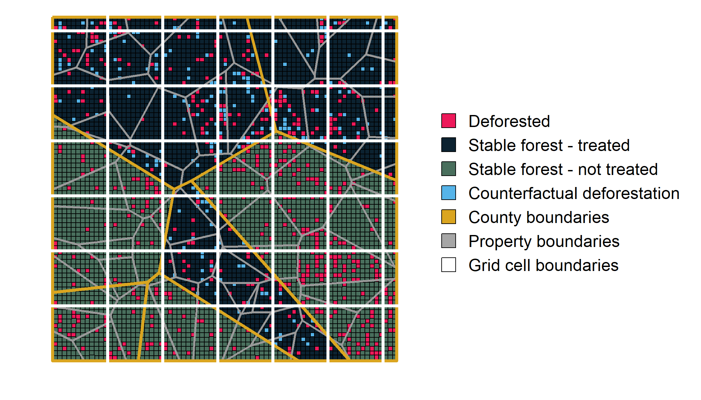

\sectionfont{\fontsize{11}{11}\selectfont}
\subsectionfont{\fontsize{11}{11}\selectfont}


```{r setup, include=FALSE}
library(knitr)
library(ggplot2)
library(kableExtra)
library(tidyverse)
library(Metrics)
library(reshape2)
library(ggpubr)
library(grid)
library(gridExtra)
library(ggplot2)
library(scales)
library(data.table)

source(here::here('paper', 'schart.R'))


knitr::opts_chunk$set(echo = FALSE, warnings = FALSE, messages = FALSE, out.width="49%", fig.align = "center")

palette <- list("white" = "#FAFAFA",
                "light_grey" = "#d9d9d9",
                "dark" = "#0c2230",
                "red" = "#ed195a",
                "blue" = "#1c86ee",
                "dark_blue" = "#00008b",
                "green" = "#00ab5b",
                "dark_green" = "#496F5D",
                "gold" = "#DAA520",
                "purple" = "#880ED4")
```

# Abstract {-}

The application of quasiexperimental impact evaluation to remotely sensed measures of deforestation has yielded important evidence detailing the effectiveness of conservation policies. However, researchers have paid insufficient attention to the binary and nonrepeatable structure of most deforestation datasets. Using analytical proofs and simulations, we demonstrate that many commonly employed econometric models are biased when applied to binary and nonrepeatable outcomes. The significance, magnitude and even direction of estimated effects from many studies are likely incorrect, threatening to undermine the evidence base that underpins conservation policy adoption and design. To address these concerns, we provide guidance and new strategies for the design of panel econometric models that yield more reliable estimates of the impacts of forest conservation policies. 

# Introduction

<!-- 1-2 paragraphs motivation -->

Policymakers often need to understand the causal impacts of conservation interventions. Can payments for ecosystem services encourage lasting reforestation? Does the allocation of land rights slow deforestation? While randomized experiments are the gold standard for the identification of causal relationships [@edwards2020; @jayachandran2017], conservation often poses questions that are prohibitively expensive, unethical or impossible to pursue through experimentation. In such settings, a growing portfolio of statistical techniques enable researchers to draw causal conclusions using observational data [@larsen2019; @ferraro2014; @miteva2012]. Increasingly, these econometric approaches to impact evaluation are being used to disentangle the causal relationships that underpin conservation decisionmaking [@butsic2017; @baylis2016; @williams2020]. 

The proliferation of panel, impact evaluations of conservation interventions has been enabled, in large part, by the increasing prevalence of remotely sensed datasets detailing deforestation over time [@blackman2013; @jones2015]. Decades of remotely sensed images taken across the entirety of Earth's surface have yielded data that are well-suited for observational impact evaluations --- a scientist hoping to quantify the impacts of a conservation policy adopted decades ago can observe deforestation in treated and untreated units spanning both pre- and post-implementation periods [@jain2020]. Responding to this opportunity,  hundreds of studies have applied econometric techniques of impact evaluation to a single dataset, the Global Forest Change product produced by @hansen2013. However, this data product and others like it have a somewhat unusual structure in that they detail the first year in which a given pixel was deforested and, importantly, do not detect repeated deforestation events in the same location. As a result, empirical researchers are left with data describing deforestation as a binary and nonrepeatable process.

<!-- 1 paragraph research question -->

In this paper, we investigate whether the binary, nonrepeatable data structure that characterizes many deforestation studies affects the performance of common panel econometric methods including difference-in-differences (DID), two-way fixed effects (TWFE) and survival models. We use a combination of analytical proofs and Monte Carlo simulations to demonstrate that many prior econometric analyses of deforestation are likely biased --- the significance, magnitude and even direction of estimated effects might be incorrect. While we focus primarily upon impact evaluation of forest conservation policies, our findings are relevant to the broader set of research contexts in which the outcome of interest represents a binary, nonrepeatable event, including recidivism [@agan_minimum_2018; @mastrobuoni], individual mortality [@li_exposure_2022; @friedman2013; @dolan_bednet_2019], technology adoption [@bogart_party_2018; @bollinger_visibility_2022], retirement [@brown2012; @bloemen2017], and employee retention [@bueno_retention_2018; @feng_incentives_2018]. 

<!-- 3-4 paragraphs detailed findings -->
One of our core results shows that TWFE regressions with individual unit fixed effects do not identify the desired treatment effect when applied to panel datasets with binary, nonrepeatable outcomes. In more traditional data settings, the DID estimator is numerically equivalent to the linear TWFE estimator in the case of two-periods (each of which can consist of multiple years) and two-groups [@imai_kim_2021; @goodman-bacon2021]. However we demonstrate that, when applied to binary, nonrepeatable panel data, the TWFE estimator is distinct from the standard DID estimator. Specifically, the coefficient of interest in TWFE specifications does not recover the $ATT$, but instead recovers an ex-post difference in deforestation rates between treatment and control areas. This is particularly worrisome in the context of forest conservation, where interventions often target areas with high deforestation rates (e.g., Brazil's blacklisted Priority Municipalities) or low opportunity costs (e.g., protected areas). Papers published in both conservation science and economics journals frequently use this problematic specification to recover treatment effect estimates. We further show that this concern extends to many recently developed DID estimators that estimate treatment effects in staggered adoption settings [e.g., @sun_dynamic_2021; @gardner2021; @borusyak2021]. 

To help guide future impact evaluations, we identify multiple ways in which this bias can be reduced or even eliminated. In the land use context, one easily implemented solution is to aggregate the binary pixels spatially. Both pixel-level TWFE specifications with spatially aggregated unit fixed effects and TWFE specifications with spatially aggregated units of analysis recover the true treatment effect. Another potential solution is for researchers to adopt non-linear survival models that explicitly account for the nonrepeatable nature of the outcome variable. However, we show that prior efforts to use survival models in DID research designs require identifying assumptions that would violate the traditional linear parallel trends assumption. In response, we develop and test a new survival-based DID estimator that relies on the more traditional linear parallel trends assumption. 

Finally, we reflect on the econometric benefits that emerge when researchers are able to incorporate institutional knowledge into their analyses by aligning their model structure with the relevant scale of decisionmaking. For example, in settings where individual landowners may have strong, heterogeneous preferences affecting land-use change, we show that incorporating property-level fixed effects can reduce bias and improve statistical coverage over alternate model structures.

<!-- 1-3 paragraphs contribution to literature -->
Our conclusions yield important insights for the community of environmental economists, conservation scientists, and policymakers that wish to understand the causal impacts of conservation policies. Causal impact evaluation in nature conservation has emerged relatively recently [@borner_effectiveness_2020], and multiple papers have called for improved rigor in this space [@ferraro2019; @baylis2016; @miteva2012]. In this paper, we identify key challenges associated with the estimation of panel econometric models using popular deforestation datasets. Although recent studies in the forest conservation literature have begun to adopt alternative DID estimators that are robust to general treatment effect heterogeneity [e.g., @rico-straffon_2023], we demonstrate that these methods are not immune to the lessons identified in this paper.  We also build on prior work by @avelino2016, showing the benefits that can emerge when matching analyses to the scale at which heterogeneity operates in the context of inherently spatial processes such as land use change. Ultimately, our analyses raise potential concerns about the conclusions in many past studies, while providing researchers with practical guidance to improve the reliability of future analyses. 

Our research also contributes to an emerging literature proposing methodological improvements for the integration of remotely sensed data with econometric methods of causal inference. Review studies have identified the need for social scientists to better understand the structure and limitations of remotely sensed data products [@jain2020; @donaldson_view_2016]. Several studies have begun to document measurement error in satellite-based measurements and explore its implications for econometric analysis [@proctor_parameter_2023; @gibson_lights_2021]. This includes work specific to the forest conservation context. For example, @alix-garcia_remotely_2022 address misclassification in the context of a remotely sensed binary forest cover outcome and propose a solution for unbiased causal inference. @torchiana_improving_2022 present a hidden Markov model that corrects for misclassification bias in land use change settings. Our paper implicitly assumes away issues of mismeasurement but illustrates that, even in settings without non-classical measurement error, the underlying structure and limitations of remotely sensed, deforestation data products may still lead researchers to recover biased treatment effect estimates.

<!-- Roadmap -->

The remainder of the paper proceeds as follows. In Section \@ref(setup), we introduce our empirical context, focusing on the nonrepeatability inherent to forest conservation impact evaluation. We also discuss common panel econometric approaches used in the conservation literature and in other fields that often encounter binary, nonrepeatable outcome data. Section \@ref(methods) describes the setup for our analytical proofs and the Monte Carlo simulations we use to evaluate candidate econometric approaches in the context of a simulated conservation intervention. In Section \@ref(results-analytical), we present the results of our analytical proofs, including the derivation of the \textit{nonrepeatable outcome, unit fixed effects bias} associated with TWFE models incorporating nonrepeatable, binary unit fixed effects and the non-random sample selection that may stem from nonrepeatability inherent to these settings. We also introduce our newly developed survival estimator. Next, in Section \@ref(results-simulation), we present results from our Monte Carlo simulations that illustrate the biases mentioned previously along with proposed solutions. We then explore the advantages to matching analyses to the scale of the decisionmaking unit and discuss the interpretation of coefficients from analyses incorporating area weighting. Additionally, we simulate an intervention with staggered adoption to show that many recently developed DID estimators fail to recover the expected treatment effect parameter when pixels are used as the unit of analysis, similar to TWFE regressions with irreversible, binary unit fixed effects. Finally, Section \@ref(conclusion) concludes. 

# Empirical context {#setup}

## Analysis setting

We focus on the case in which a researcher would like to quantify the impact an intervention has had on deforestation rates. We assume that the intervention has clearly defined boundaries (e.g., a protected area, certified concession, or indigenous territory), and that the researcher has access to spatially explicit observations of forest cover and forest loss spanning multiple years over the periods before and after the intervention was adopted. This general setting describes a broad array of studies that apply panel methods to remotely sensed data. Table \@ref(tab:table-lit) provides an unsystematic review of impact evaluations that apply panel econometric methods to remotely sensed data detailing the timing and location of deforestation.

In each of the studies detailed in Table \@ref(tab:table-lit), the researcher's goal is to measure the impact that a specific policy has had on deforestation within treated units, also known as the \textit{average treatment effect on the treated} ($ATT$). The $ATT$ estimates the difference between the average deforestation rate of treated units with treatment, and the average deforestation rate treated units would have experienced without treatment. The fundamental challenge is that the researcher is unable to observe what would have occurred in treated units had they not received treatment [@holland1986].

\renewcommand{\arraystretch}{1.5}
```{r table-lit}

lit_table <- read.csv("lit_table.csv")%>%#[,1:4]
  filter(Method != "matching")

kable(lit_table, format = "latex", row.names = FALSE,  booktabs = T,
      caption = "Example studies that measure conservation impacts by applying panel econometric methods to remotely sensed measures of deforestation.",
      col.names = c("Paper",
                    "Panel method",
                    "Unit of analysis",
                    "Unit FE level")) %>% 
  row_spec(0,bold=TRUE) %>% 
  kable_styling(font_size = 9.5, latex_options = c("striped", "HOLD_position"),
                #full_width = TRUE
                position = "center"
                )

```

To further define the $ATT$ in our research setting, we model deforestation $(y_{ivt})$ as a binary choice by a landowner to clear a small plot of land $i$ within their larger property $v$ in year $t$, where $t \in T$. The decision to deforest depends upon a latent variable $(y_{ivt}^*)$ that represents the monetary returns from the plot of land in its cleared state $(V_{ivt}^{cleared})$ relative to the returns from its forested state $(V_{ivt}^{uncleared})$, such that:

\begin{align}
 y^*_{ivt} = V^{cleared}_{ivt} - V^{uncleared}_{ivt} (\#eq:clearing)\\
 y_{ivt} = \begin{cases}
      1 &  \text{if $y^*_{ivt}>0$}\\
      0 &  \text{otherwise}
   \end{cases}
\end{align}

This generic clearing rule underpins a broad class of more specific static and dynamic models that have been used to explore the determinants of deforestation [e.g., @pfaff1999; @kerr2003; @pfaff2004].

However, this basic model makes an assumption that the decision to deforest is reversible and repeatable. In reality, a number of characteristics of both the process of deforestation, as well as the empirical reality of detecting deforestation in individual pixels, complicate this assumption. First, the goal of many conservation interventions is to prevent the loss of mature forests that may take decades, if not centuries, to regrow. In such cases, deforestation itself may be considered nonrepeatable in human time scales, focusing the researchers' attention upon the first instance in which a plot is deforested. Even when deforestation of secondary forests is an object of interest, constraints imposed by remote sensing methods and datasets often force empirical researchers to treat deforestation as an absorbing state. Gradual processes of reforestation are inherently harder to identify than abrupt losses of forest cover. As a result, commonly used deforestation datasets such as the Global Forest Change product generally only identify the first year in which a pixel was cleared [@hansen2013]. When converted to a panel dataset, deforestation must thus be treated as an absorbing state, meaning that once a pixel is deforested, it cannot revert to a forested state. Whether desired, or due to technical limitations, the resulting inability to observe repeated deforestation means that deforestation is, in effect, treated as a nonrepeatable process in the vast majority of conservation impact evaluations. 

To incorporate this nonrepeatability into our model, we denote $C_i$ as the first year in which $y^*_{ivt} > 0$. Importantly, observations of $i$ after $C_i$ provide no new information about the transition into an absorbing state [@farbmacher_linear_2023]. Similarly, $y_{ivt}$ cannot be observed when $t > C_i$. To reflect this limitation, we modify our binary deforestation outcome:

\begin{align}
 y^o_{ivt} = \begin{cases}
      1   & t = C_i  \\
      0   &  t < C_i \\
      - & t > C_i
   \end{cases}
\end{align}

Here, $-$ indicates that the outcome for pixel $i$ in time $t$ has been dropped from the panel in years where $t > C_i$. This practice is typical in empirical models of deforestation [@jones2015] and other nonrepeatable outcomes [@farbmacher_linear_2023]. A simple illustrative panel dataset with this structure can be seen in \@ref(example-panel). Although we use $y^o_{ivt}$ as the outcome variable of interest throughout much of this paper, \@ref(retain-pixels) documents complications in interpretation that emerge when researchers instead choose to retain units $i$ in years after they enter the absorbing state.

Our parameter of interest, the $ATT$, is the average effect of an intervention on treated pixels. Let $y_{ivt}(1)$ and $y_{ivt}(0)$ denote the potential outcomes of pixel $i$ in property $v$ in year $t$ with and without the treatment, respectively. In addition, let $t_0$ denote the first year in which the intervention of interest is implemented and let $D_i$ represent a dummy indicating whether pixel $i$ is ever treated. The $ATT$ can now be expressed as: 

\begin{align}
ATT = E[y_{ivt}(1) - y_{ivt}(0) |  t\geq t_0, D_i=1]
\end{align}

DID and TWFE methods have become popular tools to estimate this $ATT$ because the researcher does not need random assignment of treatment to generate convincing estimates of a program's impact on avoided deforestation. Instead, the researcher must make a parallel trends assumption, under which we evaluate each method. 

\textbf{Assumption 1:} (Parallel trends)
\begin{align*}
E[y_{ivt}(0) |  t\geq t_0, D_i=1]-E[y_{ivt}(0) |  t< t_0, D_i=1]=E[y_{ivt}(0) |  t\geq t_0, D_i=0]-E[y_{ivt}(0) |  t< t_0, D_i=0]
\end{align*}

Assumption 1 requires that pixels in treated and untreated areas would have experienced the same change in their probability of deforestation across the two periods had no intervention occurred. While fundamentally untestable, researchers can take steps to explore the plausibility of this assumption [@butsic2017; @roth_pretest_2022]. 

We also make the following stable unit treatment value assumption (SUTVA)

\textbf{Assumption 2:} (SUTVA)
\begin{align*}
\forall d \in \{ 0,1\}: \text{ if }D_i=d \text{ and }t\geq t_0, \text{ then }y_{ivt}(d)=y_{ivt}
\end{align*}

Assumption 2 requires that the potential outcomes for pixel $i$, $y_{it}(1)$ and $y_{it}(0)$, do not depend on the treatment status of any other pixel. There also cannot exist unobserved versions of treatment that may affect the potential outcomes. 

## Candidate empirical models

We present five empirical model specifications that we will evaluate and refer to throughout the remainder of the paper: (1) the traditional difference-in-differences model; (2) the individual, unit-level two-way fixed effects model; (3) the two-way fixed effects model with aggregated unit fixed effects; (4) the two-way fixed effects model with aggregated units of analysis; and (5) the Cox proportional hazards difference-in-differences model. These models have all been used in the forest conservation literature to estimate the $ATT$ of specific conservation interventions. While some approaches, such as the Cox proportional hazards model, are only beginning to emerge in the deforestation literature, they are popular in other areas of research that seek to estimate the impact of an intervention on the occurrence of nonrepeatable events.  

### Traditional difference-in-differences model 

Under the above two assumptions, a common approach to estimating the $ATT$ is the traditional DID regression:

\textbf{Regression 1:} (DID regression)
Let $\beta_{DID}$ denote the coefficient of the interaction between $D_{i}$ and an indicator for whether the intervention has been implemented in time $t$, $\mathbb{1} \{ t\geq t_0\}$,  in the following (population) OLS regression: 
\begin{align*}
y^o_{ivt} = \alpha_0 + \alpha_1 D_i + \alpha_2 \mathbb{1} \{ t\geq t_0\}+ \beta_{DID} \times D_i \mathbb{1} \{ t\geq t_0\}  + \epsilon_{ivt}
\end{align*}

Conceptually, the DID estimator calculates the treatment effect as the change in deforestation before and after treatment (first difference), differenced across treated and untreated observations (second difference) [@butsic2017]. 
\begin{align*}
\beta_{DID} = E[y^o_{ivt} |  t\geq t_0, D_i=1] - E[y^o_{ivt} |  t<t_0, D_i=1] - (E[y^o_{ivt} |  t\geq t_0, D_i=0] - E[y^o_{ivt} |  t<t_0, D_i=0] )
\end{align*}

When the $y^o_{ivt}$s are i.i.d. and Assumptions 1 and 2 hold, it is straightforward to show that
\begin{align*}
\beta_{DID}=ATT
\end{align*}

### Individual unit-level TWFE model 

Researchers often want to estimate the $ATT$ in a setting that does not fit the two-group, two-period case covered by the standard DID model. In such cases, TWFE regressions are frequently used to apply DID methods to multiple groups or treatment periods [@goodman-bacon2021]. This amounts to estimating a regression that includes individual unit and time fixed effects to control for unobservable confounding variables that vary across units or through time. 

\textbf{Regression 2:} (Individual unit TWFE regression)
Let $\beta_{TWFE}$ denote the coefficient of the interaction between $D_{i}$ and $\mathbb{1} \{ t\geq t_0\}$  in the following (population) OLS regression: 
\begin{align*}
y^o_{ivt} =  \beta_{TWFE} \text{ x } D_i \mathbb{1} \{ t\geq t_0\} + \lambda_t + \gamma_i + \epsilon_{ivt}
\end{align*}
Here $\lambda_t$ and $\gamma_i$ represent the year and individual unit fixed effects, respectively. In the context of forest conservation, the individual unit $i$ represents the pixel. 

In the case of two groups and two time periods, the TWFE regression typically yields an estimate of the $ATT$ that is numerically equivalent to the estimate generated by the DID model [@wooldridge2010; @imai_kim_2021]. With this in mind, many researchers have used the TWFE model as a "generalized DID" that can be estimated not only in the 2x2 case, but also in settings where different units are exposed to treatment in more than two distinct time periods (Table \@ref(tab:table-lit)). For example, a researcher may use a TWFE regression model to examine the effectiveness of a network of protected areas where the protected areas were created at different times, or a payment for ecosystem services (PES) program that enrolled properties in annual cohorts. 

### TWFE model with aggregated unit fixed effects 

Rather than relying upon individual fixed effects, some researchers have included fixed effects that aggregate over multiple individual units. In the forest conservation context, aggregation is generally done spatially, aggregating pixels into larger units. For example, researchers using pixel-level TWFE regressions have used unit fixed effects at the level of larger administrative units such as the county [e.g., @blackman2015] or municipality [e.g., @heilmayr2020]. Regression 3 outlines the form of these individual unit-level TWFE models with aggregated unit fixed effects.

\textbf{Regression 3:} (Individual unit-level TWFE regression with aggregated unit fixed effects)
Let $\beta_{FE,j}$ denote the coefficient of the interaction between $D_{i}$ and $\mathbb{1} \{ t\geq t_0\}$  in the following (population) OLS regression:
\begin{align*}
y^o_{ivt} =  \beta_{FE,j} \text{ x } D_i \mathbb{1} \{ t\geq t_0\} + \lambda_t + \gamma_j + \epsilon_{ivt}
\end{align*}
, where $\gamma_j$ now denotes fixed effects at the level of an aggregated unit. If $j$ differs from the level of treatment assignment, one must also include a treatment group indicator or fixed effects at the level of the unit at which treatment is assigned. 

### TWFE model with aggregated units of analysis 

In addition to aggregating fixed effects, researchers can also transform their data by aggregating multiple pixel-level observations into larger units of analysis. For example, in the conservation case, researchers have often run a TWFE regression where the unit of analysis itself is the grid cell [e.g., @rico-straffon_2023], property [e.g., @heilmayr2016], or larger administrative unit [e.g., @sims2017]. 

\textbf{Regression 4:} (TWFE regression with aggregated unit of analysis)
Let $\beta_{j}$ denote the coefficient of the interaction between $D_{j}$ and $\mathbb{1} \{ t\geq t_0\}$  in the following (population) OLS regression:
\begin{align*}
z_{jt} =  \beta_{j} \text{ x } D_j \mathbb{1} \{ t\geq t_0\} + \lambda_t + \gamma_j + \epsilon_{jt}
\end{align*}
Regression 4 differs from Regression 3 in both the treatment variable, $D_j$ and the outcome variable, $z_{jt}$. The treatment variable $D_j = \frac{1}{N_j}\sum_{i=1}^{N_j}D_i$, is the average treatment value amongst all pixels in unit $j$. If treatment is assigned at the level of $j$, $D_j=1$. 

The outcome variable, $z_{jt}$, denotes the event rate within unit $j$ in period $t$. Arguably the most commonly used formula for $z_{jt}$ in the deforestation literature is the deforestation rate calculated using the forested share of unit $j$ in period $t$ and its single-period lag $t-1$ [e.g. @carlson2018; @busch2015]:
\begin{align} 
z_{jt} &= \frac{F_{j,t-1} - F_{j,t}}{F_{j,t-1}} (\#eq:deforrate)
\end{align}
, where $F_{j,t}$ and $F_{j,t-1}$ are area of forest cover within unit $j$ at times $t$ and $t-1$, respectively. Although we use this definition of $z_{jt}$ throughout the rest of the main text, we explore the relative merits and performance of alternative formulas for calculating deforestation rates in Section \@ref(rate-formula).

### Cox proportional hazards DID model

Survival analysis has emerged as a common approach to modelling the length of time until the occurrence of a nonrepeatable event [@emmert-streib_survival_2019]. Such survival models, including the Cox proportional hazards model, are frequently used to model events such as mortality [e.g., @puterman_predicting_2020] and recidivism [e.g., @luallen_recidivism_2018], but can also be applied to deforestation contexts. In the case of deforestation, survival analyses can be used to explore how policy adoption changes the duration that treated, forested pixels survive until they are first cleared. 

Despite the theoretical appeal of using survival models to study deforestation, they are still relatively uncommon in conservation impact evaluation. One emerging approach introduces the intuition of a difference-in-differences research design into a Cox Proportional Hazards model [e.g., @heilmayr2020; @sales2022]. Specifically, researchers estimate a Cox proportional hazards model of the following general form [e.g., @mastrobuoni]:

\textbf{Regression 5:} (Cox DID regression)
Let $\beta_{coxDID}$ denote the coefficient of the interaction between $D_{i}$ and $\mathbb{1} \{ t\geq t_0\}$  in the following Cox-proportional hazards regression:
\begin{align*}
h(t) = \delta_0(t)exp( \alpha_0 + \alpha_1 D_i + \alpha_2 \mathbb{1} \{ t\geq t_0\}+ \beta_{coxDID} \text{ x } D_i \mathbb{1} \{ t\geq t_0\}  + \epsilon_{it})
\end{align*}

, where $h(t)$ is the hazard rate of deforestation, $t$ years into the study period; and $\delta_0(t)$ is the baseline hazard function.

# Methods {#methods}

## Analytical proofs 

The rapid growth of the conservation impact evaluation literature has resulted in a diversity of model structures that all attempt to estimate the effectiveness of conservation interventions (Table \@ref(tab:table-lit)). However, researchers have not adequately considered how the nonrepeatable structure of these data may affect the properties of some estimators. We use analytical proofs to demonstrate several concerns that arise with the use of specific model specifications in this context. All of our analytical results apply not only to forest conservation, but to any setting with a nonrepeatable outcome. 

For our analytical results, we restrict ourselves to the case where $t\in \{1,2\}$ and $t_0 = 2$. We can then denote $y^0_{iv1}$ and $y^0_{iv2}$ as the outcomes for individual unit $i$ in the first and second periods, respectively. In this setting, $y^0_{iv1} \in \{0, 1\}$ and $y^0_{iv2} \in \{0, 1, -\}$, meaning that although only outcomes in the second period are dropped, there exists variation in deforestation across both periods. We present the core analytical results in the main text, and the detailed proofs can be found in \@ref(analytical-pf).

## Simulation models

To validate our analytical results and explore the relative performance of different models frequently used in conservation impact evaluation, we employ a series of Monte Carlo simulations. Specifically, we randomly generate synthetic landscapes with known policy effectiveness and analyze the performance of different econometric models in estimating the policy's known impact.

### Landscape configuration

```{r res-input}

# nobs in counterfactual landscape map
fig_nobs = 75^2

# Monte Carlo simulation parameters
nobs = 150^2
ppoints = 225
cpoints = 25
avg_parea = nobs/ppoints
avg_carea = nobs/cpoints
cellsize_med = 10
cellsize_large = 30

# property: 100 pixels | 100 x 30^2 = 90000 m^2 = 9 ha
p_ha = avg_parea * 30^2 / 10000
c_ha = avg_carea * 30^2 / 10000

# unit | grid cell resolution (m) | area (ha) | comparable use in literature

resolution_df <- data.frame(
  "unit" = c("Property", "County", "Large grid", "Small grid"),
  "avg_pix" = c(avg_parea, avg_carea, cellsize_large^2, cellsize_med^2),
  "structure" = c("Thiessen polygons", "Thiessen polygons", "Uniform square", "Uniform square")
) %>%
  mutate(area_ha = avg_pix * 30^2 / 10000) %>% 
  select(unit, structure, avg_pix, area_ha)

fig_nobs = 75^2
analysis_to_fig_ratio = nobs/fig_nobs

analysis_km2 <- nobs * 0.0009

```

```{r counterfactual, echo=FALSE, fig.cap="A map of a simulated landscape depicting patterns of deforestation under an effective conservation intervention, as well as counterfactual deforestation illustrating what would have happened in the absence of the intervention.", out.width = "100%"}


```

Figure \@ref(fig:counterfactual) displays a simulated conservation intervention that reduced deforestation rates in treated areas. The landscape depicts both what is observed by the researcher at the end of the study period, as well as the unobservable counterfactual of what would have happened if the conservation intervention had not been adopted. Note that in untreated areas, there is no counterfactual deforestation, since no intervention ever took place. We begin each Monte Carlo simulation by creating a synthetic landscape consisting of `r sqrt(nobs)` rows and `r sqrt(nobs)` columns of square pixels (22,500 total pixels), equivalent to a raster that is `r analysis_to_fig_ratio` times larger than what is illustrated in Figure \@ref(fig:counterfactual). We assume that each pixel has a resolution of 30 meters, comparable to the resolution of many Landsat-based, remote sensing analyses. The landscape thus represents an area of approximately `r analysis_km2` $km^2$. We then divide this landscape into a variety of spatial units, composed of either uniform aggregations of pixels (i.e. large or small "grid cells"), or randomly spaced Thiessen polygons (i.e. "counties" or "properties"). Grid cells are intended to represent arbitrary units of spatial aggregation imposed by the researcher. In contrast, counties and properties are intended to represent simulated administrative units over which policy or land use decisions are made. Table \@ref(tab:res) summarizes the relative scale of each of these spatial units under our baseline specifications.

```{r res}
kable(resolution_df, format = "latex", row.names = FALSE,  booktabs = T,
       caption = "Spatial unit structure and size",
       col.names = NULL) %>%
  add_header_above(c("Spatial unit"=1, "Spatial structure"=1, "Avg. number of pixels"=1, "Area (hectares)"=1), escape = TRUE, line =TRUE, bold = TRUE)%>%
  kable_styling(font_size = 9.5, latex_options = c("HOLD_position", "striped"),
                position = "center")

```

### Data generating process

Each of our simulated landscapes consists of administrative units that are either untreated $(D_i=0)$ or are assigned to a conservation treatment $(D_i=1)$. We observe deforestation in two even-length periods, each of which consists of multiple years.

We follow Equation \@ref(eq:clearing) and model these binary deforestation events as a function of each pixel's unobservable value along the continous, latent variable ($y^*_{ivt}$) indicating the return to clearing pixel $i$, in property $v$, in year $t$. 
\begin{align*}
y^*_{ivt} = & V^{cleared}_{ivt} - V^{uncleared}_{ivt}\\
=&\beta_0 + \beta_1 D_i +
 \beta_{2,0} (1 -  D_i ) \mathbbm{1}\{  t \geq t_0  \} +(\beta_{2,1} + \beta_3 )D_i \mathbbm{1}\{  t \geq t_0  \} +
 \alpha_i + u_{it} + \rho_{v}
\end{align*}

That is, the returns to deforestation evolve over the two time periods $(\mathbbm{1}\{  t \geq t_0  \})$, and differ across the control $(  D_i = 0 )$ and treated pixels $(  D_i = 1 )$. In addition, we assume that the value of deforestation is influenced by time-invariant random disturbances at the scale of individual pixels ($\alpha_i \sim N(0, \sigma_a^2)$) or properties ($\rho_v \sim N(0, \sigma_p^2)$), as well as time-varying, pixel-scale disturbances ($u_{it} \sim N(0, \sigma_u^2)$). These disturbances can represent a variety of spatial and temporal processes including, for example, the biophysical characteristics of a location, or the preferences of a property owner.

The potential outcomes for the latent variable, $y^*_{ivt}$, are as follows: 
\begin{align}
y^*_{ivt}(0) =&\beta_0 + \beta_1 D_i +
 \beta_{2,0} (1 -  D_i ) \mathbbm{1}\{  t \geq t_0  \} + \beta_{2,1} D_i \mathbbm{1}\{  t \geq t_0  \} +
 \alpha_i + u_{it} + \rho_{v}
\end{align}

and 

\begin{align}
y^*_{ivt}(1) =&\beta_0 + \beta_1 +\beta_{2,1} + \beta_3 +
 \alpha_i + u_{it} + \rho_{v}
\end{align}

The $ATT$ in our simulated setting is, therefore, defined as:

\begin{align}
ATT =& P(y^*_{ivt}(1) > 0 | D_i = 1, t \geq t_0) - P(y^*_{ivt}(0) > 0 | D_i = 1, t \geq t_0) \notag \\
=& P(\beta_0 + \beta_1 + \beta_{2,1} + \beta_3 + \alpha_i + u_{it} + \rho_{v} > 0) - P(\beta_0 + \beta_1 + \beta_{2,1} + \alpha_i + u_{it} + \rho_{v} > 0)
\end{align}

### Assumed parameter values and evaluation criteria

For the remainder of the paper, we explore a guiding example that has been parameterized to represent an impactful intervention in a high deforestation setting. Conservation interventions often have annual treatment effects smaller than a 1 percentage point reduction in the annual deforestation rate [e.g. @robalino2013; @jones2017]. These modest reductions in the annual deforestation rate, however, can amount to large landscape-scale effects. For example, @alix-garcia2018 find that environmental land registration in Brazil’s Amazonian states of Mato Grosso and Para reduced the annual deforestation rate by an average of 0.5 percentage points, which has resulted in an overall reduction in deforestation of 10\%. 

Our initial simulated landscape has the following characteristics: 6 years in each of the pre-treatment and post-treatment periods ($T = 12$, $t_0 = 7$); a pre-treatment deforestation rate of 2\% in the control area; a pre-treatment deforestation rate of 5\% in the intervention area; a decrease in the deforestation rate of 0.5 percentage points between the first and second period in the absence of treatment; and an average reduction of 1 percentage point in the deforestation rate in treated units due to the intervention ($ATT = -0.01$). We assume that $\sigma_u = 0.5$. Finally, we begin by assuming away time invariant pixel ($\sigma_a = 0$) and property-level disturbances ($\sigma_p = 0$) but relax this assumption in Section \@ref(results-simulation-spatial). Note that Assumptions 1 and 2 are satisfied by construction. The derivations detailing the mapping from the landscape characteristics to the corresponding parameters in $y^*_{ivt}$ can be found in \@ref(parameter-mapping). 

We compare econometric models using a combination of estimate bias, root mean squared error (RMSE), and coverage probability based on 500 replications of each set of parameters. Using our Monte Carlo simulations, we calculate estimate bias as the difference between each model's mean estimate of the $ATT$ and the known $ATT$ parameter. RMSE describes the distribution of estimates around the $ATT$. Coverage probability is defined as the proportion of simulations in which the true $ATT$ lies within the simulation's 95\% confidence interval (CI). As such, we would expect the $ATT$ to lie within this CI 95\% of the time. Factors such as bias and treatment of standard errors impact coverage.


# Analytical results {#results-analytical}
Here we use analytical proofs to explore the properties of econometric models of nonrepeatable events in the simple two-group, two-period setting. First, in Section \@ref(results-analytical-twfe), we prove that TWFE models with pixel-level fixed effects (Regression 2) do not estimate the $ATT$. In contrast, a more traditional DID (Regression 1) does recover an unbiased estimate of the $ATT$. Then, in Section \@ref(results-analytical-survival), we explore how survival models can be used to generate unbiased estimates of a treatment effect in a difference-in-differences research design.  Finally, in Section \@ref(results-analytical-selection) we demonstrate that the occurrence of nonrepeatable events can generate additional sample selection bias if the distribution of clearing risk differs across groups over time among at-risk units.


## TWFE with nonrepeatable outcomes yields biased estimate of $ATT$ {#results-analytical-twfe}

Despite widespread use of pixel-level analyses of deforestation, the application of TWFE models to a nonrepeatable process yields a biased estimate of the $ATT$. Specifically, we show that the coefficient of interest from the individual unit-level TWFE model $(\beta_{TWFE})$ estimates the post-treatment difference in outcomes (single difference), rather than the desired $ATT$. 

\textbf{Result 1:} (Nonrepeatable outcome, unit FE bias)
\begin{equation} \label{eq:twfe-bias-eqn}
\beta_{TWFE} = ATT + \underbrace{E[y_{iv1}(0) | D_i=1] - E[y_{iv1}(0) | D_i=0]}_{\text{pre-treatment difference in deforestation rates}}
\end{equation}

Regression 2 thus forgoes the benefits that panel methods provide, failing to properly control for time-invariant differences in treated and control units. If the treated area has a different baseline deforestation rate than the control, Regression 2 will generate a biased estimate of the intervention's impact. Many conservation interventions are specifically targeted toward locations with either low opportunity costs for conservation or high threats of conversion. As a result, it is likely that many conservation impact evaluations will have treatment and control units that experienced different pre-treatment deforestation rates. It is important to note that this bias could even lead to changes in the estimated treatment effect's sign, in addition to errors in the effect's magnitude and significance. 

This result stems from the fact that inclusion of individual unit fixed effects becomes meaningless, because the nonrepeatable event only occurs once. By including individual unit fixed effects in TWFE regressions, researchers hope to control for local confounders, including pre-treatment differences in the outcome. However, when following common guidance to drop observations in the periods after the nonrepeatable event is first realized, these fixed effects do not behave as the researcher expects. Observations that realize the nonrepeatable event (i.e., are deforested) in years prior to treatment are, by definition, not observed post-treatment. As a result, all pixels that contribute to the estimates of post-treatment effects must have a common pre-treatment outcome of 0, leaving $\hat{\beta}_{TWFE}$ simply to estimate the ex-post difference in means between treatment and control units:

\begin{align*}
\hat{\beta}_{TWFE} &= \frac{1}{n_{i:D_i=1}}\sum_{i:D_i=1} y^o_{iv2} - \frac{1}{n_{i:D_i=0}}\sum_{i:D_i=0} y^o_{iv2} 
\end{align*}
, which extends to Result 1 under Assumptions 1 and 2. 

In the context of nonrepeatable outcomes, $\beta_{TWFE}$ is distinct from $\beta_{DID}$, even in the 2x2 case. Section \@ref(results-simulation) corroborates this fact and Result 1 through simulations. The traditional DID does not suffer from the \textit{nonrepeatable outcome, unit fixed effects bias} in the context of forest conservation. In addition, we show in Section \@ref(TWFE-equivalence) that $\hat{\beta}_{TWFE}$ is equivalent to the coefficient from a TWFE regression on a dataset where any pixel deforested in years prior to treatment is completely excluded from the dataset, demonstrating further that no pre-treatment variation in deforestation is used to identify the $ATT$ at all. 

## Survival analysis {#results-analytical-survival}

### Hazard rate ratios from a single survival model do not estimate the $ATT$ under parallel trends {#cox-bias}

Multiple studies across a wide variety of settings have interpreted the exponentiatated coefficient, $exp(\beta_{coxDID})$, as a hazard ratio that describes the causal impact that treatment has had on the relative likelihood of survival. Specifically, many researchers expect this hazard ratio to represent the ratio of the hazard rates in the treatment group post-treatment, relative to the counterfactual in that group had treatment not occurred. This desired hazard ratio measuring the relative impact of treatment on the treated, which we denote as the $HRTT$, can be considered a reframing of the traditional $ATT$ as a ratio rather than a difference: 

$$ HRTT = \frac{E[y_{iv2}(1)  | D_i=1]} {E[y_{iv2}(0)  | D_i=1]}$$

Both in conservation and alternative settings, several studies using Regression 5 assess the plausibility of Assumption 1 [e.g., @li_exposure_2022; @mastrobuoni; @bueno_retention_2018] in order to motivate causal interpretation of $exp(\beta_{coxDID})$. However, \@ref(proportional-trends) shows that $exp(\beta_{coxDID})$ only identifies the $HRTT$ under an alternative assumption:

\textbf{Assumption 3:} (Proportional trends)
\begin{align*}
\frac{E[y_{iv2}(0) |D_i=1]}{E[y_{iv1}(0) |  D_i=1]}=\frac{E[y_{iv2}(0) | D_i=0]}{E[y_{iv1}(0) | D_i=0]}
\end{align*}

Assumption 3 requires that pixels in treated and untreated areas would have experienced the same ratio of change in their probability of deforestation across the two periods had no intervention occurred. Note that Assumption 1 and Assumption 3 cannot simultaneously hold (unless there is no trend at all). This means that researchers estimating Regression 3 under the traditional parallel trends assumption (Assumption 1) will not recover the $HRTT$, the relevant treatment effect parameter.

### Proposing a new survival analysis-based estimator of the $ATT$

To the best of our knowledge, no prior studies have successfully combined the Cox Proportional Hazards model and the difference-in-differences research design to recover an unbiased estimate of the $ATT$ under the traditional parallel trends assumption (Assumption 1). Here we outline a new estimation approach that first recovers an unbiased estimate of the $HRTT$ and then translates this into an estimate of the $ATT$ that holds under Assumption 1. First, we note that the desired $HRTT$ can be re-written as a combination of three different hazard ratios: 

\begin{align}
HR_1 &= \frac{E[y_{iv2}(1)  | D_i=1]} {E[y_{iv1}(0)  |  D_i=1]}\\
HR_2 &= \frac{E[y_{iv2}(1)  | D_i=1]} {E[y_{iv2}(0)  |  D_i=0]}\\
HR_3 &= \frac{E[y_{iv2}(0)  | D_i=0]} {E[y_{iv1}(0)  |  D_i=0]}
\end{align}

\begin{align}
HRTT = \frac{E[y_{iv2}(1)  |  D_i=1]} {E[y_{iv2}(0)  | D_i=1]} = \frac{1}{1/{HR_1} + 1/HR_2 - 1/(HR_2*HR_3)}
\end{align}

Each of the three hazard ratios, $HR_1$, $HR_2$, and $HR_3$, can be estimated through separate Cox Proportional Hazards models estimated on subsets of the larger dataset. Specifically:

* $HR_1 = exp( \alpha )$, where $\alpha$ is estimated by subsetting to observations from the treated group $(D_i = 1)$, and estimating the hazard rate of deforestation at time $t$ as $h(t) =\lambda_0(t) exp(\alpha 1\{ t \geq t_0\} )$;

* $HR_2 = exp( \beta )$, where $\beta$ is estimated by subsetting to observations from the post-treatment period $(t \geq t_0)$, and estimating the hazard rate of deforestation at time $t$ as $h(t) =\gamma_0(t) exp( \beta 1\{ D_i = 1\} )$; and

* $HR_3 = exp( \delta )$, where $\delta$ is estimated by subsetting to observations from the untreated group $(D_i = 0)$, and estimating the hazard rate of deforestation at time $t$ as $h(t) =\psi_0(t) exp(\delta 1\{ t \geq t_0\} )$.

Because the numerator of $HRTT$, $E[y_{iv2}(1)  |  D_i=1]$, can be estimated as the mean of post-treatment deforestation rates in the treated group (denoted $\widehat{defor}_{D_i:1, t\geq t_0}$), we can estimate the $ATT$ using this estimated deforestation rate and our estimate of $HRTT$:

\begin{align}
\widehat{ATT}_{Cox} = \widehat{defor}_{D_i:1, t\geq t_0} - \frac{\widehat{defor}_{D_i:1, t\geq t_0} }{\widehat{HRTT}}
\end{align}

We have shown that the simple extension of the traditional DID to the survival setting only recovers an easily interpretable measure of a policy's impact under an assumption that cannot simultaneously hold with the traditional parallel trends assumption, the ``Proportional Trends" assumption. In contrast, our proposed estimator, which relies on separate estimation of relevant hazard ratios, does recover the relevant analog of the $ATT$ under the traditional parallel trends assumption (Assumption 1). We explore the performance of $\widehat{ATT}_{Cox}$ relative to the proposed OLS regressions under various circumstances likely to arise in the deforestation setting in the next sections. If a researcher opts to use survival analysis to recover an intervention's impact, their choice of estimator should depend on which trends assumption is plausible in their specific setting. 

## Non-random sample selection can generate bias in nonrepeatable settings {#results-analytical-selection}

Nonrepeatability in observed deforestation creates the potential for non-random sample selection. Specifically, deforested pixels are no longer at risk of clearing in the periods after they are first deforested. This means the "at risk" set of pixels changes through time as more pixels become deforested. As such, the distribution that describes the returns to clearing the at-risk pixels may change through time as well, leading to non-random selection of the sample through time. In the context of two-groups and two-periods, only the second period suffers from this non-random sample selection. We express the bias introduced from non-random sample selection below.

\textbf{Result:} Under Assumptions 1 and 2, in the two-group, two-period case, $\beta_{DID}$ suffers from non-random sample selection bias when the $y^o_{ivt}$s are not i.i.d.

\begin{align}
\beta_{DID} = & ATT +  \underbrace{E[y^o_{iv2}| D_i=1]-E[y_{iv2}| D_i=1] - (E[y^o_{iv2}| D_i=0]-E[y_{iv2}| D_i=0])}_\text{{bias emerging from non-random sample selection}} \label{eq:selection-bias-eqn}
\end{align}

\textbf{Proof:} Appendix \@ref(selection-proof) Q.E.D.


This bias is due to a difference between the expectation of the $y^o_{iv2}$s and $y_{iv2}$s. The terms containing $y^o_{iv2}$ are conditional on the pixel remaining forested after the first period. That is, $y^o_{iv2}$ is only observed when $y_{ivt} = 0$. If the $y^o_{ivt}$s are i.i.d., there is no selection bias since $E[y^o_{ivt}] = E[y_{ivt}]$. However, this may not be the case in reality. For example, pixels with extremely high returns to clearing are more likely to be cleared early in the panel. As a result, these high return pixels are less likely to be present in subsequent periods. Therefore, the distribution of the returns to clearing across the landscape may change between the first and second period. If this selection process differs across treatment and control groups, non-random sample selection will bias the researcher's estimate of $ATT$.


# Simulation results {#results-simulation}
In response to the analytical results presented in Section \@ref(results-analytical), we draw upon Monte Carlo simulations to guide researchers toward empirical specifications that effectively address common sources of bias. First, in Section \@ref(results-simulation-twfe), we use our simulation model to illustrate the \textit{nonrepeatable outcome, unit FE bias} in an empirical setting. Then, in Section \@ref(results-simulation-agg), we show that researchers can easily address this bias by aggregating fixed effects or units of observation. Alternatively, Section \@ref(results-simulation-survival) shows that our proposed survival analysis-based estimator can also yield unbiased estimates of the $ATT$. However, all of these estimators may still face some bias due to sample selection, which we illustrate in Section \@ref(results-simulation-selection). Next, in Section \@ref(results-simulation-spatial), we provide results guiding researchers toward the appropriate scale at which to aggregate their analyses. Finally, Section \@ref(multipleGT) extends our analysis to settings with staggered exposure to treatment.


## TWFE bias {#results-simulation-twfe}

Figure \@ref(fig:summary-fig) contrasts the results of the candidate models when applied to our simulated datasets. The figure's first column confirms the analytical result described in Section \@ref(results-analytical-twfe), and demonstrates that this \textit{nonrepeatable outcome, unit FE bias} persists in empirical contexts with more than two years. In our guiding empirical example, the pre-treatment single difference in deforestation rates is $0.03$, the post-treatment single difference is $0.01$, and the true $ATT$ is equal to $-0.01$. Consistent with our analytical results, Regression 2 yields an estimate of the $ATT$ whose bias is roughly equivalent to the pre-treatment difference in outcomes.

Figure \@ref(fig:summary-fig) further shows that the TWFE and DID estimators are not numerically equivalent. We examine this finding further in \@ref(TWFE-equivalence), showing that the coefficient of interest from Regression 2 is numerically equivalent to that from the same regression applied to a dataset in which all pixels deforested in the first period are excluded from the dataset completely (i.e., there is no deforestation in the dataset pre-treatment). This exercise highlights that the individual unit TWFE regression uses none of the pre-treatment variation in deforestation, which is core to DID approaches.

It is worth noting that many forest conservation impact evaluations pre-process their data through matching or weighting before applying panel econometric regressions [e.g. @heilmayr2016; @carlson2018]. Although we do not explicitly analyze such two-stage estimation strategies, our analytical and empirical results do provide some insights into their performance. Since pre-processing typically reduces pre-treatment differences in observable characteristics between treatment and control groups, weighting or matching is likely to reduce the bias detailed in Equation \@ref(eq:twfe-bias-eqn). This serves as a further example of how such doubly-robust estimators can reduce bias in contexts where a researcher has mis-specified their panel regression [@ho_matching_2007; @blackman2013; @santanna_doubly_2020]. Nevertheless, pre-processing is not guaranteed to perfectly balance pre-treatment outcomes across treatment and control observations [@jones2015]. Given a set matching strategy, researchers should attempt to model the second-stage outcome regression as accurately as possible. As a result, researchers should choose panel models that do not suffer from the \textit{nonrepeatable outcome, pixel FE bias}, even if they are pre-processing their data.

```{r summary-fig, echo = FALSE, warnings = FALSE, results = FALSE, message=FALSE, fig.cap="Comparison of candidate econometric model performance. Point illustrates mean bias while the confidence interval illustrates the 0.05 to 0.95 quantile range of this bias.",  fig.width = 9, fig.height = 12, out.width="100%"}

results_long <- readRDS("results/results_aggregation.rds") 

df_summary <- results_long %>%
  filter(is.na(notes),
         weights == 0 ,
         (grid.fe == 0 | gridsize == max(gridsize, na.rm = T)),
         (property.fe == 0 | se_county == 0)
  ) %>%
  mutate_at(vars(bias, cover), as.numeric
  )%>%
  mutate_at(vars(pixel, grid, property, county, pixel.fe, grid.fe, property.fe, county.fe, treatment.fe, cox, HE.estimator, se_pixel, se_grid, se_property, se_county), ~ as.logical(as.integer(.))
  )%>%
  group_by(pixel, grid, property, county, pixel.fe, grid.fe, property.fe, county.fe, treatment.fe, cox, HE.estimator, se_pixel, se_grid, se_property, se_county)%>%
  summarise(RMSE = rmse(bias, 0),
            q05 = quantile(bias, probs = .05),
            q95 = quantile(bias, probs = .95),
            Bias = mean(bias),
            cover = mean(cover))%>%
  select(Bias, everything())

df_summary <- rbind(df_summary[10,],
                    df_summary[5,], df_summary[7:9,],  df_summary[1:3,],
                    df_summary[6,], df_summary[4,])


labels <- list("Unit of analysis:" = c("pixel", "grid", "property", "county"),
               "Fixed effects:" = c("pixel FE", "grid FE", "property FE", "county FE", "treatment FE"),
               "Survival" = c("Cox PH model", "ATT-Cox estimator"),
               "SE structure:" = c("clustered at pixel", "clustered at grid", "clustered at property", "clustered at county"))

na_row <- setNames(data.frame(matrix(ncol = ncol(df_summary), nrow = 0)), colnames(df_summary))
na_row[1,] <- NA

select_results <- rbind(na_row, as.data.frame(df_summary), na_row)

coverage <- select_results$cover
c_print <- round(coverage, digits = 3)
c_print[is.na(c_print)] <- ""

RMSE <- select_results$RMSE
RMSE <- as.numeric(RMSE)
RMSE_print<- round(RMSE, digits = 4)
RMSE_print[is.na(RMSE_print)] <- ""

select_results <- as.data.frame(subset(select_results, select=-c(cover, RMSE)))

index.ci <- match(c("q05","q95"), names(select_results))

# One could also add information about model fit to this chart
topline = -0.007

midline = topline-0.004-.0025

ylim <- c(midline-.005,0.045)
#bottomline = (min(ylim)+topline)/2
#Create the plot

rmse_cex = 0.95
cov_cex = 1
leg_cex = 1

par(oma=c(1,0,1,1))

schart(select_results,labels, ylim = ylim, index.ci=index.ci, col.est = c(palette$dark, palette$red),
       bg.dot=c(palette$dark, "grey95", "white", palette$red),
       col.dot=c(palette$dark, "grey95", "white", palette$red),
       ylab="    Bias", highlight=c(2, 10)
       , heights = c(2.5,1)
       ,band.ref=c(-.05, .04)
       , axes = FALSE
       #, col.band.ref="#c7e9f9"
) # make some room at the bottom
Axis(side=2, at = c(-0.005, 0, 0.005, 0.02, 0.04), labels=TRUE)
abline(h=topline)
abline(h=midline)
#abline(h=bottomline)
lapply(1:(length(RMSE_print)), function(i) {
  # text(x= i, y=min(ylim)+.002, paste0(i), col="black", font=2, cex = 1)
  mtext(if(i<=10){paste0(i)}, side=1, at = i + 1, font=2, cex=.95)#, line=1, at=-1)
  text(x= i, y=midline+0.0015, paste0(RMSE_print[i]), col="black", font=1, cex=rmse_cex)
  text(x= i, y=min(ylim)+0.0008, paste0(c_print[i]), col="black", font=1, cex=cov_cex )
})
#segments(3.5, topline, x1 = 3.5, y1 = 0.048, lty = 2)
segments(6.5, topline, x1 = 6.5, y1 = 0.041, lty = 2)
segments(9.5, topline, x1 = 9.5, y1 = 0.041, lty = 2)
text(x=mean(1:nrow(select_results))
     , y=midline - 0.0015, "Coverage probability", col="black", font=2)
text(x=mean(1:nrow(select_results))
     , y=topline-.0018, "RMSE", col="black", font=2)
text(x=4.5 , y=0.0401, "Aggregated\nfixed effects", col=palette$dark, font=1)
text(x=7.9 , y=0.0401, "Aggregated unit\nof analysis", col=palette$dark, font=1)
text(x=10.5 , y=0.0401, "Survival\nmodels", col=palette$dark, font=1)
text(x=2
     , y=0.0315, "Pixel-level\nTWFE", col=palette$red, font=1, cex = 0.9)
text(x=3
     , y=-0.0045, "pixel-level\nDID", col=palette$dark, font=1, cex = 0.9)
legend(x=8.5, y=0.047, col = "black", legend = "0.05 to 0.95 quantile\nof bias distribution", seg.len=0.65, inset = 0.005,  box.lty=0, cex=leg_cex, lty = 1, lwd = 4, bg="transparent")

```

## Unbiased estimates from models with spatial aggregation {#results-simulation-agg}

In the two-group, two-period case, the traditional DID (Regression 1) is an unbiased estimator of the $ATT$, as shown in column 2 of Figure \@ref(fig:summary-fig) (The traditional DID is equivalent to including treatment fixed effects). However, this traditional DID is infeasible in research settings with more than two groups that are exposed to treatment over different periods of time. In such settings, alternate forms of aggregation may provide a useful way to avoid the \textit{nonrepeatable outcome, unit FE bias}. 

Columns 3-5 of Figure \@ref(fig:summary-fig) show the results from pixel-level regressions with fixed effects aggregated at either the grid cell, county or property-level (i.e. Regression 3). The parameter of interest from these regressions, $\beta_{FE,j}$, can yield unbiased estimates of the $ATT$. Although the outcome for an individual pixel, $i$ still cannot be observed in periods after $C_i$, there is meaningful information about deforestation rates within the aggregated spatial unit to which pixel $i$ belongs, both prior to and after it is deforested. Therefore, estimation with fixed effects at the level of an aggregated spatial unit does successfully account for time-invariant heterogeneity across such units. We also see that, in the absence of property-level perturbations (i.e. $\sigma_p=0$ in the DGP), all three models provide similar estimate distributions. 

Columns 6-8 show that regressions with more aggregated units of analysis (e.g. Regression 4) also yield unbiased estimates of the $ATT$. In these regressions, the outcome of interest is transformed from the individual binary occurrence of deforestation in pixel $i$ into the aggregated rate of deforestation occurring across a broader spatial unit $j$ in each time $t$. In our primary results this aggregate rate is calculated using Equation \@ref(eq:deforrate). Once again, we see that in the absence of property-level perturbations (i.e. $\sigma_p=0$ in the DGP), neither the bias nor RMSE of the estimates vary dramatically across different levels of aggregation. 

It is possible for both $\beta_{FE,j}$ and $\beta_j$ to suffer from bias similar to the \textit{nonrepeatable outcome, unit FE bias}. If an entire aggregated unit is deforested prior to the end of the panel, estimation will fail to account for that unit's pre-treatment outcomes. In practice, the bias is more likely to bleed into $\beta_{FE,j}$ or $\beta_j$ when the aggregated unit, $j$ has few pixels or when spatial autocorrelation is severe. Luckily, researchers can examine their dataset to determine whether this bias may be relevant.

## Survival analysis {#results-simulation-survival}

Survival analysis provides an appealing alternative to traditional linear estimators when studying nonrepeatable changes such as deforestation. The simple, single-regression DID framing of the Cox Proportional hazards model  (Regression 5), however, does not yield an unbiased estimate of the $ATT$ (Section \@ref(cox-bias)) under the typical parallel trends assumption (Assumption 1). Column 9 of Figure \@ref(fig:summary-fig) shows the bias associated with this model in our parameterization where the parallel trends assumption (Assumption 1) holds but the proportional trends assumption (Assumption 3) does not. In light this bias, we explore whether our proposed estimator, $\widehat{ATT_{Cox}}$, recovers relevant treatment effect parameters in the deforestation setting. We see in column 10 that $\widehat{ATT_{Cox}}$ does recover an unbiased estimate of the $ATT$.

The most crucial issue that survival analysis addresses is censoring [@turkson_handling_2021]. This occurs when the researcher has only partial information about a subject's survival time. Many common forms of censoring are rarely a concern in the context of deforestation since remote sensing typically enables the creation of large, balanced panels. Further, the proposed strategy to drop pixels in the periods after they are first deforested successfully addresses nonrepeatability in deforestation events.  

While the above factors make both the Cox DID regression and $\widehat{ATT}_{Cox}$ less appealing in the deforestation context, they may be of more utility in settings where researchers have traditionally been drawn to survival analysis for reasons beyond the binary nature of the outcome. Censoring that never arises in the deforestation context such as random, double, independent, or interval censoring may lead a researcher to demand a survival approach  [@turkson_handling_2021]. When comparing the Cox DID regression and $\widehat{ATT}_{Cox}$, the determination of a plausible trends assumption is key. If the traditional parallel trends assumption is plausible, $\beta_{coxDID}$ from Regression 5, will not identify the desired treatment effect parameter.

## Non-random sample selection {#results-simulation-selection}

We now explore how the non-random sample selection described in Section \@ref(results-analytical-selection) may influence estimates in our simulated landscapes. Non-random sample selection did not bias our initial simulations as presented in Figure \@ref(fig:summary-fig) because we assumed away time-invariant pixel and property-level disturbances. The sample of at risk pixels in each time period did not depend on the deforestation that occurred the previous period, since the $y^o_{ivt}$s were i.i.d.. However, once time-invariant disturbances enter the DGP, the distribution of the $y^o_{ivt}s$ is potentially different in each year of the panel. This is likely to be the case in reality, since each plot of land will have time-invariant characteristics that impact its expected returns to clearing such as market access or agricultural suitability. 

In order to see how this non-random selection influences estimates in our simulated setting, we set $\sigma_a$, the standard error of the time-invariant pixel-level disturbances equal to $0.1$. Figure \@ref(fig:selection-fig) shows that non-random selection introduces a slight downward bias across every specification.

In practice, researchers cannot recover the second and fourth terms of the bias term in Equation \@ref(eq:selection-bias-eqn), meaning that the magnitude of this bias is unknown to the researcher. However, this bias is likely to be of a smaller magnitude than in our simulated setting if deforestation rates are lower or more similar across treated and control groups.

```{r selection-fig, echo = FALSE, warnings = FALSE, results = FALSE, message=FALSE, fig.cap="Comparison of model performance in the presence of non-random sample selection. Candidate models are separated by whether they incorporate aggregated fixed effects in pixel-level specifications, aggregated units of analysis, or survival analysis. Point illustrates mean bias while the confidence interval illustrates the 0.05 to 0.95 quantile range of this bias.",  fig.width = 9, fig.height = 8, out.width="100%"}

specchart_long <- readRDS("results/results_selection.rds")


df_summary <- specchart_long %>%
  filter(is.na(notes),
         pixel.fe ==0,
         weights == 0 ,
         (grid.fe == 0 | gridsize == max(gridsize, na.rm = T)),
         (property.fe == 0 | se_county == 0)
  ) %>%
  mutate_at(vars(bias, cover), as.numeric
  )%>%
  mutate_at(vars(pixel, grid, property, county, pixel.fe, grid.fe, property.fe, county.fe, treatment.fe, cox, HE.estimator, se_pixel, se_grid, se_property, se_county), ~ as.logical(as.integer(.))
  )%>%
  group_by(pixel, grid, property, county, pixel.fe, grid.fe, property.fe, county.fe, treatment.fe, cox, HE.estimator, se_pixel, se_grid, se_property, se_county)%>%
  summarise(RMSE = rmse(bias, 0),
            q05 = quantile(bias, probs = .05),
            q95 = quantile(bias, probs = .95),
            Bias = mean(bias),
            cover = mean(cover))%>%
  select(Bias, everything())

df_summary <- rbind(df_summary[5,], df_summary[7:9,],  df_summary[1:3,],
                    df_summary[6,], df_summary[4,])


labels <- list("Unit of analysis:" = c("pixel", "grid", "property", "county"),
               "Fixed effects:" = c("pixel FE", "grid FE", "property FE", "county FE", "treatment FE"),
               "Survival" = c("Cox PH model", "ATT-Cox estimator"),
               "SE structure:" = c("clustered at pixel", "clustered at grid", "clustered at property", "clustered at county"))

na_row <- setNames(data.frame(matrix(ncol = ncol(df_summary), nrow = 0)), colnames(df_summary))
na_row[1,] <- NA

select_results <- rbind(na_row, as.data.frame(df_summary), na_row)


coverage <- select_results$cover
c_print <- round(coverage, digits = 3)
c_print[is.na(c_print)] <- ""

RMSE <- select_results$RMSE
RMSE <- as.numeric(RMSE)
RMSE_print<- round(RMSE, digits = 4)
RMSE_print[is.na(RMSE_print)] <- ""

select_results <- as.data.frame(subset(select_results, select=-c(cover, RMSE)))

index.ci <- match(c("q05","q95"), names(select_results))

# One could also add information about model fit to this chart
topline = -0.009

midline = topline-0.004-.0025

ylim <- c(midline-.005,0.012)
#bottomline = (min(ylim)+topline)/2
#Create the plot

rmse_cex = 1
cov_cex = 1.1
leg_cex = 1.2

par(oma=c(1,0,1,1))

schart(select_results,labels, ylim = ylim, index.ci=index.ci, col.est = c(palette$dark, palette$dark_blue),
       bg.dot=c(palette$dark, "grey95", "white", palette$dark_blue),
       col.dot=c(palette$dark, "grey95", "white", palette$dark_blue),
       ylab="    Bias"#, highlight=c(6,7,8)
       ,band.ref=c(-.05, .04)
       , axes = FALSE
       #, col.band.ref="#c7e9f9"
) # make some room at the bottom
Axis(side=2, at = c( 0, 0.01), labels=TRUE)
abline(h=topline)
abline(h=midline)
segments(8.5, topline, x1 = 8.5, y1 = 0.015, lty = 2)
segments(5.5, topline, x1 = 5.5, y1 = 0.015, lty = 2)
lapply(1:(length(RMSE_print)), function(i) {
  # text(x= i, y=min(ylim)+.002, paste0(i), col="black", font=2, cex = 1)
  mtext(if(i<10){paste0(i)}, side=1, at = i + 1, font=2, cex=.95)#, line=1, at=-1)
  text(x= i, y=midline+0.0015, paste0(RMSE_print[i]), col="black", font=1, cex=rmse_cex)
  text(x= i, y=min(ylim)+0.0008, paste0(c_print[i]), col="black", font=1, cex=cov_cex )
})
text(x=mean(1:nrow(select_results))
     , y=midline - 0.0015, "Coverage probability", col="black", font=2)
text(x=mean(1:nrow(select_results))
     , y=topline-.0018, "RMSE", col="black", font=2)
text(x=3.5 , y=0.0108, "Aggregated\nfixed effects", col=palette$dark, font=1)
text(x=6.9 , y=0.0108, "Aggregated unit\nof analysis", col=palette$dark, font=1)
text(x=9.7 , y=0.0108, "Survival\nmodels", col=palette$dark, font=1)

```

## Selecting the appropriate spatial structure {#results-simulation-spatial}

### Model structures that match the spatial process of deforestation can reduce bias

Connecting the econometric model to the process by which land use change occurs on the ground has clear benefits for estimation and inference in deforestation impact evaluation. Table \@ref(tab:table-lit) shows that researchers often use an arbitrary spatial unit such as a point, pixel, or grid cell as the unit of analysis. While this may be a useful way of structuring data, it can lead to biased results if land use change is determined through a process that is mediated by other spatial structures. In reality, a variety of underlying processes give rise to clear patterns of spatial autocorrelation in deforestation [@amin_neighborhood_2019]. 

One important source of spatial autocorrelation in land use is the spatial area over which landowners or other decisionmakers exert their influence. Property-level unobservables such as the preferences and resources of a landowner may drive significant variation in land use. If unaccounted for in an impact evaluation, these property-level differences might affect both bias and coverage of treatment effect estimates. 

To quantify the impact of property-level differences in the returns from forest clearing, we vary $\sigma_p$, the standard deviation of time-invariant property-level disturbances in the DGP. The introduction of these perturbations introduces positive spatial autocorrelation between pixels from a common property. As a result, pixels located within the same property share a common increased or decreased propensity to be cleared. 

The introduction of $\sigma_p$ changes the performance of standard econometric models. For example, the pixel-level DID (Regression 1) does not control for spatial autocorrelation in deforestation decisions. As property-level disturbances become larger, the pixel-level DID model's bias, RMSE, and coverage all deteriorate (Figure \@ref(fig:did-property)). 

```{r did-property, results = FALSE, message = FALSE, warning = FALSE, fig.align="center", fig.cap="Comparison of pixel-level DID performance as the relative scale of property-level disturbances ($\\sigma_p$) increases. Point illustrates mean bias while the confidence interval illustrates the 0.05 to 0.95 quantile range of this bias from the Monte Carlo simulations. Standard errors are clustered at the pixel.", fig.width = 10, fig.height = 7, out.width = "100%", fig.pos='H', fig.show='hold'}

results_full <- readRDS("results/results_full.rds")

full_summary <- results_full %>%
  filter(treatment.fe == 1 & se_pixel == 1 & is.na(notes) & cox == 0) %>%
  mutate_at(vars(bias, cover), as.numeric) %>%
  group_by(std_p) %>%
  summarise(Bias = mean(bias),
            cover = mean(cover),
            RMSE = rmse(bias, 0),
            q05 = quantile(bias, probs = .05),
            q95 = quantile(bias, probs = .95)) %>%
  mutate(s0 = std_p==0,
         s1 = std_p==0.1,
         s2 = std_p==0.2,
         s3 = std_p==0.3) %>% 
  arrange(desc(s0), desc(s1), desc(s2), desc(s3))

na_row <- setNames(data.frame(matrix(ncol = ncol(full_summary), nrow = 0)), colnames(full_summary))
na_row[1,] <- NA

select_results <- rbind(na_row, as.data.frame(full_summary), na_row)


coverage <- select_results$cover
c_print <- round(coverage, digits = 3)
c_print[is.na(c_print)] <- " "

RMSE <- select_results$RMSE
RMSE <- as.numeric(RMSE)
RMSE_print<- round(RMSE, digits = 4)
RMSE_print[is.na(RMSE_print)] <- " "

schart_results <- select_results %>%
  mutate(F_col = FALSE,
         F_col2 = FALSE)%>%
  select(c(Bias, F_col, F_col2, q05, q95))
index.ci <- match(c("q05","q95"), names(schart_results))

labels <- list("",
               "")


topline = -0.012
midline = topline-0.003
ylim <- c(midline-0.002,0.003)

par(oma=c(1,0,1,1))

schart(as.data.frame(schart_results), labels = labels, 
       ylim = ylim, axes = FALSE, index.ci=index.ci, ylab="              Bias",
       #leftmargin = 16, 
       col.est = c(palette$dark, palette$red), 
       bg.dot=c("white", "white", "white", "white"),
       col.dot=c("white", "white", "white", "white"),
       heights = c(6,1), cex = c(1.25,1.25))

#mtext("Bias             ", side=2, at = -0.00, font=2, las=1, line=.5)
Axis(side=2, at = c(-0.01, -0.005, 0, 0.005, 0.01), labels=TRUE)
abline(h=topline)
abline(h=midline)
lapply(1:length(RMSE), function(i) {
  text(x= i, y=topline-0.002, paste0(RMSE_print[i]), col="black", font=1, cex=rmse_cex)
  text(x= i, y=midline-0.002, paste0(c_print[i]), col="black", font=1, cex=cov_cex)
})
text(x=mean(1:nrow(schart_results))
     , y=midline-.001, "Coverage probability", col="black", font=2)
text(x=mean(1:nrow(schart_results))
     , y=topline-.001, "RMSE", col="black", font=2)
# mtext("RMSE", side=2, at = midline+0.003, font=2, las=1, line=.5)
# mtext("Coverage\nprobability", side=2, at = midline-0.003, font=2, las=1, line=.5)
mtext(paste0(0), side=1, at = 2, font=2, cex=1.2, line=3)
mtext(paste0(0.1), side=1, at = 3, font=2, cex=1.2, line=3)
mtext(paste0(0.2), side=1, at = 4, font=2, cex=1.2, line=3)
mtext(paste0(0.3), side=1, at = 5, font=2, cex=1.2, line=3)
mtext(bquote("Value of " ~ sigma[p]), side=1, at = 0, font=2, cex=1.25, line=3)

```


In Figure \@ref(fig:agg) we see that, by incorporating spatially aggregated units into the model structure, the researcher can reduce bias relative to the simple pixel-level DID in settings where property-level perturbations are relatively large ($\sigma_p= 0.3$). This improvement is apparent across specifications that either control for spatially aggregated fixed effects (Regression 3; left panel) or use a spatially aggregated unit of analysis (Regression 4; right panel). Further, we see that the scale of spatial aggregation plays a role. Models incorporating property-level fixed effects suffered from relatively less bias, had lower RMSE, and yielded coverage closest to the expected 0.95 relative to models using larger or smaller scales. In \@ref(property-alt), we show that these findings generally hold under alternate parameterizations of the baseline deforestation rates and true treatment effect sizes. 

```{r agg, results = FALSE, message = FALSE, warning = FALSE, fig.align="center", fig.cap="Comparison of model performance under specifications with aggregated unit fixed effects (left panel) and specifications with aggregated units of analysis (right panel) when $\\sigma_p=0.3$. Models are ordered by absolute value of bias for ease of comparison in this plot. Point illustrates mean bias while the confidence interval illustrates the 0.05 to 0.95 quantile range of this bias from the Monte Carlo simulations. Standard errors are clustered at the level of unit fixed effects.", fig.width = 10, fig.height = 7, out.width = "100%", fig.pos='H', fig.show='hold'}


grid_p = 10
grid_c = 30
grid_small = grid_p
grid_large = grid_c


full_summary <- results_full %>%
  mutate_at(vars(bias, cover, power), as.numeric)%>%
  filter(std_p==0.3 , 
         is.na(notes) , 
         gridsize %in% c(grid_p, grid_c) | grid.fe == 0,
         pixel.fe == 0 , 
         weights == 0 , 
         cox == 0 
  ) %>%
  group_by(pixel, grid, property, county, grid.fe, property.fe, county.fe, treatment.fe, se_pixel, se_grid, se_property, se_county, gridsize)%>%
  summarise(Bias = mean(bias),
            cover = mean(cover),
            power = mean(power),
            RMSE = rmse(bias, 0),
            q05 = quantile(bias, probs = .05),
            q95 = quantile(bias, probs = .95))%>%
  mutate(grid.fe_large = ifelse(gridsize == grid_large, 1, 0),
         grid.fe_small = ifelse(gridsize == grid_small, 1, 0),
         grid_large = ifelse(grid.fe_large == 1 & grid == 1, 1, 0),
         grid_small = ifelse(grid.fe_small == 1 & grid == 1, 1, 0)
         )%>%
  mutate_at(vars(grid.fe_small, grid.fe_large), ~replace(., is.na(.), 0))

# Panel A - Pixel-level analyses
select_results_A <- full_summary %>% 
  filter(pixel==1) %>% 
  dplyr::arrange(Bias)
  # dplyr::arrange(property.fe, county.fe, grid.fe, gridsize)

select_results_B <- full_summary %>% 
  filter(pixel==0) %>% 
  dplyr::arrange(Bias)
  # dplyr::arrange(property, county, grid, gridsize)

na_row <- setNames(data.frame(matrix(ncol = ncol(select_results_A), nrow = 0)), colnames(select_results_A))
na_row[1,] <- NA

select_results <- rbind(na_row, select_results_A, na_row, select_results_B, na_row)

coverage <- select_results$cover
c_print <- round(coverage, digits = 4)
c_print[is.na(c_print)] <- " "

RMSE <- select_results$RMSE
RMSE <- as.numeric(RMSE)
RMSE_print<- round(RMSE, digits =4)
RMSE_print[is.na(RMSE_print)] <- " "

gridsize_print <- select_results$gridsize
gridsize_print[is.na(gridsize_print)] <- " "

schart_results <- select_results %>% 
  select(c(Bias, q05, q95, pixel, grid_small, grid_large, county, property, treatment.fe, grid.fe_small, grid.fe_large, county.fe, property.fe
  ))%>%
  mutate_at(vars(pixel, county, property, grid_small, grid_large, treatment.fe, county.fe, property.fe, grid.fe_large, grid.fe_small), ~as.logical(as.numeric(.)))

index.ci <- match(c("q05","q95"), names(schart_results))

labels <- list("Unit of analysis:" = c("pixel", "small grid", "large grid", "county", "property"),
               "Fixed effects:" = c("treatment FE", "small grid FE", "large grid FE", "county FE", "property FE")
)

topline = -0.0125
midline = topline-0.005
ylim <- c(midline-0.004,0.0078)


par(oma=c(1,0,1,1))

schart(as.data.frame(schart_results), labels = labels, ylim = ylim, axes = FALSE, index.ci=index.ci, ylab="        Bias", 
       highlight = c(6, 11),  
     #  leftmargin = 16, 
       col.est = c(palette$dark, palette$red), heights = c(6,4), cex = c(1.25, 1.25),
       bg.dot=c(palette$dark, "grey95", "white", palette$red),
       col.dot=c(palette$dark, "grey95", "white", palette$red)
)
text(x=7
     , y=midline-.0015, "Coverage probability", col="black", font=2)
text(x=7
     , y=topline-.0015, "RMSE", col="black", font=2)
Axis(side=2, at = c(-0.01, 0.005, 0, 0.005), labels=TRUE)
abline(h=topline)
abline(h=midline)
lapply(1:length(RMSE), function(i) {
  text(x= i, y=midline+0.0015, paste0(RMSE_print[i], " "), col="black", font=1, cex=rmse_cex)
  text(x= i, y=midline-0.004, paste0(c_print[i]), col="black", font=1, cex=cov_cex)
})
text(x=4 , y=0.0065, "Aggregated\nfixed effects", col=palette$dark, font=1)
text(x=9.5 , y=0.0065, "Aggregated unit\nof analysis", col=palette$dark, font=1)

```


Although our proposed, survival analysis-based approach to estimation yields a good estimate of the true $ATT$ in the simplest setting, there are questions about the utility of this non-linear model in more complex settings. In \@ref(full-summary), we see that when property-level unobservables determine pixels' propensity to be cleared, $\widehat{ATT}_{Cox}$ performs poorly relative to linear models that incorporate aggregated units of analysis, helping to account for spatial autocorrelation. Although spatially aggregated fixed effects can improve the performance of OLS-based model specifications, incidental parameters problems and computational demands complicate the introduction of many fixed effects in the nonlinear survival model [@lancaster_incidental_2000; @fernandez-val_2016]. When unobserved, spatial processes contribute to the underlying DGP, linear models that effectively control for these processes are likely to outperform survival analysis-based estimates of the impact of conservation interventions. Survival analysis-based estimators may perform better when the preferred unit of analysis is actually the individual (i.e., mortality or recidivism of individual people).

### Weighting by area recovers landscape scale estimates {#results-simulation-weights}

As researchers transition toward spatially aggregated units of analysis, interpretation of the estimated $ATT$ can become more complicated. Authors frequently choose to use a set of evenly-sized pixels or grid cells as their preferred units of analysis in order to simplify the interpretation of their estimated $ATT$ [@alix-garcia2017]. For example, when researchers estimate a model with pixel-level units of analysis, the coefficient of interest can be interpreted as a population average for all treated, forested pixels. In contrast, if a property is used as the unit of analysis, the coefficient should be interpreted as the effect of the intervention on the characteristic property in the sample. In order to obtain a landscape-scale interpretation, one must weight the regression by the area of each unit of analysis (i.e. property). 

Weighting does not have a large impact on bias, RMSE, or coverage probability when the treatment effect is constant across properties (even with property-level unobservables). The use of area weights is likely to be most useful when the treatment effect in the characteristic property differs from the landscape's $ATT$. To illustrate this effect, we consider a landscape in which treatment effects are correlated with property size. (Full DGP in \@ref(pweightDGP)). 

The treatment effect now varies across properties, and properties with greater areas experience treatment effects of a lower magnitude than smaller properties. For clarity of definitions, we assign treatment at the property-level in this subsection. We consider two sample $ATT$s: the landscape $ATT$ and the property-level $ATT$. They can be defined as follows:

* $ATT_{ls} = \frac{1}{n_{i:D_i=1}}\sum_{i:D_i=1}(y_{iv2}(1) - y_{iv2}(0))$, where $n_{i:D_i=1}$ is the number of treated pixels in the simulated landscape; and

* $ATT_{property} = \frac{1}{n_{v:D_v=1}} \sum_{v:D_v=1}(\frac{1}{n_{iv}} \sum_{i=1}^{n_{iv}}(y_{iv2}(1) - y_{iv2}(0)))$, where $n_{v:D_v=1}$ is the number of treated properties in the simulated landscape; and $n_{iv}$ is the number of pixels in property $v$.

Note that neither $ATT_{ls}$ nor $ATT_{property}$ can be calculated directly, because $y(0)_{iv2}$ is not observable for treated units. 

```{r pweight, include= FALSE}

summary_pweights <- readRDS("results/results_pweights.rds")

summary <- summary_pweights %>%
  mutate_at(vars(estimate, cover, p_ATT), as.numeric
  )%>%
  mutate_at(vars(pixel, grid, property, county, pixel.fe, grid.fe, property.fe, county.fe, treatment.fe, weights, se_pixel, se_grid, se_property, se_county), ~ as.logical(as.integer(.))
  )%>%
  filter(is.na(notes) & pixel.fe == FALSE & (treatment.fe == T | property == T) & (se_property == T | se_pixel == T))%>%
  group_by(pixel, property, property.fe, treatment.fe, weights, se_property, se_pixel)%>%
  summarise(RMSE = rmse(estimate, given_ATT),
            q05 = quantile(estimate, probs = .05),
            q95 = quantile(estimate, probs = .95),
            Estimate = mean(estimate),
            cover = mean(cover),
            ls_ATT = mean(ls_ATT),
            p_ATT = mean(p_ATT))%>%
  select(Estimate, everything())

ls_ATT <- round(mean(summary$ls_ATT), digits = 4)
p_ATT <- round(mean(summary$p_ATT), digits = 4)

```

Because we parameterize our simulations such that the treatment is more effective in properties of a smaller size, the treatment effect for the average property is greater than the average treatment effect experienced across the" landscape. Figure \@ref(fig:pweight-fig) shows the sample $ATT$s for both the property and landscape. In our simulation, $ATT_{property}$ = `r p_ATT`, and $ATT_{ls}$ = `r ls_ATT`. The property-level TWFE regression recovers the $ATT$ relative to the characteristic property when area weights are not used and the landscape scale $ATT$ when they are used. Researchers should use these area weights when they are interested in the impact of the intervention across the landscape. In cases where the researcher is interested in how an intervention affects incentives at the property-level, using these weights may not be necessary.

```{r pweight-fig, fig.align="center", results = FALSE, warning = FALSE, message = FALSE, fig.cap="Comparison of model coefficients when treatment effect varies across properties. Point illustrates the mean estimate of the $ATT$  while the confidence interval illustrates the 0.05 to 0.95 quantile range of this estimate from the Monte Carlo simulations. Standard errors are clustered at the unit of analysis.", fig.pos='H', fig.width = 8, fig.height = 5, out.width= "100%", fig.show='hold'}

df_summary <- summary 

par(oma=c(1,0,1,1))

labels <- list("Unit of analysis:" = c("pixel", "property"),
               "Fixed effects:" = c("property FE", "treatment FE"),
               "Weights:" = c("area weights"))
coverage <- round(df_summary$cover, digits=3)
RMSE <- round(df_summary$RMSE, digits=5)
select_results <- as.data.frame(subset(df_summary, select=-c(cover, RMSE)))

select_results <- subset(select_results, select=-c(ls_ATT, p_ATT, se_property, se_pixel))%>%
  distinct()

na_row <- setNames(data.frame(matrix(ncol = ncol(select_results), nrow = 0)), colnames(select_results))
na_row[1,] <- NA

select_results <- rbind(na_row, select_results, na_row)


#identifying quantile columns
index.ci <- match(c("q05","q95"), names(select_results))

# limits
ylim <- c(-0.018, -0.006)
#Create the plot

schart(select_results,labels, ylim = ylim,leftmargin = 12, heights = c(4, 3), index.ci=index.ci, col.est = c(palette$dark, palette$red),
       bg.dot=c(palette$dark, "grey95", "white", palette$red),
       col.dot=c(palette$dark, "grey95", "white", palette$red)
       , ylab="Coefficient estimate"
      , axes = F
) # make some room at the bottom
Axis(side=2, at = c(-0.006, -0.01, -0.014), labels=TRUE)
abline(h=mean(summary$p_ATT), col = palette$blue, lty = "dashed")
abline(h=mean(summary$ls_ATT), col = palette$dark_blue, lty = "dashed")
text(x=4.65 , y=mean(summary$p_ATT), "property-level\nATT", col=palette$blue, font=1)
text(x=4.65 , y=mean(summary$ls_ATT), "landscape\nATT", col=palette$dark_blue, font=1)


```

## Estimating the $ATT$ under staggered treatment {#multipleGT}

### Staggered setup

The traditional DID regression applies to settings with two groups and two time periods. However, researchers often use TWFE regressions to exploit variation across groups of units that receive treatment at different times. Recent work has shown that, in these staggered treatment settings, TWFE regressions identify a weighted average of all possible two-group/two-period DID estimators in the data [@goodman-bacon2021]. However, when estimating the $ATT$, these weights are uneven, and some weights on each group-time treatment effect parameter may actually be negative [@dechaisemartin2020]. Newly developed DID estimators seek to produce unbiased estimates of the $ATT$ in settings with multiple groups and time periods. These estimators do so through a variety of strategies including imputation [e.g., @borusyak2021], two-stage least squares [e.g., @gardner2021], and the re-weighting of group-time $ATT$s [e.g., @callaway2020]. Some researchers might hope that these new estimators would solve the bias detailed in Section \@ref(results-simulation-twfe). 

<!-- various strategies to solutions https://causalinf.substack.com/p/two-stage-did-and-taming-the-did?s=r -->

### New DID estimators when applied to nonrepeatable outcomes

Although the new class of DID estimators effectively address concerns about staggered treatment timing and heterogeneous treatment effects, they continue to yield biased treatment effect estimates when applied to nonrepeatable outcomes. To illustrate this, we introduce a setting in which groups of units receive treatment at different times (full DGP can be found in \@ref(multiDGP)). We consider three groups: an early group, a late group, and a never-treated group, where the early and late groups undergo treatment in years three and four, respectively. Each group experiences differing pre-treatment deforestation rates (7\%, 4\%, and 2\% for the early, late, and never-treated groups, respectively) and no time trend. The $ATT$ for both treated groups is $-0.02$. Parallel trends is satisfied by construction, and we do not introduce any dynamic effects. Figure \@ref(fig:observed-multiGT) shows the observed deforestation rates ($E[y^o_{ivt}]$) from one iteration of our simulation in this setting. 

```{r observed-multiGT, out.width="100%", fig.cap="Observed deforestation in simulated landscape with multiple groups and variation in treatment timing.", fig.pos='H', fig.width = 9, fig.height = 5, fig.show='hold'}

rate_landscape <- readRDS("results_multi/landscape.rds")

ggplot(data=rate_landscape, aes(x=year, y=defor, colour=Group))+
  geom_line(linewidth=1.5)+
  ylab("Deforestation rate")+
  xlab("Year")+
  scale_y_continuous(labels = scales::percent)+
  scale_color_manual(values=c(palette$dark, palette$blue, palette$red))+
  ggtitle("Annual deforestation across multiple groups")+
  theme_minimal(base_size = 14)+
  theme(#legend.key = element_rect(color = NA, fill = NA),
        legend.key.size = unit(.5, "cm"),
        legend.title.align = 0.5,
        text = element_text(size = 14),
        panel.border = element_rect(colour = "black", fill=NA, linewidth=1))
  

```

The left panel of Figure \@ref(fig:multiGT) shows that the estimators developed by @sun_dynamic_2021, @gardner2021, and @roth_efficient_2021 suffer from similar bias to TWFE regressions with pixel unit fixed effects if the pixel is used as the unit of analysis. All methods yield a treatment effect greater than or equal to 0 in all post-treatment periods, reflecting the fact that pre-treatment period deforestation rates are unaccounted for by the estimators. Interestingly, the @callaway2020 estimator did recover the true treatment effect. When allowing for an unbalanced panel, the estimator computes each separately available 2x2 group-time DID, before aggregating them into a summary measure of the $ATT$ by event time.

The right panel of Figure \@ref(fig:multiGT) shows that the bias associated with TWFE and most newer estimators is eliminated when one uses an aggregated unit of analysis with binary treatment (e.g., county). We do not include pixel-level TWFE regressions with spatially aggregated fixed effects, because most recently developed estimators do not allow for a comparable implementation at this time. 

```{r multiGT-gen, include = FALSE} 

county_es <- readRDS("results_multi/county_long.rds") %>%
  group_by(term, estimator, uoa)%>%
  mutate(estimate = as.numeric(estimate))%>%
  summarise(q05 = quantile(estimate, probs = 0.05),
            q95 = quantile(estimate, probs = 0.95),
            estimate = mean(estimate))%>%
  mutate_at(vars(term, q05,q95, estimate), as.numeric)

pixel_es <- readRDS("results_multi/pixel_long.rds")%>%
  group_by(term, estimator, uoa)%>%
  mutate(estimate = as.numeric(estimate))%>%
  summarise(q05 = quantile(estimate, probs = 0.05),
            q95 = quantile(estimate, probs = 0.95),
            estimate = mean(estimate))%>%
  mutate_at(vars(term, q05,q95, estimate), as.numeric)

color_scale = c("TWFE" = palette$red, "Gardner (2021)" = palette$dark, 
                "Callaway and Sant'Anna (2020)" = palette$blue, 
                "Borusyak, Jaravel, Spiess (2021)" = palette$dark_blue,  
                "Roth and Sant'Anna (2021)" = palette$purple, 
                "Sun and Abraham (2020)" = palette$gold, 
                "Truth" = palette$green)

# Get list of estimators
estimators = unique(county_es$estimator)
  
# Subset factor levels
levels = c("TWFE", 
           "Borusyak, Jaravel, Spiess (2021)", 
           "Callaway and Sant'Anna (2020)", 
           "Gardner (2021)",
           "Roth and Sant'Anna (2021)", 
           "Sun and Abraham (2020)",
           "Truth")
levels = levels[levels %in% estimators]
  
# Subset color scales
color_scale = color_scale[names(color_scale) %in% estimators]

out_leg = county_es %>%
  dplyr::mutate(
    ci_lower = q05,
    ci_upper = q95,
    estimator = factor(estimator, levels = levels)
    )

p_leg <- ggplot(out_leg, ggplot2::aes(x = term, y = estimate, color = estimator)) +
  geom_point(size = 2.6) +
  theme_minimal(base_size = 14) +
  scale_color_manual(values = color_scale)+
  labs(color = "Estimator") +
  guides(
      color = ggplot2::guide_legend(title.position = "top", nrow = 3)
    )

# Add CI and estimator level for plotting

out_pix = pixel_es %>%
  dplyr::mutate(
    ci_lower = q05,
    ci_upper = q95,
    estimator = factor(estimator, levels = levels)
    )

out_county = county_es %>%
  dplyr::mutate(
    ci_lower = q05,
    ci_upper = q95,
    estimator = factor(estimator, levels = levels)
    )%>% 
  filter(estimator != "Roth and Sant'Anna (2021)")

  
# position 
position = position_dodge(width = 0.5)

ylimmin = min(min(out_pix$ci_lower), min(out_county$ci_lower))
ylimmax = max(max(out_pix$ci_upper), max(out_county$ci_upper))
ylim = c(ylimmin, ylimmax)

p1 <- ggplot(out_pix, ggplot2::aes(x = term, y = estimate, color = estimator, ymin = ci_lower, ymax = ci_upper)) +
  geom_point(position = position, size = 2.6) +
  geom_errorbar(position = position) +
  geom_vline(xintercept = -0.5, linetype = "dashed", linewidth = 0.25) +
  labs(y = "Mean point estimate", x = "Event Time", color = "Estimator") +
  theme_minimal(base_size = 14) +
  scale_color_manual(values = color_scale) +
  guides(
      color = ggplot2::guide_legend(title.position = "top", nrow = 2)
    ) +
  ylim(ylimmin, ylimmax)+
  ggtitle(" Pixel as unit of analysis")+
  theme(plot.title = element_text(hjust = 0))

p2 <- ggplot(out_county, ggplot2::aes(x = term, y = estimate, color = estimator, ymin = ci_lower, ymax = ci_upper)) +
  geom_point(position = position, size = 2.6) +
  geom_errorbar(position = position) +
  geom_vline(xintercept = -0.5, linetype = "dashed", linewidth = 0.25) +
  labs(y = "Mean point estimate", x = "Event Time") +
  theme_minimal(base_size = 14) +
  scale_color_manual(values = color_scale) +
  ylim(ylimmin, ylimmax)+
  ggtitle("Aggregated unit of analysis")+
  theme(axis.title.y=element_blank(),
        axis.text.y=element_blank(),
        axis.ticks.y=element_blank(),
        plot.title = element_text(hjust = 0))

p2$labels$y <- " "

```

```{r multiGT, results = FALSE, warning = FALSE, out.width="100%", fig.cap="Comparison of event time coefficient estimates by estimator under pixel unit of analysis (left panel) and spatially aggregated (county) unit of analysis (right panel). Point illustrates mean coefficient estimate while the confidence interval illustrates the 0.05 to 0.95 quantile range of estimates. Standard errors clustered at unit of analysis.", fig.pos='H', fig.width = 9, fig.height = 6, fig.show='hold'}

ggarrange(p1, p2, ncol=2, nrow=1, 
          legend.grob = get_legend(p_leg), 
          legend="bottom")

x_u = 0.535
y_u = 0.615
ht = 0.645
grid.rect(x= unit(x_u, "npc"), y = unit(y_u, "npc"), width = 0.9, height = ht, gp = gpar(lwd = 2, col = "black", fill = NA))
grid.rect(x= unit(0.5, "npc"), y = unit(y_u, "npc"), width = 0, height = ht, gp = gpar(lwd = 2, col = "black", fill = NA))


```

### New DID estimators can yield unbiased estimates of heterogeneous treatment effects

Finally, we examine the performance of the new DID estimators relative to a traditional TWFE regression when treatment effects vary across time and across groups. We again work with an early, late and untreated group. The full parameterization and DGP can be found in \@ref(multiDGP-param). Figure \@ref(fig:observed-multiGT2) shows deforestation rates in each of the three groups through time.

```{r observed-multiGT2, out.width="100%", fig.cap="Observed deforestation in simulated landscape when treatment effects vary across groups and through time.", fig.width = 9, fig.height = 5, fig.pos='H', fig.show='hold'}

het_landscape <- readRDS("results_multi/het_landscape.rds")

ggplot(data=het_landscape, aes(x=year, y=defor, colour=Group))+
  geom_line(linewidth=1.5)+
  ylab("deforestation rate")+
  scale_y_continuous(labels = scales::percent)+
  scale_color_manual(values=c(palette$dark, palette$blue, palette$red))+
  ggtitle("Annual deforestation across heterogeneous groups")+
  theme_minimal(base_size = 14)+
  theme(#legend.key = element_rect(color = NA, fill = NA),
        legend.key.size = unit(.5, "cm"),
        legend.title.align = 0.5,
        text = element_text(size = 14),
        panel.border = element_rect(colour = "black", fill=NA, linewidth=1))
  

```

Figure \@ref(fig:multiGT2) shows the event study estimates produced by each of the three estimators as well as the "truth" for both pixel and county-level analyses. Again, none of the estimators yield the $ATT$ with pixel-level analyses. In the county-level estimates, we see that the newer estimators slightly outperform the TWFE estimator. This is evidence of the weighting that has become a concern with TWFE estimators in these type of settings. While TWFE estimates represent a weighted average of all possible 2x2 DID estimates, the weights may not always be intuitive [@goodman-bacon2021]. In contrast, newer estimators do not suffer from this problem. 

```{r multiGT2-gen, include = FALSE}

county_es <- readRDS("results_multi/county_long_hetTE.rds") %>%
  group_by(term, estimator, uoa)%>%
  mutate(estimate = as.numeric(estimate))%>%
  summarise(q05 = quantile(estimate, probs = 0.05),
            q95 = quantile(estimate, probs = 0.95),
            estimate = mean(estimate))%>%
  mutate_at(vars(term, q05,q95, estimate), as.numeric)

pixel_es <- readRDS("results_multi/pixel_long_hetTE.rds")%>%
  group_by(term, estimator, uoa)%>%
  mutate(estimate = as.numeric(estimate))%>%
  summarise(q05 = quantile(estimate, probs = 0.05),
            q95 = quantile(estimate, probs = 0.95),
            estimate = mean(estimate))%>%
  mutate_at(vars(term, q05,q95, estimate), as.numeric)


# create confidence intervals
out_pix = pixel_es %>%
  dplyr::mutate(
    ci_lower = q05,
    ci_upper = q95,
    estimator = factor(estimator, levels = levels)
    )

out_county = county_es %>%
  dplyr::mutate(
    ci_lower = q05,
    ci_upper = q95,
    estimator = factor(estimator, levels = levels)
    )%>% 
  filter(estimator != "Roth and Sant'Anna (2021)")

  
# position 
position = position_dodge(width = 0.5)

ylimmin = min(min(out_pix$ci_lower), min(out_county$ci_lower))
ylimmax = max(max(out_pix$ci_upper), max(out_county$ci_upper))
ylim = c(ylimmin, ylimmax)

p1 <- ggplot(out_pix, ggplot2::aes(x = term, y = estimate, color = estimator, ymin = ci_lower, ymax = ci_upper)) +
  geom_point(position = position, size = 2.6) +
  geom_errorbar(position = position) +
  geom_vline(xintercept = -0.5, linetype = "dashed", linewidth = 0.25) +
  labs(y = "Mean point estimate", x = "Event Time", color = "Estimator") +
  theme_minimal(base_size = 14) +
  scale_color_manual(values = color_scale) +
  guides(
      color = ggplot2::guide_legend(title.position = "top", nrow = 3)
    ) +
  ylim(ylimmin, ylimmax)+
  ggtitle(" Pixel as unit of analysis")+
  theme(plot.title = element_text(hjust = 0))

p2 <- ggplot(out_county , ggplot2::aes(x = term, y = estimate, color = estimator, ymin = ci_lower, ymax = ci_upper)) +
  geom_point(position = position, size = 2.6) +
  geom_errorbar(position = position) +
  geom_vline(xintercept = -0.5, linetype = "dashed", linewidth = 0.25) +
  labs(y = "Mean point estimate", x = "Event Time") +
  theme_minimal(base_size = 14) +
  scale_color_manual(values = color_scale) +
  ylim(ylimmin, ylimmax)+
  ggtitle("Aggregated unit of analysis")+
  theme(axis.title.y=element_blank(),
        axis.text.y=element_blank(),
        axis.ticks.y=element_blank(),
        plot.title = element_text(hjust = 0))

p2$labels$y <- " "

```

```{r multiGT2, fig.cap="Comparison of event time coefficient estimates by estimator under pixel unit of analysis (left panel) and spatially aggregated (county) unit of analysis (right panel). Point illustrates mean coefficient estimate while the confidence interval illustrates the 0.05 to 0.95 quantile range of estimates. Standard errors clustered at unit of analysis.", results = FALSE, warning = FALSE, out.width="100%", fig.pos='H', fig.width = 9, fig.height = 6, fig.show='hold'}

ggarrange(p1, p2, ncol=2, nrow=1, legend.grob = get_legend(p_leg), legend="bottom")

x_u = 0.535
y_u = 0.615
ht = 0.645
grid.rect(x= unit(x_u, "npc"), y = unit(y_u, "npc"), width = 0.9, height = ht, gp = gpar(lwd = 2, col = "black", fill = NA))
grid.rect(x= unit(0.5, "npc"), y = unit(y_u, "npc"), width = 0, height = ht, gp = gpar(lwd = 2, col = "black", fill = NA))


```


# Discussion and conclusions {#conclusion}

By applying econometric methods of causal inference to remotely-sensed measurements of land use change, researchers have advanced society's understanding of the impacts of conservation interventions. However, this interdisciplinary research community has insufficiently considered how the data generating processes underpinning land use change and its measurement might affect the performance of standard econometric models. The analytical proofs and simulations presented in this paper highlight that the conclusions made in many prior studies may be biased. 

Our analysis highlights that researchers can take several practical steps in the design of their econometric models to more accurately measure the impacts of conservation policies. First, despite past guidance to the contrary, researchers should recognize that pixel-level, TWFE models are unable to yield unbiased estimates of a policy's impact when applied to nonrepeatable outcomes. Researchers can easily avoid this bias by aggregating either the units of observation, or the scale at which fixed effects are estimated. Second, while survival models provide an appealing empirical framework with which to study deforestation, past studies have typically overlooked implicit assumptions made when applying survival models to the difference-in-differences research design. To resolve this challenge, we propose a new, survival-based estimation procedure that enables researchers to recover an unbiased estimate of the $ATT$ under the traditional parallel trends assumption. 

Finally, we provide evidence suggesting that researchers should seek to align the structure of their econometric models to match the real-world units at which land use decisions are being made. For example, if unobservable, property-level characteristics are thought to be an important driver of deforestation, the inclusion of property-level fixed effects can improve the accuracy of model estimates and inference. We encourage researchers to apply their understanding of the institutional context to help decide which level of aggregation might best reflect patterns of autocorrelation within a landscape. Ultimately, context plays a role in what is feasible, and researchers should clearly state the limits to their impact evaluation strategy. 

Although we have sought to address several of the most important considerations for the design of panel, econometric analyses of conservation impacts, multiple extensions deserve further consideration in future research. First, applied researchers may benefit from a more thorough evaluation of the tradeoffs between different deforestation rate calculations. Our chosen formula is the most common in the conservation literature and performed best in the context of our DGP. However, alternate DGPs, such as those that explicitly incorporate the nonlinearity often found in deforestation [@sales_nonlinear_2023], may affect which calculations perform best. Second, we have not identified clear solutions to the selection bias that may emerge in settings with nonrepeatable outcomes. This bias may be a minor issue in many settings [@farbmacher_linear_2023], but there is room for researchers to develop approaches to either reduce or diagnose this bias in empirical applications. Deforestation in one location may affect the returns landowners receive from clearing nearby forests. For example, proximate deforestation may make additional clearing less costly, or may remove ecosystem services that enhance agricultural productivity. In such cases, models that explicitly account for spatial autocorrelation due to deforestation spillovers may be necessary. Finally, future remotely sensed data products may more frequently account for reforestation, making a more complex treatment of deforested pixels necessary in panel data settings. While complete solutions to all of these challenges are beyond the scope of this paper, we do provide public access to our simulation model's code in the hope that it will enable continued improvement in the design of conservation impact evaluations.

This paper complements an emerging literature calling for a deeper understanding of the interdependencies between the creation of remotely sensed data and the interpretation of that data through econometric models [@jain2020; @alix-garcia_remotely_2022; @proctor_parameter_2023]. However, we have largely abstracted away from prior concerns that characteristics of the remote sensing data collection process, including sensor properties, atmospheric conditions, and image processing methods, may influence the structure of output data products. Of particular concern is the potential for these processes to give rise to non-classical measurement error, which can lead to biased estimates of the $ATT$ [@wooldridge2010]. Importantly, our study implicitly assumes that pixel-level outcomes are measured without any non-classical measurement error.

Although this paper focuses upon conservation policies, the lessons we highlight are relevant to a wider community of researchers studying the frequency of any nonrepeatable events. For example, estimates of the impacts of policies on unidirectional technology adoption, recidivism, or mortality may suffer from the same biases that we have identified in the context of deforestation. Prior work has addressed fixed effects estimation broadly in the context of nonrepeated event data. For example, @allison_nonrepeated_2006 address concerns relating to fixed effects in nonlinear hazard models, particularly the use of covariates that are a monotonic function of time. @farbmacher_linear_2023 show that linear fixed effects models may fail to remove individual heterogeneity, a result similar to ours. They propose an alternative instrumental variables approach and show its validity in cases with continuous explanatory variables. Our research complements their analysis by articulating solutions for research designs seeking to isolate the causal effect of individual policies.

Moving forward, researchers should carefully consider the underlying structure of their data, and ensure that their chosen models minimize bias and allow inference at expected levels of confidence. Misleading causal inference may lead policymakers to avoid effective policies, or to adopt interventions that worsen environmental damages. 

# Code availability

This entire paper, including the underlying data, results, figures, and tables can be reproduced using code available at [this link](https://github.com/AlbertogGarcia/defor_econometrics_replication "Replication Repo").

# Acknowledgements {-}
We thank Kelsey Jack, Andrew Plantinga, and Jennifer Alix-Garcia for useful comments on early versions of this paper. We are grateful for feedback received at the BIOECON XXII conference and TWEEDS. We thank the University of California, Santa Barbara's Academic Senate for a Faculty Research Grant that supported this work. This paper is based upon work supported by the National Aeronautics and Space Administration under Grant No. 80NSSC20K1489 issued through the Land Cover and Land Use Change Program. This paper contributes to the Global Land Programme.

# References
<div id="refs"></div>

\renewcommand{\thesection}{A}

# Appendix {-}

## Illustrative pixel-level panel with nonrepeatable data structure {#example-panel}

Below, we present a simple example of panel data with the structure described in section \@ref(setup). Suppose we observe a pixelated map of nine pixels with structure similar to @hansen2013 and are interested in deforestation over four years, where treatment of some pixels begins in year 3. Following the above guidance yields the panel dataset. Note that panel datasets with this structure still maintain variation pre- and post-treatment.

```{r tile-fig, echo = FALSE, warnings = FALSE, results = FALSE, message=FALSE, fig.cap="Example pixelated deforestation data, indicating year of deforestation.",  fig.width = 2.5, fig.height = 2.5, out.width="75%"}
# Setup the data
m <- matrix(c("Pixel 1:\nnever\ncleared","Pixel 2:\ncleared\nYear 2","Pixel 3:\ncleared\nYear 3","Pixel 4:\ncleared\nYear 1","Pixel 5:\ncleared\nYear 4","Pixel 6:\ncleared\nYear 2","Pixel 7:\ncleared\nYear 4","Pixel 8:\nnever\ncleared", "Pixel 9:\ncleared\nYear 3"), nrow=3, ncol=3, byrow = T)
df <- expand.grid(x=1:ncol(m),y=1:nrow(m))
df$val <- m[as.matrix(df[c('y','x')])]

ggplot(df, aes(x=x, y=y, label=val)) + 
  geom_tile(fill='transparent', colour = 'black') + 
  geom_text(size = 3) + 
  scale_y_reverse() +
  theme_classic() + 
  theme(axis.text  = element_blank(),
        panel.grid = element_blank(),
        axis.line  = element_blank(),
        axis.ticks = element_blank(),
        axis.title = element_blank())+
  coord_fixed()

```

\begin{center}
\begin{table}[h!]
\begin{tabular}{| c | c | c c c c c c c c c |}
\hline
Period & Year & Pixel 1 & Pixel 2 & Pixel 3 & Pixel 4 & Pixel 5 & Pixel 6 & Pixel 7 & Pixel 8 & Pixel 9\\
\hline 
Pre-      & 1 & 0 & 0 & 0 &  1 & 0 & 0 & 0 & 0 &  0 \\
treatment & 2 & 0 & 1 & 0 &  - & 0 & 1 & 0 & 0 &  0\\
\hline   
Post-     & 3 & 0 & - & 1 &  - & 0 & - & 0 & 0 &  1\\
treatment & 4 & 0 & - & - &  - & 1 & - & 1 & 0 &  -\\
\hline                                       
\end{tabular}
\end{table}
\end{center}

## Analytical results {#analytical-pf}

### Setup 

Let $y_{it}$ be the binary outcome of interest for individual unit $i$ at time $t$. We assume that researchers have access to outcome data pre-treatment ($t = 1$) and post-treatment ($t=2$). Some units ($D_i = 1$) are exposed to a policy treatment in the second time period ($t_0 = 2$ denotes the time of first treatment for treated points). Let $W_{it} = 1$ if unit $i$ is treated in time $t$ and $W_{it} = 0$ otherwise. Using the potential outcome notation, denote $y_{it}(0)$ the outcome of unit $i$ at time $t$ if it is not treated in time $t$, and $y_{it}(1)$, the outcome for the same unit if it does receive treatment. 

Thus, the realized outcome for unit $i$ at time $t$ is 
$$y_{it}= W_{it}y_{it}(1) + (1 - W_{it})y_{it}(0)$$. 

The parameter of interest, the $ATT$ is defined: 

$$ATT = E[y_{it}(1) - y_{it}(0)| D_i = 1] $$

Make the following parallel trends assumption, under which we evaluate these methods:

$$ E[y_{i2}(0) - y_{i1}(0)| D_i = 1] = E[y_{i2}(0) - y_{i1}(0)| D_i = 0] $$

Lastly, define $C_i$ as the first year in which a nonrepeatable event of interest (e.g., deforestation) is realized for individual unit $i$ and suppose $y_{it}$ is not observable when $t > C_i$.


### TWFE regression models with point fixed effects do not identify $ATT$ {#TWFE-proof}

In settings with a binary and unrepeatable outcome variable, the commonly used unit-level TWFE model yields the post-treatment difference in outcomes (single difference), rather than the desired $ATT$.

We define the observed outcome $y^o_{it}$:

\begin{align}
 y^o_{it} = \begin{cases}
      1   & t = C_i \\
      0   &  t < C_i \\
      - & t > C_i
   \end{cases}
\end{align}

, where $y^o_{it} = -$ indicates that the outcome for pixel $i$ has been dropped from the panel in time $t$. 

Lastly, define the traditional individual unit-level TWFE regression:

$$ y^o_{it} = \alpha + \beta_{TWFE} \text{ x } W_{it}  + \gamma_i + \lambda_t+ u_{it}$$
, where

- $\gamma_i$ indicate point fixed effects

- $\lambda_t$ indicate year fixed effects 


In the 2x2 case, we can write

$$ y^o_{i1}=\alpha+\gamma_i+u_{i1}$$

and

\[y^o_{i2}= \begin{cases} 
      \alpha+\beta_{TWFE} \text{ x }D_i+\gamma_i+\eta_{t=2} + u_{i2} & y^o_{i1}= 0\\
      - & y^o_{i1} \neq 0 
   \end{cases}
\]

, where $\eta_{t=2}$, an indicator for the post-treatment period, subsumes $\lambda_t$. Note that we substituted $W_{it}$ for $D_i$, since the two are equivalent post-treatment. 

In the 2x2 case, the TWFE estimator is equivalent to the first differences estimator, and yields:

\[y^o_{i2}-y^o_{i1}= \begin{cases} 
      (\alpha+\beta_{TWFE} \text{ x }D_i+\gamma_i+\eta_{t=2} + u_{i2}) - (\alpha+\gamma_i+u_{i1}) & y^o_{i1}= 0\\
      - & y^o_{i1} \neq 0 
   \end{cases}
\]


 Focusing on the first case, where $y^o_{i1}=0$
\begin{align*}
y^o_{i2}-y^o_{i1}&=(\alpha+\beta_{TWFE}\text{ x }D_i+\gamma_i+\eta_{t=2} + u_{i2}) - (\alpha+\gamma_i+u_{i1})\\
&=\beta_{TWFE}\text{ x }D_i + \eta_{t=2} + \Delta u_{i}
\end{align*}

The general expression can be restated as:

\[y^o_{i2}-y^o_{i1}= \begin{cases} 
 \beta_{TWFE} \text{ x }D_i + \eta_{t=2} + \Delta u_{i} & y^o_{i1}= 0\\
      - & y^o_{i1} \neq 0 
   \end{cases}
\]

With binary treatment ($D_i$), $\hat{\beta}_{TWFE}$, the regression’s estimate of $\beta_{TWFE}$ can be expressed as the double difference in mean outcomes across treated / untreated units, and across the two time periods:

\begin{align*}
\hat{\beta}&= \frac{1}{n_{i:D_i=1}}\sum_{i:D_i=1} y^o_{i2} - \frac{1}{n_{i:D_i=1}}\sum_{i:D_i=1} y^o_{i1} - (\frac{1}{n_{i:D_i=0}}\sum_{i:D_i=0} y^o_{i2} - \frac{1}{n_{i:D_i=0}}\sum_{i:D_i=0} y^o_{i1})
\end{align*}

However, this is only valid when $y^o_{i1}=0$. As a result, we can restate as: 

\begin{align*}
\hat{\beta}_{TWFE}&= \frac{1}{n_{i:D_i=1}}\sum_{i:D_i=1} y^o_{i2} - 0 - (\frac{1}{n_{i:D_i=0}}\sum_{i:D_i=0} y^o_{i2} - 0)\\
&= \frac{1}{n_{i:D_i=1}}\sum_{i:D_i=1} y^o_{i2} - \frac{1}{n_{i:D_i=0}}\sum_{i:D_i=0} y^o_{i2}
\end{align*}

Thus far, we have shown that $\hat{\beta}_{TWFE}$ is equal to the ex-post difference in means between treatment and control units. 

We now examine what this means for estimating the parameter of interest, the $ATT$.

Applying the potential outcomes notation to indicate whether we see the treated or untreated outcome:
\begin{align*}
\hat{\beta}_{TWFE}&= \frac{1}{n_{i:D_i=1}}\sum_{i:D_i=1} y^o_{i2}(1) - \frac{1}{n_{i:D_i=0}}\sum_{i:D_i=0} y^o_{i2}(0)\\
\end{align*}

Adding and subtracting $\frac{1}{n_{i:D_i=1}}\sum_{i:D_i=1} y^o_{i2}(0)$ gives:
\begin{align*}
\hat{\beta}_{TWFE}&=    \frac{1}{n_{i:D_i=1}}\sum_{i:D_i=1} y^o_{i2}(1) - y^o_{i2}(0)  \\
+& \frac{1}{n_{i:D_i=1}}\sum_{i:D_i=1}y^o_{i2}(0) - \frac{1}{n_{i:D_i=0}}\sum_{i:D_i=0} y^o_{i2}(0) 
\end{align*}

Taking the expectation gives:
\begin{align*}
E[\hat{\beta}_{TWFE}]&=ATT+E[y_{i2}(0)|D_i = 1] - E[y_{i2}(0)|D_i = 0]
\end{align*}

, where the expectation of the $y^o_{it}$s is equal to that of the $y_{it}$s if they are i.i.d..

\begin{align*}
\beta_{TWFE}&=ATT+E[y_{i2}(0)|D_i = 1] - E[y_{i2}(0)|D_i = 0]
\end{align*}

Now, imposing the parallel trends assumption, substituting for $E[y_{i2}(0)|D_i = 1]$, and simplifying:
\begin{align*}
\beta_{TWFE}&=ATT+E[y_{i1}(0)|D_i = 1] - E[y_{i1}(0)|D_i = 0]
\end{align*}

### Cox PH DID identifies $HRTT$ when proportional trends assumption holds {#proportional-trends}


Consider the cox proportional hazards model of the censored $y_{it}$ regressed on the treatment dummy, $D_i$, the post dummy, $\mathbb{1}\{ t \geq t_0 \}$, and their interaction:

\begin{align*}
h(t) = \delta_0(t)exp( \alpha_0 + \alpha_1 D_i + \alpha_2 \mathbb{1} \{ t\geq t_0\}+ \beta_{coxDID} \text{ x } D_i \mathbb{1} \{ t\geq t_0\}  + \epsilon_{it})
\end{align*}

, where $h(t)$ is the hazard rate of deforestation, $t$ years into the study period; and $\delta_0(t)$ is the baseline hazard function. 

The exponentiated coefficient on the interaction between two binary variables, $D_i$ and $\mathbb{1}\{ t \geq t_0 \}$, $exp(\beta_{coxDID})$,  is expressed as the ratio of the two pre-post hazard rate ratios across the two groups:

\begin{align}
exp(\beta_{coxDID}) &= \frac{E[y_{i2}  | D_i=1]/E[y_{i1}  | D_i=1] }{E[y_{i2}  | D_i=0]/E[y_{i1}  |  D_i=0] }
\end{align}

Introducing potential outcomes and simplifying:

\begin{align}
exp(\beta_{coxDID}) &= \frac{E[y_{i2}(1)  |   D_i=1]E[y_{i1}(0)  | D_i=0] }{E[y_{i2}(0)  |  D_i=0]E[y_{i1}(0)  |  D_i=1] }
\end{align}

Now, operating under Assumption 1 (Proportional Trends) and substituting for the right-hand side of (7):

\begin{align}
exp(\beta_{coxDID}) &= \frac{E[y_{i2}(1)  |  D_i=1]E[y_{i1}(0)  | D_i=1] }{E[y_{i2}(0)  | D_i=1]E[y_{i1}(0) | D_i=1] }
\end{align}

, showing that under proportional trends, $exp(\beta_{coxDID}) = HRRT$

### Analytical expression of non-random sample selection bias in two-period two-group setting {#selection-proof}


Consider again, the observed outcome, $y^o_{it}$. We begin with the $DID$ estimand in the two-group, two-period case:

\begin{align*}
\beta_{DID} = &E[y^o_{it} |  t\geq t_0, D_i=1] - E[y^o_{it} |  t<t_0, D_i=1] - (E[y^o_{it} |  t\geq t_0, D_i=0] - E[y^o_{it} |  t<t_0, D_i=0] )
 \end{align*}

 Now the bias generated due to non-random sample selection can be represented as the difference between this estimand and the $ATT$:
\begin{align*}
\beta_{DID} -ATT = &E[y^o_{it} |  t\geq t_0, D_i=1] - E[y^o_{it} |  t<t_0, D_i=1] \\
&- (E[y^o_{it} |  t\geq t_0, D_i=0] - E[y^o_{it} |  t<t_0, D_i=0] )\\
&- (E[y_{it}(1) |  t\geq t_0, D_i=1] - E[y_{it}(0) |  t\geq t_0, D_i=1])
\end{align*}

In the first period, the expectation of $y^o_{it}$ is the same as that of $y_{it}$, giving: 
\begin{align*}
\beta_{DID} -ATT=& E[y^o_{it} |  t\geq t_0, D_i=1] - E[y_{it} |  t<t_0, D_i=1] \\
& - (E[y^o_{it} |  t\geq t_0, D_i=0] - E[y_{it} |  t<t_0, D_i=0] )\\
& - (E[y_{it}(1) |  t\geq t_0, D_i=1] - E[y_{it}(0) |  t\geq t_0, D_i=1])
\end{align*}

Applying potential outcomes:
\begin{align*}
\beta_{DID} -ATT =& E[y^o_{it}(1) |  t\geq t_0, D_i=1] - E[y_{it}(0) |  t<t_0, D_i=1] \\
& - (E[y^o_{it}(0) |  t\geq t_0, D_i=0] - E[y_{it}(0) |  t<t_0, D_i=0] )\\
& - (E[y_{it}(1) |  t\geq t_0, D_i=1] - E[y_{it}(0) |  t\geq t_0, D_i=1])
\end{align*}


Applying our parallel trends assumption:
\begin{align*}
\beta_{DID} -ATT =& E[y^o_{it}(1) |  t\geq t_0, D_i=1] - E[y_{it}(0) |  t<t_0, D_i=0] \\
& - (E[y^o_{it}(0) |  t\geq t_0, D_i=0] - E[y_{it}(0) |  t<t_0, D_i=0] )\\
& - (E[y_{it}(1) |  t\geq t_0, D_i=1] - E[y_{it}(0) |  t\geq t_0, D_i=0])
\end{align*}

Finally, simplifying: 
\begin{align*}
\beta_{DID} -ATT =& E[y^o_{it}(1) |  t\geq t_0, D_i=1] - E[y^o_{it}(0) |  t\geq t_0, D_i=0]  \\
&-(E[y_{it}(1) |  t\geq t_0, D_i=1] - E[y_{it}(0) |  t\geq t_0, D_i=0])
\end{align*}


## Alternate construction of the nonrepeatable outcome {#retain-pixels}

In response to the \textit{nonrepeatable outcome, unit FE bias}, some researchers may consider an alternate construction of the outcome variable, whereby units for which the nonrepeatable event has occurred are left in the panel:

\begin{align}
 y^{alt}_{ivt} = \begin{cases}
      0   &  t < C_i \\
      1 & t \geq C_i
   \end{cases}
\end{align}

Here, we show that while the coefficient of a TWFE regression using $y^{alt}_{ivt}$ does not suffer from the \textit{nonrepeatable outcome, unit FE bias}, it estimates an alternate parameter from that of the $ATT$. Instead, the coefficient recovers an estimate of an intervention's average effect on the probability of post-treatment clearing across all post-treatment years for treated units. Importantly, $ATT_{alt}$ is mechanically influenced by previously deforested pixels, because there is no distinction of whether a pixel was actually at risk. 

The $ATT$ as defined in Section 2 represents an estimate of the impact of an intervention on the frequency of deforestation events (i.e. the decision to clear). Economists have typically focused their attention on this clearing decision, estimating the impact of a policy on the deforestation rate (flow) rather than the stock of ever-cleared forest. For the reasons discussed here, we use $y^o_{ivt}$ rather than $y^{alt}_{ivt}$ as the relevant outcome for the main text of the paper. 


### Interpreting the alternate $ATT$

We can rewrite $y^{alt}_{it}$ in terms of an alternate variable, $y^C_{it}$, which denotes whether unit $i$ is observed in the exact year the nonrepeatable event is realized:

\begin{align}
y^{alt}_{it} = \sum^t_{k = 1} y^{C}_{it} \label{eq:clearing-equiv}
\end{align}

, where
\begin{align}
 y^{C}_{it} = \begin{cases}
      1   &  t = C_i \\
      0 & t \neq C_i
   \end{cases} 
\end{align}

Note that $y^C_{it}=0$ both in the years before the nonrepeatable event occurs and in the years after it has already happened.

Using potential outcomes notation, let $y^{alt}_{it}(0)$ and $y^{C}_{it}(0)$ denote the imputed and contemporaneous outcomes of unit $i$ at time $t$, respectively, if it is not treated in time $t$. Then let $y^{alt}_{it}(1)$ and $y^{C}_{it}(1)$, denote the imputed and contemporaneous outcomes for the same unit if it does receive treatment.

Thus, the realized imputed and clearing outcomes for unit $i$ at time $t$ are
$$y^{alt}_{it}= W_{it}y^{alt}_{it}(1) + (1 - W_{it})y^{alt}_{it}(0)$$

and

$$y^{C}_{it}= W_{it}y^{C}_{it}(1) + (1 - W_{it})y^{C}_{it}(0)$$

The relevant treatment effect parameter for the researcher, instead of the $ATT$, can now be expressed as it relates to $y^{alt}_{it}$:

$$ATT_{alt} = E[y^{alt}_{it}(1) - y^{alt}_{it}(0)| D_i = 1]$$

Similarly, make the following analog parallel trends assumption, now relating to $y^{alt}_{it}$:

\begin{align}
 E[y^{alt}_{i2}(0) - y^{alt}_{i1}(0)| D_i = 1] = & E[y^{alt}_{i2}(0) - y^{alt}_{i1}(0)| D_i = 0]
\end{align}

$ATT_{alt}$ can be rewritten in terms of $y^C_{it}$ based on Equation \@ref(eq:clearing-equiv) above.

\begin{align}
ATT_{alt} =& E[\sum^t_{k = 1} y^{C}_{it}(1) - \sum^t_{k = 1} y^{C}_{it}(0)| D_i = 1]\notag\\
=& E[\sum^T_{k = t_0} y^{C}_{it}(1) + \sum^{t_0}_{k = 1} y^{C}_{it}(0) - \sum^T_{k = t_0} y^{C}_{it}(0) + \sum^{t_0}_{k = 1} y^{C}_{it}(0)| D_i = 1]\notag\\
=& E[\sum^T_{k = t_0} y^{C}_{it}(1) - \sum^T_{k = t_0} y^{C}_{it}(0)| D_i = 1] \label{eq:lat-ATT-int}
\end{align}

Equation \@ref(eq:lat-ATT-int) now makes the interpretation of this alternative treatment effect parameter more clear. $ATT_{alt}$ is equal to the average effect of treatment on the probability of post-treatment clearing across all post-treatment years for treated units. Importantly, there is a distinction between observing a clearing event for an at-risk pixel and $y^C_{it}$. This is because $y^C_{it} = 0$ for all $t > C_i$. As such, this parameter can be affected by the length of time previously deforested units are observed, a less than ideal property.


We can also rewrite the new parallel trends assumption, where it simplifies to the following:
\begin{align}
E[  y^{C}_{i2}(0) + y^{C}_{i1}(0) - y^{C}_{i1}(0)| D_i= 1] = & E[ y^{C}_{i2}(0) + y^{C}_{i1}(0) - y^{C}_{i1}(0)| D_i= 0] \notag \\
\Leftrightarrow & \notag \\
E[  y^{C}_{i2}(0) | D_i= 1] = & E[ y^{C}_{i2}(0)| D_i= 0] \label{eq:CTA-alt}
\end{align}

This shows that the implicit parallel trends assumption made when using $y^{alt}_{it}$ as an outcome is equivalent to assuming that the probability of clearing post-treatment for the control units is equal to what it would have been for the treatment units had they not received treatment. If treatment and control units have differing pre-treatment deforestation risk, the two groups will have a different proportion of the remaining pixels still at risk in the second period. This means that in order for Equation \@ref(eq:CTA-alt) to hold, pixels still at risk must experience differing clearing risk across the two groups. While this may not be an implausible requirement, it makes clear that the use of $y^{alt}_{it}$ can become complicated because it sacrifices important information about a pixel's risk status.

### TWFE coefficient under retention of deforested pixels {#impute-coef}

Define the traditional individual unit-level TWFE regression, similar to Regression 1, but this time with respect to the outcome $y^{alt}_{it}$:

$$ y^{alt}_{it} = \alpha + \beta_{impute} \text{ x } W_{it}  + \gamma_i + \lambda_t+ \epsilon_{it}$$

By using the same approach as in \@ref(TWFE-proof), we can derive the estimator, $\hat{\beta}_{impute}$:

\begin{align*}
\hat{\beta}_{impute}&= \frac{1}{n_{i:D_i=1}}\sum_{i:D_i=1} y^{alt}_{i2} - \frac{1}{n_{i:D_i=1}}\sum_{i:D_i=1} y^{alt}_{i1} - (\frac{1}{n_{i:D_i=0}}\sum_{i:D_i=0} y^{alt}_{i2} - \frac{1}{n_{i:D_i=0}}\sum_{i:D_i=0} y^{alt}_{i1})
\end{align*}

Rewriting $\hat{\beta}_{impute}$ in terms of $y^C_{it}$ gives:

\begin{align*}
\hat{\beta}_{impute}&= \frac{1}{n_{i:D_i=1}}\sum_{i:D_i=1} (y^{C}_{i1} + y^{C}_{i2}) - \frac{1}{n_{i:D_i=1}}\sum_{i:D_i=1} y^{C}_{i1} \\
&- (\frac{1}{n_{i:D_i=0}}\sum_{i:D_i=0} (y^{C}_{i1} + y^{C}_{i2}) - \frac{1}{n_{i:D_i=0}}\sum_{i:D_i=0} y^{C}_{i1})\\
&= \frac{1}{n_{i:D_i=1}}\sum_{i:D_i=1} y^{C}_{i1} + \frac{1}{n_{i:D_i=1}}\sum_{i:D_i=1} y^{C}_{i2} - \frac{1}{n_{i:D_i=1}}\sum_{i:D_i=1} y^{C}_{i1} \\
&- (\frac{1}{n_{i:D_i=0}}\sum_{i:D_i=0} y^{o}_{i1} + \frac{1}{n_{i:D_i=0}}\sum_{i:D_i=0} y^{C}_{i2} - \frac{1}{n_{i:D_i=0}}\sum_{i:D_i=0} y^{C}_{i1})
\end{align*}

The terms containing $y^C_{i1}$ cancel out, leaving:
\begin{align*}
\hat{\beta}_{impute}&=\frac{1}{n_{i:D_i=1}}\sum_{i:D_i=1} y^{C}_{i2} - \frac{1}{n_{i:D_i=0}}\sum_{i:D_i=0} y^{C}_{i2}
\end{align*}

Applying the potential outcomes notation to indicate whether we see the treated or untreated outcome:
\begin{align*}
\hat{\beta}_{impute}&=\frac{1}{n_{i:D_i=1}}\sum_{i:D_i=1} y^{C}_{i2}(1) - \frac{1}{n_{i:D_i=0}}\sum_{i:D_i=0} y^{C}_{i2}(0)
\end{align*}

Taking the expectation:
\begin{align*}
\beta_{impute}&=E[  y^{C}_{i2}(1)| D_i= 1] - E[ y^{C}_{i2}(0)| D_i= 0]
\end{align*}


Now imposing the parallel trends assumption given by Equation \@ref(eq:CTA-alt) and substituting for $E[ y^{C}_{i2}(0)| D_i= 0]$ in $\beta_{impute}$ yields:
\begin{align*}
\beta_{impute}&=E[  y^{C}_{i2}(1)| D_i= 1] - E[ y^{C}_{i2}(0)| D_i= 1]\\
&=E[  y^{alt}_{i2}(1)| D_i= 1] - E[ y^{alt}_{i2}(0)| D_i= 1]\\
&= ATT_{alt}
\end{align*}

Thus, $\beta_{impute}$ recovers $ATT_{alt}$, which is equivalent to the difference in the probability that treated units are cleared post-treatment, with and without treatment.

One concern with this alternate parameter is that pixels deforested prior to treatment are implicitly assumed to be at risk. Put another way, $P(  y^{C}_{i2} = 1|y^C_{i1} = 1) = 0$. However, units for which $y^C_{i1} = 1$ still contribute to the treatment effect parameter.

In order to recover an interpretable $ATT_{alt}$, one must implicitly make the assumption that $E[  y^{C}_{i2}(0) | D_i= 1] = E[ y^{C}_{i2}(0)| D_i= 0]$. This assumption may be less plausible when $E[  y^{C}_{i1}(0) | D_i= 1] \neq E[ y^{C}_{i1}(0)| D_i= 0]$. Further, when $E[  y^{C}_{i1}(0) | D_i= 1] \neq E[ y^{C}_{i1}(0)| D_i= 0]$, in order for \@ref(eq:CTA-alt) to hold, $E[y^C_{it}|y^C_{it} = 0]$ must differ across treatment and control groups. This is because the proportion of at-risk versus already cleared units differs across control and treatment groups. 

## Monte Carlo evidence that individual unit-level TWFE is equivalent to coefficient from same regression on dataset without pixels deforested pre-treatment {#TWFE-equivalence}

Table \@ref(tab:twfe-comp) shows coefficient estimates from the Monte Carlo setup described in the main text on altered datasets. It demonstrates that the coefficient of interest from Regression 2 is numerically equivalent to that from the same regression on a dataset where all pixels deforested in the first period are excluded from the dataset completely. The estimated coefficient is not numerically equivalent to the ex-post difference in means, although this is true in the 2x2 case. This exercise provides further evidence that this commonly used TWFE regression does not use the pre-treatment variation in deforestation at all, which is necessary to recover the $ATT$ in this setting.  

```{r twfe-comp}
models_of_interest <- c("DID", "TWFE", "TWFE on dataset removing any pixel deforested pre-treatment", "ex-post difference in means")#, "final year difference in means")

twfe_comp <- readRDS("results/TWFE_comp.rds")%>%
  mutate(q25 = round(q25, digits = 5),
         q75 = round(q75, digits = 5),
         Bias = round(Bias, digits = 5),
         RMSE = round(RMSE, digits = 5),
         Model = ifelse(model == "TWFE on dataset dropping deforested pixels prior to treatment", "TWFE on dataset removing any pixel deforested pre-treatment", model),
         Model = ifelse(Model == "final period difference in means", "final year difference in means", Model))%>%
  unite("0.25 to 0.75 quantile", c(q25, q75), sep = " , ", remove = TRUE)%>%
  filter(Model %in% models_of_interest)%>%
  select(Model, Bias, everything(), - model)

kable(twfe_comp, format = "latex", row.names = FALSE,  booktabs = T,
      caption = "TWFE with pixel fixed effects is numerically equivalent to TWFE on dataset with all pixels deforested pre-treatment removed completely from the dataset"
       ,
        col.names = NULL
      ) %>%
  add_header_above(c("Model"=1, "Bias" = 1, "RMSE" = 1, "0.25 to 0.75 quantile" = 1), escape = TRUE, line =TRUE, bold = TRUE)%>%
  kable_styling(font_size = 10, latex_options = c("HOLD_position", "striped"),
                position = "center")

```


## Initial Monte Carlo parameter to $\beta$ coefficient mapping {#parameter-mapping}

The following five parameters and their definitions inform the simulation parameterizations. 

\begin{align*}
baseline_0 &= E[y_{it}(0) |  t<t_0, D_i=0]\\
baseline_1 &= E[y_{it}(0) |  t<t_0, D_i=1]\\
trend_0 &= E[y_{it}(0) |  t\geq t_0, D_i=0] - E[y_{it}(0) |  t<t_0, D_i=0]\\
trend_1 &= E[y_{it}(0) |  t\geq t_0, D_i=1] - E[y_{it}(0) |  t<t_0, D_i=1]\\
ATT &= E[y_{it}(1) - y_{it}(0) |  t\geq t_0, D_i=1]\\
\end{align*}

Note the following constraints on the parameters:
\begin{align*}
E[y_{it}(0) |  t \geq t_0, D_i=0] \geq 0\\
E[y_{it}(1) |  t \geq t_0, D_i=1] \geq 0
\end{align*}

The parameters can be expressed as follows:

\begin{align*}
ATT =& E[y_{it}(1) - y_{it}(0) |  t\geq t_0, D_i=1] \\
=& E[ y_{it}(1) |  t\geq t_0, D_i=1] - E[y_{it}(0) |  t\geq t_0, D_i=1]\\
=& P(y_{it}(1) = 1 | t\geq t_0, D_i=1) - P(y_{it}(0) = 1 | t\geq t_0, D_i=1)\\
=& P(y_{it}^* (1) >0 | t\geq t_0, D_i=1) - P(y_{it}^*(0) >0 | t\geq t_0, D_i=1)\\
=& P(\beta_0 + \beta_1 +\beta_{2,1} +\beta_3 + \alpha_i +u_{it} > 0) - P(\beta_0 + \beta_1 +\beta_{2,1} + \alpha_i +u_{it} > 0)\\
=& P(-\alpha_i -u_{it} < \beta_0 + \beta_1 +\beta_{2,1} +\beta_3) - P(-\alpha_i -u_{it} < \beta_0 + \beta_1 +\beta_{2,1})\\
=& F(\beta_0 + \beta_1 +\beta_{2,1} +\beta_3) - F(\beta_0 + \beta_1 +\beta_{2,1})
\end{align*}


\begin{align*}
trend_0 =& E[y_{it}(0) |  t\geq t_0, D_i=0] - E[y_{it}(0) |  t<t_0, D_i=0]\\
=& P(y_{it}(0)=1 |  t\geq t_0, D_i=0) - P(y_{it}(0)=1 |  t<t_0, D_i=0)\\
=& P(y^*_{it}(0)>0 |  t \geq t_0, D_i=0 | y^*_{it}(0)<0 |  t < t_0, D_i=0) - P(y^*_{it}(0)>0 |  t<t_0, D_i=0)\\
=& \frac{(1-P(y^*_{it}(0)>0 |  t < t_0, D_i=0)) P(y^*_{it}(0)>0 |  t \geq t_0, D_i=0 )}{(1-P(y^*_{it}(0)>0 |  t < t_0, D_i=0))}- P(y^*_{it}(0)>0 |  t<t_0, D_i=0)\\
=& P(-\alpha_i -u_{it} < \beta_0 +\beta_{2,0}) - P(-\alpha_i -u_{it} < \beta_0 )\\
=& F(\beta_0 + \beta_{2,0}) - F(\beta_0)
\end{align*}

\begin{align*}
trend_1 =& E[y_{it}(0) |  t\geq t_0, D_i=1] - E[y_{it}(0) |  t<t_0, D_i=1]\\
=& P(y_{it}(0)=1 |  t\geq t_0, D_i=1) - P(y_{it}(0)=1 |  t<t_0, D_i=1)\\
=& P(y^*_{it}(0) > 0 |  t \geq t_0, D_i=1 \cap y^*_{it}(0) < 0 |  t < t_0, D_i=1) - P(y^*_{it}(0)>0 |  t<t_0, D_i=1)\\
=& P(-\alpha_i -u_{it} < \beta_0 +\beta_1+\beta_{2,1}) - P(-\alpha_i -u_{it} < \beta_0+\beta_1 )\\
=& F(\beta_0 +\beta_1+ \beta_{2,1}) - F(\beta_0+\beta_1)
\end{align*}

\begin{align*}
baseline_0 =& E[y_{it}(0) |  t<t_0, D_i=0]\\
=& P(y_{it}(0)=1 |  t< t_0, D_i=0)\\
=& P(y^*_{it}(0)>0 | t<t_0, D_i=0)\\
=& P(-\alpha_i -u_{it} < \beta_0 ) \\
=& F(\beta_0)
\end{align*}

\begin{align*}
baseline_1 =& E[y_{it}(0) |  t<t_0, D_i=1]\\
=& P(y_{it}(0)=1 |  t< t_0, D_i=1)\\
=& P(y^*_{it}(0)>0 | t<t_0, D_i=1)\\
=& P(-\alpha_i -u_{it} < \beta_0 +\beta_1) \\
=& F(\beta_0+\beta_1)
\end{align*}


, Where $F()$ is the CDF of a $N(0, \sigma^2_a + \sigma^2_u + \sigma^2_p)$


Now solving for the $\beta$ coefficients:

solving for $\beta_0$
\begin{align*}
& baseline_0= F(\beta_0) \\
\Leftrightarrow \\
& \beta_0 = F^{-1}(baseline_0)
\end{align*}

solving for $\beta_1$
\begin{align*}
& baseline_1= F(\beta_0 + \beta_1) \\
\Leftrightarrow \\
& \beta_1 = F^{-1}(baseline_1) - \beta_0
\end{align*}

solving for $\beta_{2,0}$
\begin{align*}
&trend= F(\beta_0 + \beta_{2,0} ) - F(\beta_0) \\
\Leftrightarrow \\
&trend + baseline_0 =F( \beta_0 + \beta_{2,0})\\
\Leftrightarrow \\
&F^{-1}(trend + baseline_0 ) =\beta_0 + \beta_{2,0}\\
\Leftrightarrow \\
&\beta_{2,0} = F^{-1}(trend + baseline_0 ) - \beta_0 
\end{align*}

solving for $\beta_{2,1}$
\begin{align*}
&trend= F(\beta_0 + \beta_{1}+\beta_{2,1} ) - F(\beta_0 + \beta_1) \\
\Leftrightarrow \\
&trend + baseline_1 =F( \beta_0 +\beta_1+ \beta_{2,1})\\
\Leftrightarrow \\
&F^{-1}(trend + baseline_1 ) =\beta_0 + +\beta_1+ \beta_{2,1}\\
\Leftrightarrow \\
&\beta_{2,1} = F^{-1}(trend + baseline_1 ) - \beta_0 -\beta_1
\end{align*}

solving for $\beta_3$
\begin{align*}
&ATT= F(\beta_0 + \beta_1 +\beta_{2,1} +\beta_3) - F(\beta_0 + \beta_1 +\beta_{2,1})\\
\Leftrightarrow \\
&ATT + F(\beta_0 + \beta_1 +\beta_{2,1}) = F(\beta_0 + \beta_1 +\beta_{2,1} +\beta_3) \\
\Leftrightarrow \\
&F^{-1}(ATT + F(\beta_0 + \beta_1 +\beta_{2,1}) )= \beta_0 + \beta_1 +\beta_{2,1} +\beta_3\\
\Leftrightarrow \\
&\beta_3 = F^{-1}(ATT + F(\beta_0 + \beta_1 +\beta_{2,1}) )- (\beta_0 + \beta_1 +\beta_{2,1})\\
\end{align*}

### when treatment effects are correlated with property size {#pweightDGP}


\begin{align*}
ATT&= E(\beta_0 + \beta_1 +\beta_{2,1} +\beta_3) - E(\beta_0 + \beta_1 +\beta_{2,1})\\
&=P(-\alpha_i -u_{it} - \beta_3 < \beta_0 + \beta_1 +\beta_{2,1} + \mu) - P(-\alpha_i -u_{it} < \beta_0 + \beta_1 +\beta_{2,1})\\
&= G(\beta_0 + \beta_1 +\beta_{2,1} + \mu) - F(\beta_0 + \beta_1 +\beta_{2,1})
\end{align*}
, where $\beta_3 \sim N(\mu, \sigma_{te}^2)$ and $G()$ is the CDF of a $N(0, \sigma^2_a + \sigma^2_u + \sigma^2_p + \sigma_{te}^2)$
and 

\begin{align*}
&ATT= G(\beta_0 + \beta_1 +\beta_{2,1} ) - F(\beta_0 + \beta_1 +\beta_{2,1})\\
\Leftrightarrow \\
&ATT + F(\beta_0 + \beta_1 +\beta_{2,1}) = G(\beta_0 + \beta_1 +\beta_{2,1} +\mu) \\
\Leftrightarrow \\
&G^{-1}(ATT + F(\beta_0 + \beta_1 +\beta_{2,1}) )= \beta_0 + \beta_1 +\beta_{2,1} +\mu\\
\Leftrightarrow \\
&\mu = G^{-1}(ATT + F(\beta_0 + \beta_1 +\beta_{2,1}) )- (\beta_0 + \beta_1 +\beta_{2,1})\\
\end{align*}

## Full summary figure from all specifications and values of $\sigma_p$ {#full-summary}

Using Figure \@ref(fig:summary) to compare across all specifications and varying $\sigma_p$, we see that RMSE tends to increase across all specifications as $\sigma_p$ increases. The pixel-level TWFE specifications with spatially aggregated unit fixed effects tend to have the lowest RMSE whenever $\sigma_p$ is nonzero. In contrast, the specification with the property as the unit of analysis and pixel-level DID tend to have the highest RMSE. 

```{r summary, results = FALSE, message = FALSE, warning = FALSE, fig.align="center", fig.cap="Comparison of model performance, separated by vlue of $\\sigma_p$. Point illustrates mean bias while the confidence interval illustrates the 0.05 to 0.95 quantile range of this bias.", fig.width = 12, fig.height = 12, out.width = "100%", fig.pos='H', fig.show='hold'}

results_full <- readRDS("results/results_full.rds")

full_summary <- results_full %>%
  filter(is.na(notes), 
           pixel.fe == 0, 
           (cox == 0 | HE.estimator ==1),
           (grid.fe == 0 | gridsize == max(gridsize, na.rm = T))
         ) %>%
  mutate_at(vars(bias, cover), as.numeric
  )%>%
  mutate_at(vars(pixel, grid, property, county, pixel.fe, grid.fe, property.fe, county.fe, treatment.fe, weights, se_pixel, se_grid, se_property, se_county, cox, HE.estimator), ~ as.logical(as.integer(.))
  )%>%
  group_by(std_a, std_v, std_p, pixel, grid, property, county, pixel.fe, grid.fe, property.fe, county.fe, treatment.fe, weights, HE.estimator, se_pixel, se_grid, se_property, se_county)%>%
  summarise(RMSE = rmse(bias, 0),
            q05 = quantile(bias, probs = .05),
            q95 = quantile(bias, probs = .95),
            Bias = mean(bias),
            cover = mean(cover))%>%
  select(Bias, everything())%>%
  ungroup()


full_summary <- full_summary %>%  
  dplyr::arrange(std_p, abs(Bias), by.group=TRUE)

full_summary <- setDT(full_summary)[full_summary[, c(.I, NA), std_p]$V1][!.N]

par(oma=c(1,0,1,1))

labels <- list(#"Model:" = " ",
  "Unit of analysis:" = c("pixel", "grid", "property", "county"),
  "Fixed effects:" = c("grid FE", "property FE", "county FE", "treatment FE"),
 # "Weights:" = c("unit area"),
  "Survival:" = c("ATT-Cox estimator"),
  "SE structure:" = c("clustered at pixel", "clustered at grid", "clustered at property", "clustered at county"))


coverage <- full_summary$cover
#coverage[is.na(coverage)] <- 0
c_print <- round(full_summary$cover, digits = 2)
c_print[is.na(c_print)] <- " "

RMSE <- full_summary$RMSE
RMSE[is.na(RMSE)] <- 0
RMSE <- as.numeric(RMSE)

RMSE_print<- round(full_summary$RMSE, digits =3)
RMSE_print[is.na(RMSE_print)] <- " "

select_results <- as.data.frame(subset(full_summary, select=-c(std_a, std_v, std_p, cover, RMSE, 
                                                               weights, pixel.fe)))

index.ci <- match(c("q05","q95"), names(select_results))

topline = -0.025

ylim <- c(topline,0.011)
#Create the plot

schart(select_results,labels, ylim = ylim, index.ci=index.ci, ylab="Bias", #highlight=highlight_rows,
leftmargin = 15, 
       heights = c(5, 5), cex = c(1.75, 1.75),
      col.est = c(palette$dark, palette$red),
       bg.dot=c(palette$dark, "grey95", "white", palette$red),
       col.dot=c(palette$dark, "grey95", "white", palette$red),
       axes = FALSE#, n=8
       #, col.band.ref="#c7e9f9"
) # make some room at the bottom
Axis(side=2, at = c(-.02, -.01, 0, 0.01), labels=TRUE)
#abline(h=topline)
#abline(h=midline)
abline(v=9, lty="dashed")
abline(v=18, lty="dashed")
abline(v=27, lty="dashed")
#lapply(1:length(RMSE), function(i) {
  #rect(xleft=i-.3, ybottom=midline, xright=i+.3, ytop=midline+RMSE[i]*1.5, border=NA, col="#D55E00")
  #mtext(paste0(column_indic[i]), side=1, at = i, font=2, cex=.9)#, line=1, at=-1)
  #text(x= i, y=midline+RMSE[i]*1.5+0.004, paste0(RMSE_print[i]), col="black", font=1, cex=.65)
#  text(x= i, y=midline-0.01, paste0(c_print[i]), col="black", font=1, cex=.75 )
#})
# text(x=5#mean(1:nrow(test))
#      , y=topline-0.0075, "RMSE", col="black", font=2)
#mtext("RMSE", side=2, at = midline+0.015, font=2, las=1, line=.5)
# text(x=5#mean(1:nrow(test))
#      , y=midline-0.0075, "Coverage probability", col="black", font=2)
#mtext("Coverage\nprobability", side=2, at = midline-0.01, font=2, las=1, line=.5)
text(x=2
     , y=.01, expression(paste(sigma[p],"=0.0")), col="black", font=2, cex = 1.5)
text(x=11
     , y=.01, expression(paste(sigma[p],"=0.1")), col="black", font=2, cex = 1.5)
text(x=20
     , y=.01, expression(paste(sigma[p],"=0.2")), col="black", font=2, cex = 1.5)
text(x=29
     , y=.01, expression(paste(sigma[p],"=0.3")), col="black", font=2, cex = 1.5)
#legend(x=-3, y=0.06, col = c("#00A1D5"), legend = c("specifications\nincorporating\nspatial aggregation"), inset = 0.005,  box.lty=0, cex=0.95
#       ,  seg.len=0.25, lty = 1, horiz=TRUE, lwd = 4, bg="transparent")

```

## Property-level models still suffer from least bias in alternative parameterizations {#property-alt}

Figure \@ref(fig:alt-param) shows model performance for two alternate landscape parameterizations in the presence of property unobservables ($\sigma_p$), ordered from least to most biased. The top panel considers our initial parameterization, but switches the pre-treatment deforestation rates for the two groups. This leaves a pre-treatment deforestation rate of 5\% in the control area and 2\% in the intervention area. The bottom panel considers the initial parameterization but with a positive $ATT$ (i.e. $ATT = 0.01$ rather than $-0.01$). 

```{r alt-param, message = FALSE, warning = FALSE, results = FALSE, fig.align="center", fig.cap="Comparison of model performance in alternative landscape parameterizations. Candidate models are separated by whether they incorporate aggregated fixed effects in pixel-level specifications, aggregated units of analysis, or survival analysis. Point illustrates mean bias while the confidence interval illustrates the 0.05 to 0.95 quantile range of this bias.", out.width = "100%", fig.width = 9, fig.height = 6, fig.pos='H', fig.show='hold'}


df_summary <- readRDS("results/results_alt.rds") %>%
  filter(is.na(notes),
         pixel.fe ==0,
         weights == 0 ,
         (grid.fe == 0 | gridsize == max(gridsize, na.rm = T)),
         (property.fe == 0 | se_county == 0)
  ) %>%
  mutate_at(vars(bias, cover), as.numeric
  )%>%
  mutate_at(vars(pixel, grid, property, county, pixel.fe, grid.fe, property.fe, county.fe, treatment.fe, cox, HE.estimator, se_pixel, se_grid, se_property, se_county), ~ as.logical(as.integer(.))
  )%>%
  group_by(pixel, grid, property, county, pixel.fe, grid.fe, property.fe, county.fe, treatment.fe, cox, HE.estimator, se_pixel, se_grid, se_property, se_county)%>%
  summarise(RMSE = rmse(bias, 0),
            q05 = quantile(bias, probs = .05),
            q95 = quantile(bias, probs = .95),
            Bias = mean(bias),
            cover = mean(cover))%>%
  select(Bias, everything())

df_summary <- rbind(df_summary[5,], df_summary[7:9,],  df_summary[1:3,],
                    df_summary[6,], df_summary[4,])


labels <- list("Unit of analysis:" = c("pixel", "grid", "property", "county"),
               "Fixed effects:" = c("pixel FE", "grid FE", "property FE", "county FE", "treatment FE"),
               "Survival" = c("Cox PH model", "ATT-Cox estimator"),
               "SE structure:" = c("clustered at pixel", "clustered at grid", "clustered at property", "clustered at county"))


select_results <- as.data.frame(df_summary)

coverage <- select_results$cover
c_print <- round(coverage, digits = 3)
c_print[is.na(c_print)] <- ""

RMSE <- select_results$RMSE
RMSE <- as.numeric(RMSE)
RMSE_print<- round(RMSE, digits = 4)
RMSE_print[is.na(RMSE_print)] <- ""

select_results <- as.data.frame(subset(select_results, select=-c(cover, RMSE)))


highlight_rows <- which(select_results[ , "property.fe"] == TRUE )
index.ci <- match(c("q05","q95"), names(select_results))
#%%%%%%%
#%%%%%%%%%%%%%%%%%%%%%%%%%%%%%%%%%%%%%%%%%%%%%%%%%%%

topline = -0.01
midline = topline-0.01-.0025
ylim <- c(midline-.01,0.035)

schart(select_results,labels = labels, ylim = ylim, index.ci=index.ci, 
       col.est = c(palette$dark, palette$red),
       bg.dot=c(palette$dark, "grey95", "white", palette$red),
       col.dot=c(palette$dark, "grey95", "white", palette$red),
       ylab="Bias", highlight=highlight_rows
       ,band.ref=c(-.05, .04)
       , axes = FALSE
) # make some room at the bottom
Axis(side=2, at = c( 0), labels=TRUE)
abline(h=topline)
abline(h=midline)
lapply(1:(length(RMSE_print)), function(i) {
  # text(x= i, y=min(ylim)+.002, paste0(i), col="black", font=2, cex = 1)
  mtext(if(i<10){paste0(i)}, side=1, at = i + 1, font=2, cex=.95)#, line=1, at=-1)
  text(x= i, y=midline+0.0024, paste0(RMSE_print[i]), col="black", font=1, cex=rmse_cex)
  text(x= i, y=min(ylim)+0.001, paste0(c_print[i]), col="black", font=1, cex=cov_cex )
})
text(x=mean(1:nrow(select_results))
     , y=midline-.003, "Coverage probability", col="black", font=2)
text(x=mean(1:nrow(select_results))
     , y=topline-.003, "RMSE", col="black", font=2)
legend(x=4, y=0.0365, col = palette$red, legend = "property-level specifications", seg.len=0.65, inset = 0.005,  box.lty=0, cex=1, lty = 1, lwd = 4, bg="transparent")

#%%%%%%%%%%%%%%%%%%%%%%%%%%%%%%%%%%%%%%%%%%%%%%%%%%%%%%%%%%%%%%%%%%%%%%%
######### creating chart for other alternate parameterization
#%%%%%%%%%%%%%%%%%%%%%%%%%%%%%%%%%%%%%%%%%%%%%%%%%%%%%%%%%%%%%%%%%%%%%%%

df_summary <- readRDS("results/results_alt2.rds") %>%
  filter(is.na(notes),
         pixel.fe ==0,
         weights == 0 ,
         (grid.fe == 0 | gridsize == max(gridsize, na.rm = T)),
         (property.fe == 0 | se_county == 0)
  ) %>%
  mutate_at(vars(bias, cover), as.numeric
  )%>%
  mutate_at(vars(pixel, grid, property, county, pixel.fe, grid.fe, property.fe, county.fe, treatment.fe, cox, HE.estimator, se_pixel, se_grid, se_property, se_county), ~ as.logical(as.integer(.))
  )%>%
  group_by(pixel, grid, property, county, pixel.fe, grid.fe, property.fe, county.fe, treatment.fe, cox, HE.estimator, se_pixel, se_grid, se_property, se_county)%>%
  summarise(RMSE = rmse(bias, 0),
            q05 = quantile(bias, probs = .05),
            q95 = quantile(bias, probs = .95),
            Bias = mean(bias),
            cover = mean(cover))%>%
  select(Bias, everything())

df_summary <- rbind(df_summary[5,], df_summary[7:9,],  df_summary[1:3,],
                    df_summary[6,], df_summary[4,])


labels <- list("Unit of analysis:" = c("pixel", "grid", "property", "county"),
               "Fixed effects:" = c("pixel FE", "grid FE", "property FE", "county FE", "treatment FE"),
               "Survival" = c("Cox PH model", "ATT-Cox estimator"),
               "SE structure:" = c("clustered at pixel", "clustered at grid", "clustered at property", "clustered at county"))


select_results <- as.data.frame(df_summary)

coverage <- select_results$cover
c_print <- round(coverage, digits = 3)
c_print[is.na(c_print)] <- ""

RMSE <- select_results$RMSE
RMSE <- as.numeric(RMSE)
RMSE_print<- round(RMSE, digits = 4)
RMSE_print[is.na(RMSE_print)] <- ""

select_results <- as.data.frame(subset(select_results, select=-c(cover, RMSE)))


highlight_rows <- which(select_results[ , "property.fe"] == TRUE )
index.ci <- match(c("q05","q95"), names(select_results))
#%%%%%%%
#%%%%%%%%%%%%%%%%%%%%%%%%%%%%%%%%%%%%%%%%%%%%%%%%%%%

topline = -0.035
midline = topline-0.01-.0025
ylim <- c(midline-.01,0.01)

schart(select_results,labels = labels, ylim = ylim, index.ci=index.ci, 
       col.est = c(palette$dark, palette$red),
       bg.dot=c(palette$dark, "grey95", "white", palette$red),
       col.dot=c(palette$dark, "grey95", "white", palette$red), 
       ylab="Bias", highlight=highlight_rows
       ,band.ref=c(-.05, .04)
       , axes = FALSE
) # make some room at the bottom
Axis(side=2, at = c( 0), labels=TRUE)
abline(h=topline)
abline(h=midline)
lapply(1:(length(RMSE_print)), function(i) {
  # text(x= i, y=min(ylim)+.002, paste0(i), col="black", font=2, cex = 1)
  mtext(if(i<10){paste0(i)}, side=1, at = i + 1, font=2, cex=.95)#, line=1, at=-1)
  text(x= i, y=midline+0.0024, paste0(RMSE_print[i]), col="black", font=1, cex=rmse_cex)
  text(x= i, y=min(ylim)+0.001, paste0(c_print[i]), col="black", font=1, cex=cov_cex )
})
text(x=mean(1:nrow(select_results))
     , y=midline-.003, "Coverage probability", col="black", font=2)
text(x=mean(1:nrow(select_results))
     , y=topline-.003, "RMSE", col="black", font=2)

```


<!-- ```{r varying-gridsize, out.width="100%", fig.cap="Mean coefficient bias varies with grid cell size for Regressions 3 and 4. Mean coefficient bias and 0.05 to 0.95 quantiles shown by regression specification.", fig.width = 9, fig.height = 5, fig.pos='H', fig.show='hold'} -->

<!-- results_gridsize <- readRDS("results/results_gridsize.rds") -->

<!-- gridsize_summary <- results_gridsize %>% -->
<!--   mutate_at(vars(bias, cover), as.numeric -->
<!--   )%>% -->
<!--   select(bias, cover, grid, grid.fe, gridsize)%>% -->
<!--   mutate_at(vars(grid, grid.fe), ~ as.logical(as.integer(.)) -->
<!--   )%>% -->
<!--   group_by(grid, grid.fe, gridsize)%>% -->
<!--   summarise(RMSE = rmse(bias, 0), -->
<!--             q05 = quantile(bias, probs = .05), -->
<!--             q95 = quantile(bias, probs = .95), -->
<!--             Bias = mean(bias), -->
<!--             cover = mean(cover), -->
<!--             .groups = 'drop')%>% -->
<!--   select(Bias, everything())%>% -->
<!--   ungroup()%>% -->
<!--   filter(gridsize > 1)%>% -->
<!--   mutate(Model = ifelse(grid == TRUE, "Regression 4", "Regression 3")) -->

<!-- ggplot(data=gridsize_summary, aes(x=gridsize, y=Bias, color=Model, fill = Model -->
<!--                                   ))+ -->
<!--   geom_ribbon(aes(ymin=q05, ymax=q95), alpha=0.15, linetype = 0) + -->
<!--   #geom_hline(yintercept = 0, linetype = "dashed")+ -->
<!--   geom_line(linewidth=1.5)+ -->
<!--   ylab("Mean coefficient bias")+ -->
<!--  # ylim(-0.006, 0.006)+ -->
<!--   xlab("Grid cell size")+ -->
<!--   scale_color_manual(values=c(palette$red, palette$blue))+ -->
<!--   scale_fill_manual(values=c(palette$red, palette$blue))+ -->
<!--   theme_minimal(base_size = 14)+ -->
<!--   theme(legend.key.size = unit(.5, "cm"), -->
<!--         legend.title.align = 0.5, -->
<!--         text = element_text(size = 14), -->
<!--         panel.border = element_rect(colour = "black", fill=NA, linewidth=1) -->
<!--         )+ -->
<!--   scale_x_continuous(labels = c("2x2", "5x5", "10x10", "20x20"), -->
<!--                      breaks = c(2, 5, 10, 20))+ -->
<!--   guides(color = guide_legend(override.aes = list(fill = c("white", "white")))) -->


<!-- ``` -->

## DGP for multiple groups and variation in treatment timing {#multiDGP}

The following parameters and their definitions inform the simulation parameterizations. 

\begin{align*}
baseline_a &= E[y_{it}(0) |  t<t_0, G_i = a]\\
baseline_b &= E[y_{it}(0) |  t<t_0, G_i = b]\\
baseline_c &= E[y_{it}(0) |  t<t_0, G_i = c]\\
trend_1 &= E[y_{it}(0) |  t=1, G_i = g] - E[y_{it}(0) |  t=0, G_i = g] \\
trend_2 &= E[y_{it}(0) |  t=2, G_i = g] - E[y_{it}(0) |  t=1, G_i = g]\\
trend_3 &= E[y_{it}(0) |  t=3, G_i = g] - E[y_{it}(0) |  t=2, G_i = g]\\
trend_4 &= E[y_{it}(0) |  t=4, G_i = g] - E[y_{it}(0) |  t=3, G_i = g]\\
ATT &= E[y_{it}(1) - y_{it}(0) |  t\geq t_0, G_i = g]\\
\end{align*}


Here, three groups, $g\in \{ a, b, c \}$ have different baseline deforestation rates, and all three groups would experience the same trends in the absence of treatment. Group $a$ experiences treatment in time $2$, group $b$ experiences treatment in time $3$, and group $c$ is never treated. The $ATT$ is equal across the two treated groups and there are no dynamic effects.  

The DGP for each observation can be written as follows: 

Group $a$: 
$$y^*_{it} = \beta_{0,a} 1\{ t = 0\} + \beta_{1,a}1\{ t = 1\} + \beta_{2,a}1\{ t = 2\} + \beta_{3,a}1\{ t = 3\}+ \beta_{4,a}1\{ t = 4\} + \tau_a 1\{ t \geq 2\} +\alpha_i + u_{it}$$

Group $b$: 
$$y^*_{it} = \beta_{0,b} 1\{ t = 0\} + \beta_{1,b}1\{ t = 1\} + \beta_{2,b}1\{ t = 2\} + \beta_{3,b}1\{ t = 3\}+ \beta_{4,b}1\{ t = 4\} + \tau_b 1\{ t \geq 3\} +\alpha_i + u_{it}$$

Group $c$: 
$$y^*_{it} = \beta_{0,c} 1\{ t = 0\} + \beta_{1,c}1\{ t = 1\} + \beta_{2,c}1\{ t = 2\} + \beta_{3,c}1\{ t = 3\}+ \beta_{4,c}1\{ t = 4\}  +\alpha_i + u_{it}$$

, where the $\beta$ and $\tau$ coefficients are calculated as follows:


\begin{align*}
\beta_{0,a} &= F^{-1}(baseline_a )\\
\beta_{1,a} &= F^{-1}(trend_1 + baseline_a )- \beta_{0,a}\\
\beta_{2,a} &= F^{-1}(trend_2 + F(\beta_{0,a} + \beta_{1,a}) )- \beta_{0,a} - \beta_{1,a}\\
\beta_{3,a} &= F^{-1}(trend_3 + F(\beta_{0,a} + \beta_{1,a} + \beta_{2,a}) )- \beta_{0,a} - \beta_{1,a} - \beta_{2,a}\\
\beta_{4,a} &= F^{-1}(trend_4 + F(\beta_{0,a} + \beta_{1,a} + \beta_{2,a} + \beta_{3,a}) )- \beta_{0,a} - \beta_{1,a} - \beta_{2,a} - \beta_{3,a}\\
\tau_a &= F^{-1}(ATT + F(\beta_{0,a} + \beta_{1,a} + \beta_{2,a} ) )- \beta_{0,a} - \beta_{1,a}  - \beta_{2,a} \\
\end{align*}

\begin{align*}
\beta_{0,b} &= F^{-1}(baseline_b )\\
\beta_{1,b} &= F^{-1}(trend_1 + baseline_b )- \beta_{0,b}\\
\beta_{2,b} &= F^{-1}(trend_2 + F(\beta_{0,b} + \beta_{1,b}) )- \beta_{0,b} - \beta_{1,b}\\
\beta_{3,b} &= F^{-1}(trend_3 + F(\beta_{0,b} + \beta_{1,b} + \beta_{2,b}) )- \beta_{0,b} - \beta_{1,b} - \beta_{2,b}\\
\beta_{4,b} &= F^{-1}(trend_4 + F(\beta_{0,b} + \beta_{1,b} + \beta_{2,b} + \beta_{3,b}) )- \beta_{0,b} - \beta_{1,b} - \beta_{2,b} - \beta_{3,b}\\
\tau_b &= F^{-1}(ATT + F(\beta_{0,b} + \beta_{1,b} + \beta_{2,b} + \beta_{3,b} ) )- \beta_{0,b} - \beta_{1,b} - \beta_{2,b} - \beta_{3,b} \\
\end{align*}

\begin{align*}
\beta_{0,c} &= F^{-1}(baseline_c )\\
\beta_{1,c} &= F^{-1}(trend_1 + baseline_c )- \beta_{0,c}\\
\beta_{2,c} &= F^{-1}(trend_2 + F(\beta_{0,c} + \beta_{1,c}) )- \beta_{0,c} - \beta_{1,c}\\
\beta_{3,c} &= F^{-1}(trend_3 + F(\beta_{0,c} + \beta_{1,c} + \beta_{2,c}) )- \beta_{0,c} - \beta_{1,c} - \beta_{2,c}\\
\beta_{4,c} &= F^{-1}(trend_4 + F(\beta_{0,c} + \beta_{1,c} + \beta_{2,c} + \beta_{3,c}) )- \beta_{0,c} - \beta_{1,c} - \beta_{2,c} - \beta_{3,c}\\
\end{align*}

, Where $F()$ is the CDF of a $N(0, \sigma^2_a + \sigma^2_u)$


### parameterization for heterogeneous treatment effects example {#multiDGP-param}

The following parameters and their definitions inform the simulation parameterizations. 

\begin{align*}
baseline_a &= E[y_{it}(0) |  t<t_0, G_i = a]\\
baseline_b &= E[y_{it}(0) |  t<t_0, G_i = b]\\
baseline_c &= E[y_{it}(0) |  t<t_0, G_i = c]\\
trend_1 &= E[y_{it}(0) |  t=1, G_i = g] - E[y_{it}(0) |  t=0, G_i = g] \\
trend_2 &= E[y_{it}(0) |  t=2, G_i = g] - E[y_{it}(0) |  t=1, G_i = g]\\
trend_3 &= E[y_{it}(0) |  t=3, G_i = g] - E[y_{it}(0) |  t=2, G_i = g]\\
trend_4 &= E[y_{it}(0) |  t=4, G_i = g] - E[y_{it}(0) |  t=3, G_i = g]\\
ATT_{0,a} &= E[y_{it}(1) - y_{it}(0) |  t= 2, G_i = a]\\
ATT_{1,a} &= E[y_{it}(1) - y_{it}(0) |  t= 3, G_i = a]\\
ATT_{2,a} &= E[y_{it}(1) - y_{it}(0) |  t= 4, G_i = a]\\
ATT_{0,b} &= E[y_{it}(1) - y_{it}(0) |  t= 3, G_i = b]\\
ATT_{1,b} &= E[y_{it}(1) - y_{it}(0) |  t= 4, G_i = b]\\
\end{align*}


Here, three groups, $g\in \{ a, b, c \}$ have different baseline deforestation rates, and all three groups would experience the same trends in the absence of treatment. Group $a$ experiences treatment in time $2$, group $b$ experiences treatment in time $3$, and group $c$ is never treated. The $ATT$ is equal across the two treated groups and there are no dynamic effects.  

The DGP for each observation can be written as follows: 

Group $a$: 
$$y_{it} = \beta_{0,a} 1\{ t = 0\} + \beta_{1,a}1\{ t = 1\} + (\beta_{2,a}+\tau_{0,a})1\{ t = 2\} + (\beta_{3,a}+\tau_{1,a})1\{ t = 3\}+ (\beta_{4,a}+\tau_{2,a})1\{ t = 4\}  +\alpha_i + u_{it}$$

Group $b$: 
$$y_{it} = \beta_{0,b} 1\{ t = 0\} + \beta_{1,b}1\{ t = 1\} + \beta_{2,b}1\{ t = 2\} + (\beta_{3,b}+ \tau_{0,b})1\{ t = 3\}+ (\beta_{4,b} + \tau_{1,b})1\{ t = 4\}  +\alpha_i + u_{it}$$

Group $c$: 
$$y_{it} = \beta_{0,c} 1\{ t = 0\} + \beta_{1,c}1\{ t = 1\} + \beta_{2,c}1\{ t = 2\} + \beta_{3,c}1\{ t = 3\}+ \beta_{4,c}1\{ t = 4\}  +\alpha_i + u_{it}$$

, where the $\beta$ and $tau$ coefficients are calculated as follows:


\begin{align*}
\beta_{0,a} &= F^{-1}(baseline_a )\\
\beta_{1,a} &= F^{-1}(trend_1 + baseline_a )- \beta_{0,a}\\
\beta_{2,a} &= F^{-1}(trend_2 + F(\beta_{0,a} + \beta_{1,a}) )- \beta_{0,a} - \beta_{1,a}\\
\beta_{3,a} &= F^{-1}(trend_3 + F(\beta_{0,a} + \beta_{1,a} + \beta_{2,a}) )- \beta_{0,a} - \beta_{1,a} - \beta_{2,a}\\
\beta_{4,a} &= F^{-1}(trend_4 + F(\beta_{0,a} + \beta_{1,a} + \beta_{2,a} + \beta_{3,a}) )- \beta_{0,a} - \beta_{1,a} - \beta_{2,a} - \beta_{3,a}\\
\tau_{0,a} &= F^{-1}(ATT_{0,a} + F(\beta_{0,a} + \beta_{1,a} + \beta_{2,a} ) )- \beta_{0,a} - \beta_{1,a}  - \beta_{2,a} \\
\tau_{1,a} &= F^{-1}(ATT_{1,a} + F(\beta_{0,a} + \beta_{1,a} + \beta_{2,a}+\beta_{3,a} +\tau_{0,a}) )- \beta_{0,a} - \beta_{1,a}  - \beta_{2,a}-\beta_{3,a} -\tau_{0,a}\\
\tau_{2,a} &= F^{-1}(ATT_{2,a} + F(\beta_{0,a} + \beta_{1,a} + \beta_{2,a}+\beta_{3,a} +\tau_{0,a}+\tau_{1,a}) )- \beta_{0,a} - \beta_{1,a}  - \beta_{2,a}-\beta_{3,a} -\tau_{0,a}-\tau_{1,a} \\
\end{align*}

\begin{align*}
\beta_{0,b} &= F^{-1}(baseline_b )\\
\beta_{1,b} &= F^{-1}(trend_1 + baseline_b )- \beta_{0,b}\\
\beta_{2,b} &= F^{-1}(trend_2 + F(\beta_{0,b} + \beta_{1,b}) )- \beta_{0,b} - \beta_{1,b}\\
\beta_{3,b} &= F^{-1}(trend_3 + F(\beta_{0,b} + \beta_{1,b} + \beta_{2,b}) )- \beta_{0,b} - \beta_{1,b} - \beta_{2,b}\\
\beta_{4,b} &= F^{-1}(trend_4 + F(\beta_{0,b} + \beta_{1,b} + \beta_{2,b} + \beta_{3,b}) )- \beta_{0,b} - \beta_{1,b} - \beta_{2,b} - \beta_{3,b}\\
\tau_{b, 0} &= F^{-1}(ATT_{0,b} + F(\beta_{0,b} + \beta_{1,b} + \beta_{2,b} + \beta_{3,b} ) )- \beta_{0,b} - \beta_{1,b} - \beta_{2,b} - \beta_{3,b} \\
\tau_{b, 1} &= F^{-1}(ATT_{1,b} + F(\beta_{0,b} + \beta_{1,b} + \beta_{2,b} + \beta_{3,b}+\tau_{b, 0} ) )- \beta_{0,b} - \beta_{1,b} - \beta_{2,b} - \beta_{3,b} - \tau_{b, 0} \\
\end{align*}

\begin{align*}
\beta_{0,c} &= F^{-1}(baseline_c )\\
\beta_{1,c} &= F^{-1}(trend_1 + baseline_c )- \beta_{0,c}\\
\beta_{2,c} &= F^{-1}(trend_2 + F(\beta_{0,c} + \beta_{1,c}) )- \beta_{0,c} - \beta_{1,c}\\
\beta_{3,c} &= F^{-1}(trend_3 + F(\beta_{0,c} + \beta_{1,c} + \beta_{2,c}) )- \beta_{0,c} - \beta_{1,c} - \beta_{2,c}\\
\beta_{4,c} &= F^{-1}(trend_4 + F(\beta_{0,c} + \beta_{1,c} + \beta_{2,c} + \beta_{3,c}) )- \beta_{0,c} - \beta_{1,c} - \beta_{2,c} - \beta_{3,c}\\
\end{align*}

, Where $F()$ is the CDF of a $N(0, \sigma^2_a + \sigma^2_u )$


## Calculating deforestation rates {#rate-formula}

Upon choosing an aggregated unit of analysis, the researcher must compute the deforestation rate. This varies throughout the literature, and many authors do not explicitly define the formula used. Different names are used to describe the calculation of the annual deforestation rate, which generates further confusion [@puyravaud2003]. We test the performance of three common deforestation rate formulas in the literature.

The formula used in the main text is:
\begin{align}
\text{Outcome 1:} &= \frac{F_{i,t-1} - F_{it}}{F_{i,t-1}}
\end{align}
, where $F_{it}$ and $F_{i,t-1}$ are the forest cover at times $t$ and $t-1$, respectively. This calculation is used consistently in the literature [e.g. @carlson2018; @busch2015], and is arguably the most widely used formula. 

Some authors have also calculated the deforestation rate in relation to the initial observed level of forest cover, $F_{i0}$. This gives Outcome 2:
\begin{align}
\text{Outcome 2:} &= \frac{F_{i0} - F_{it}}{F_{i0}}
\end{align}

Lastly, we consider a formula derived from the Compound Interest Law that has also been used in recent studies [e.g. @ruggiero2019; @puyravaud2003]. Outcome 3 is given by:

\begin{align}
\text{Outcome 3:} &= ln(F_{i,t-1}/F_{it})
\end{align}

```{r deforrates, message=FALSE,out.width="100%", fig.cap="Distribution of estimates produced by different outcome variable formulae", fig.width = 7, fig.height = 5, fig.pos='H', fig.show='hold', fig.align='center'}
#knitr::include_graphics("figs/outcome.png")
outcome <- readRDS("results/outcomes.rds")
 suppressWarnings(cbias <- melt(outcome, value.name = "bias"))

caption <- paste0("Outcome 1. Mean bias: ", round(mean(outcome$outcome1), digits = 4),"; RMSE: ",round(rmse(0, outcome$outcome1), digits = 5), "\n", "Outcome 2. Mean bias: ", round(mean(outcome$outcome2), digits = 4),"; RMSE: ",round(rmse(0, outcome$outcome2), digits = 5), "\n", "Outcome 3. Mean bias: ", round(mean(outcome$outcome3), digits = 4),"; RMSE: ",round(rmse(0, outcome$outcome3), digits = 5))

ggplot(data = cbias, aes(x = bias, fill=variable)) +
    geom_density(alpha = .6) +
    guides(fill=guide_legend(title=NULL))+
    geom_vline(xintercept = 0, linetype = "dashed")+
    labs(x= "Bias", caption = caption) +
  scale_x_continuous(breaks = c(-0.01, -0.005, 0, 0.005))+
  theme_bw(base_size = 14)+
  theme(plot.caption = element_text(hjust = 0.5))+
  scale_fill_manual(labels=c("Outcome 1", "Outcome 2", "Outcome 3"), values = c(palette$dark, palette$red, palette$blue)
                    )
```

Figure \@ref(fig:deforrates) demonstrates that outcome 1 results in the least bias and lowest RMSE in our guiding example. The other outcomes result in somewhat greater bias, although the differences between outcomes 1 and 3 is minimal in our setting. Outcome 2 performed relatively worse in this example. However, we note that our data generating process may implicitly favor outcome 1. We leave stronger claims surroundign which deforestation rate formula is best suited for impact evaluation for future work. Regardless of authors' choice of formula, we advise that the formula used should be explicitly stated in a paper. This will help to avoid confusion as to which formula was used and help researchers understand which methods are the standard within the literature. Throughout our paper, all specifications using aggregated data use outcome 1. In our guiding example, it resulted in the least bias and lowest RMSE, and our understanding is that it is currently the most common deforestation rate calculation used in the literature.
